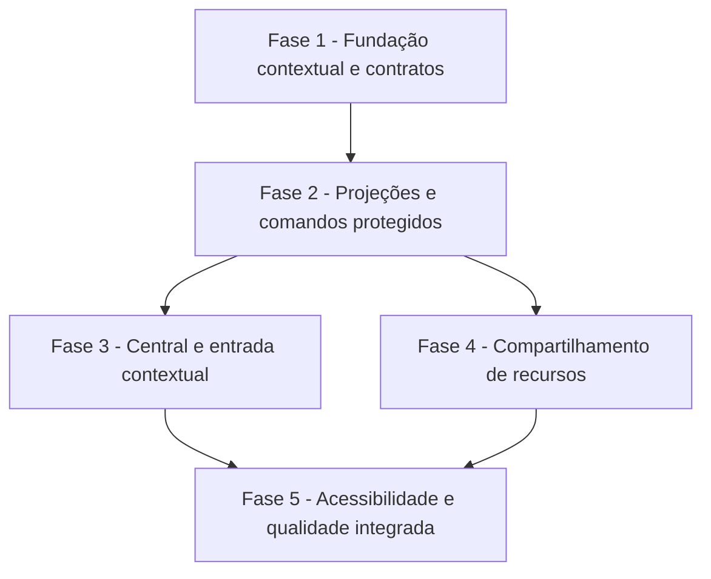

# Tarefas RinosOne — Interface unificada de acessos e permissões

Escopo: Evoluir a administração de autorização existente para uma experiência web contextual nas esferas `PERSONAL`, `TENANT` e `PLATFORM`, incluindo compartilhamento de recursos, sem alterar a semântica central de autorização nem criar posse individual de item.

**Legenda de status:**

- `[ ]` Pendente
- `[~]` Em andamento
- `[x]` Concluído
- `[!]` Bloqueado

**Legenda de criticidade:**

- `[C]` Crítico — Impacto de segurança, isolamento de contexto ou decisão de autorização
- `[A]` Alto — Funcionalidade essencial da interface ou API
- `[M]` Médio — Qualidade, refinamento e observabilidade necessários

---

## FASE 1 - Fundação contextual e contratos

### 1.1 Delimitar o adaptador de contexto de autorização `[C]`

Ref: [Plan §Desenho técnico](plan.md#desenho-técnico), [Contract §Famílias de contexto](contracts/contextual-access-administration-api.md#famílias-de-contexto), Spec FR-API-001 a FR-API-003

- [x] 1.1.1 Mapear os serviços, facades e guards existentes que validam `TENANT`, `PERSONAL` e `PLATFORM`, preservando as diferenças de membership e autorização de plataforma. <!-- plan.md §Mapeamento da fundação contextual -->
- [x] 1.1.2 Implementar um descritor interno de contexto derivado da rota e do solicitante, sem aceitar escopo, tenant ou workspace no corpo de mutações. <!-- AuthorizationAdministrationContextResolver -->
- [x] 1.1.3 Projetar capabilities mínimas de leitura, gestão, compartilhamento e controles avançados sem transformá-las em autorização no cliente. <!-- AuthorizationAdministrationCapabilities -->
- [x] 1.1.4 Cobrir o adaptador com testes unitários de contexto válido, contexto ausente, escopo incompatível e tentativa de escalonamento. <!-- AuthorizationAdministrationContextResolverTest -->

### 1.2 Consolidar DTOs e parsers contextuais `[A]`

Ref: [Plan §Convenções de borda](plan.md#convenções-de-borda), [Data Model](data-model.md), [Contract §Convenções](contracts/contextual-access-administration-api.md#convenções)

- [x] 1.2.1 Definir DTOs PHP de projeção e serializers camelCase para contexto, sujeito, fonte de acesso, catálogo, compartilhamento e auditoria segura. <!-- Dto/* e AuthorizationAdministrationProjectionSerializer -->
- [x] 1.2.2 Criar tipos e parsers TypeScript estritos no módulo `resources/js/authorization`, rejeitando ID inseguro, enum desconhecido e payload incompleto. <!-- contextualAdministrationApi.ts -->
- [x] 1.2.3 Criar testes unitários de paridade de shape entre casos válidos, campos ausentes, tipos divergentes e identificadores BIGINT inválidos. <!-- PHPUnit e Vitest contextualAdministrationApi -->
- [x] 1.2.4 Manter compatibilidade explícita entre os DTOs novos e os contratos administrativos/avançados existentes durante a migração. <!-- Contract §Projeções contextuais compartilhadas; módulo novo sem alterar administrationApi.ts -->

---

## FASE 2 - Projeções e comandos protegidos

### 2.1 Implementar consultas administrativas contextuais `[C]`

Ref: [Contract §Consultas contextuais novas](contracts/contextual-access-administration-api.md#consultas-contextuais-novas), Spec FR-API-004, FR-API-006, FR-API-009 e FR-API-015

- [x] 2.1.1 Implementar projeções paginadas de contexto, sujeitos, papéis e permissões que retornem somente dados visíveis ao solicitante. <!-- ContextualAuthorizationAdministrationQuery -->
- [x] 2.1.2 Implementar detalhe de acesso efetivo por sujeito e explicação de capacidade reutilizando o mesmo motor de decisão da operação protegida. <!-- subjectType obrigatório no contrato para evitar colisão entre IDs BIGINT de usuários e identidades de serviço -->
- [x] 2.1.3 Adaptar auditoria para filtros contextuais seguros, incluindo período, sujeito/recurso quando autorizado, operação e paginação. <!-- ContextualAuthorizationAdministrationQuery::auditEvents -->
- [x] 2.1.4 Criar testes de feature para `TENANT`, `PERSONAL` e `PLATFORM`, anti-enumeração, paginação, sujeito não visível e dados mínimos. <!-- ContextualAuthorizationAdministrationQueryTest -->

### 2.2 Expor rotas contextuais e preservar compatibilidade `[C]`

Ref: [Contract §Famílias de contexto](contracts/contextual-access-administration-api.md#famílias-de-contexto), [Contract §Comandos de papel e grupo](contracts/contextual-access-administration-api.md#comandos-de-papel-e-grupo), Spec FR-API-005, FR-API-007 e FR-API-016

- [x] 2.2.1 Adicionar rotas versionadas de leitura para tenant, pessoal e plataforma, derivando contexto exclusivamente do path e da identidade autenticada. <!-- ContextualAuthorizationAdministrationController -->
- [x] 2.2.2 Adaptar comandos existentes de papel e grupo para o sujeito contextual compatível, sem quebrar payloads `userId` legados durante a migração. <!-- AuthorizationSubjectRequest aceita USER/subjectId e userId -->
- [x] 2.2.3 Retornar envelope seguro e sem enumeração para `403`, `404`, `409`, `412` e `422`, com versão contextual quando aplicável. <!-- contextVersion e AUTHORIZATION_ADMINISTRATION_CONTEXT_STALE -->
- [x] 2.2.4 Cobrir endpoints por testes de feature de autorização, contrato de erro, último administrador, revogação e reconsulta após escrita. <!-- ContextualAuthorizationAdministrationApiTest e AuthorizationAdministrationApiTest legado -->

### 2.3 Implementar administração de compartilhamento por recurso `[C]`

Ref: [Contract §Compartilhamento de recursos de workspace](contracts/contextual-access-administration-api.md#compartilhamento-de-recursos-de-workspace), [Data Model §Compartilhamento de recurso](data-model.md#entity-compartilhamento-de-recurso), Spec FR-API-010 e FR-API-011

- [x] 2.3.1 Criar adaptador de recurso que projete relações diretas e herdadas de `auth_resource_relation` para recursos pessoais e de tenant. <!-- ContextualAuthorizationResourceShareService; FOLDER registrado -->
- [x] 2.3.2 Expor leitura, criação, alteração e revogação de relação por rotas contextualizadas, sem aceitar seleção livre de workspace. <!-- ContextualAuthorizationResourceShareController -->
- [x] 2.3.3 Declarar `workspaceResponsible` apenas como informação contextual e garantir que nenhum comando ou DTO introduza proprietário de arquivo ou pasta. <!-- resposta contextual sem campo de posse individual -->
- [x] 2.3.4 Criar testes de feature para relação direta, herança, origem não editável, recurso de outro contexto, revogação e falha atômica. <!-- ContextualAuthorizationResourceShare{Service,Api}Test -->

### 2.4 Integrar controles avançados à projeção contextual `[A]`

Ref: [Contract §Controles avançados](contracts/contextual-access-administration-api.md#controles-avançados), Spec FR-API-014, [Interface §INT-WEB-ADMIN-001](interface-spec.md#int-web-admin-001--central-contextual-de-acessos)

- [x] 2.4.1 Projetar seções avançadas permitidas pelo contexto sem entregar lista ou detalhe de recurso sem capacidade de leitura. <!-- seção advanced condicionada a canUseAdvancedControls -->
- [x] 2.4.2 Reutilizar operações de políticas, delegações, solicitações, SoD e identidades de serviço existentes, sem criar endpoint alternativo de credencial. <!-- contratos /advanced existentes permanecem fonte única -->
- [x] 2.4.3 Garantir que emissão de credencial continue a devolver segredo uma única vez e nunca entre em leitura contextual, auditoria ou cache da interface. <!-- contrato e teste de projeção sem apiKey/secretHash -->
- [x] 2.4.4 Criar testes de feature para visibilidade progressiva, negação segura e preservação das regras de credenciais existentes. <!-- ContextualAuthorizationAdministrationApiTest e AdvancedAuthorizationAdministrationApiTest -->

---

## FASE 3 - Central e entrada contextual na Área de Trabalho

### 3.1 Implementar INT-WEB-ADMIN-001 — Central contextual de acessos `[A]`

Ref: [Interface §INT-WEB-ADMIN-001](interface-spec.md#int-web-admin-001--central-contextual-de-acessos), wireframe `wireframes/int-web-admin-001.md`, Histórias 1, 2, 4 e 5

- [x] 3.1.1 Refatorar `AuthorizationAdministrationSurface.vue` em composição contextual que reutilize a entrada `tenant.authorization-administration` e aceite descritor de contexto tipado. <!-- WorkspaceSurface e projeções contextuais -->
- [x] 3.1.2 Implementar banner persistente de escopo, lista paginada de sujeitos, busca segura e detalhe de acesso efetivo com fontes distinguíveis. <!-- API contextual paginada e componente -->
- [x] 3.1.3 Implementar catálogo de papéis/grupos com descrições humanas, indicação de papel de sistema e fluxo de atribuição sem entrada de ID técnico. <!-- endpoint contextual de grupos e seleção por nome -->
- [x] 3.1.4 Implementar confirmação de alteração com alvo, contexto, efeito e vigência, incluindo tratamento de `409` de último administrador e `412` de dado obsoleto. <!-- confirmação contextual e mensagens HTTP -->
- [x] 3.1.5 Cobrir estados loading, empty, offline, access-denied, partial-stale e feedback por testes de componente e integração com API real. <!-- Vitest e features contextualizadas -->

### 3.2 Implementar INT-WEB-ACCESS-001 — Entrada segura para acessos `[A]`

Ref: [Interface §INT-WEB-ACCESS-001](interface-spec.md#int-web-access-001--entrada-segura-para-acessos), Spec FR-API-001 a FR-API-003

- [x] 3.2.1 Atualizar catálogo de workspace, navegação desktop e móvel para abrir a Central no contexto já montado, sem seletor livre de esfera. <!-- Evidência: workspaceCatalog.ts, WorkspaceShell.vue e workspaceStore.spec.ts -->
- [x] 3.2.2 Usar capability mínima apenas para visibilidade, revalidando contexto ao montar a superfície e tratando revogação durante a sessão. <!-- Evidência: AuthorizationAdministrationSurface.vue e WorkspaceStage.spec.ts -->
- [ ] 3.2.3 Garantir foco de entrada/retorno, rótulo localizado e comportamento consistente em teclado, mouse e toque.
- [x] 3.2.4 Criar testes de componente e E2E para entrada permitida, entrada oculta, deep link/superfície negada e retorno seguro ao workspace. <!-- Evidência: workspaceStore.spec.ts, WorkspaceStage.spec.ts e application.spec.ts -->

### 3.3 Integrar auditoria, explicação e controles progressivos `[A]`

Ref: [Interface §INT-WEB-ADMIN-001](interface-spec.md#int-web-admin-001--central-contextual-de-acessos), Spec FR-API-008, FR-API-009 e FR-API-015

- [x] 3.3.1 Implementar os caminhos “quem tem acesso?” e “o que esta pessoa pode fazer?” com fonte, abrangência e vigência legíveis. <!-- Evidência: AuthorizationAdministrationSurface.vue e AuthorizationAdministrationSurface.spec.ts -->
- [x] 3.3.2 Implementar filtros de auditoria e apresentação de resumo seguro, sem snapshots confidenciais nem detalhes de outro contexto. <!-- Evidência: AuthorizationAdministrationSurface.vue e AuthorizationAdministrationSurface.spec.ts -->
- [x] 3.3.3 Reorganizar os controles avançados existentes sob divulgação progressiva, preservando todos os comandos autorizados e o aviso de segredo de emissão única. <!-- Evidência: AdvancedAuthorizationControls.vue, AuthorizationAdministrationSurface.vue e application.spec.ts -->
- [x] 3.3.4 Criar testes de componente para filtros, ausência de dados, acesso efetivo com múltiplas fontes e visibilidade seletiva do avançado. <!-- Evidência: AuthorizationAdministrationSurface.spec.ts e AdvancedAuthorizationControls.spec.ts -->

---

## FASE 4 - Compartilhamento de recursos

### 4.1 Implementar INT-WEB-SHARING-001 — Painel de compartilhamento `[A]`

Ref: [Interface §INT-WEB-SHARING-001](interface-spec.md#int-web-sharing-001--compartilhar-recurso-do-workspace), wireframe `wireframes/int-web-sharing-001.md`, História 3

- [ ] 4.1.1 Implementar painel reutilizável de compartilhamento e invocação a partir do detalhe de item do Drive e do detalhe de acesso quando houver recurso contextual.
- [ ] 4.1.1a Estender a projeção de detalhe de acesso com referência de recurso quando ela existir, para permitir invocação segura do painel sem inferência de ID pela interface. <!-- Trabalho emergente: contrato atual de effective-access não contém recurso -->
- [x] 4.1.2 Exibir recurso, selo de contexto, responsável do workspace, relações diretas, relações herdadas e origem de herança com textos canônicos. <!-- Evidência: ResourceSharingPanel.vue e ResourceSharingPanel.spec.ts -->
- [ ] 4.1.3 Implementar busca de destinatário, criação, edição e revogação apenas para relações diretas autorizadas, com confirmação contextual.
- [ ] 4.1.4 Implementar reflow de painel lateral para página móvel, retorno ao invocador e todos os estados de rede/conflito definidos.
- [ ] 4.1.5 Cobrir painel por testes de componente e E2E de compartilhamento pessoal, tenant, herdado, revogação e acesso cruzado negado.

### 4.2 Garantir terminologia e isolamento de workspace `[C]`

Ref: Spec FR-API-011, [Interface §Shared Content and Terminology](interface-spec.md#shared-content-and-terminology), [Checklist security CHK005](checklists/security.md)

- [ ] 4.2.1 Revisar rótulos, tipos, DTOs e mensagens do painel e Drive para não introduzir “owner”, “dono de arquivo” ou “proprietário de pasta”.
- [ ] 4.2.2 Verificar que responsáveis de workspace pessoal e de tenant são obtidos do contexto correto e nunca podem ser alterados pelo painel.
- [ ] 4.2.3 Cobrir regressões de isolamento entre workspace pessoal, tenant A e tenant B em testes de feature e E2E.
- [ ] 4.2.4 Atualizar documentação de uso do Drive e autorização por recurso somente se o comportamento público mudar durante a execução.

---

## FASE 5 - Acessibilidade, localização e qualidade integrada

### 5.1 Validar acessibilidade e localização das interações `[A]`

Ref: Spec FR-API-018, [Interface §Shared Accessibility and Input](interface-spec.md#shared-accessibility-and-input), [Checklist interface CHK009 a CHK011](checklists/interface.md)

- [ ] 5.1.1 Implementar e testar ordem de foco, foco em diálogo, retorno de foco, nomes acessíveis, regiões vivas e operação integral por teclado.
- [ ] 5.1.2 Revisar contraste textual, estados não dependentes de cor, preferência de movimento reduzido e alvos de toque nos três itens `INT-*`.
- [ ] 5.1.3 Adicionar chaves e traduções revisadas em português, inglês, espanhol e francês, cobrindo expansão de texto e formatos de data/vigência.
- [ ] 5.1.4 Executar inspeção visual nos form factors definidos e registrar evidência de desktop, tablet e telefone para cada wireframe obrigatório.

### 5.2 Executar a matriz de contratos e qualidade `[C]`

Ref: [Quickstart](quickstart.md), [Plan §Validação planejada](plan.md#validação-planejada), [Checklist api](checklists/api.md)

- [ ] 5.2.1 Executar testes PHP de serviços e features para contexto, anti-enumeração, último administrador, compartilhamento, herança, credenciais e invalidação.
- [ ] 5.2.2 Executar parsers e testes Vitest para todos os DTOs novos, estados de interface e handlers de erro.
- [ ] 5.2.3 Executar roundtrip real entre frontend e backend, comparando respostas de contexto, sujeitos, papéis e acesso efetivo ao contrato documentado.
- [ ] 5.2.4 Executar E2E em desktop e telefone para atribuição, explicação, compartilhamento, offline e contexto alterado durante edição.
- [ ] 5.2.5 Medir em homologação p95 de até 500 ms para `context`, `subjects` e `roles` paginados, e de até 1 s para `effective-access` e `explain`, no cenário de até 1.000 sujeitos ativos.
- [ ] 5.2.6 Rodar `php artisan test`, `npm run type-check`, `npm test`, `npm run build` e suíte E2E configurada, registrando qualquer falha sem mascará-la.

### 5.3 Sincronizar documentação e estado do backlog `[M]`

Ref: Constitution §Documentação, [Plan](plan.md), [Interface](interface-spec.md)

- [ ] 5.3.1 Atualizar contratos, quickstart, interface spec e catálogo de superfícies se a implementação revelar ajuste de comportamento aprovado.
- [ ] 5.3.2 Marcar cada subtarefa concluída com evidência curta e inserir tarefas emergentes no mesmo ciclo em que forem descobertas.
- [ ] 5.3.3 Executar análise cross-artifact antes de iniciar o primeiro item de implementação e corrigir qualquer drift documental encontrado.

---

## Matriz de Dependências

**Caminho crítico**: 1.1 → 1.2 → 2.1 → 2.2 → 3.1 → 3.2 → 5.2. A tarefa 2.3 permite executar 4.1 em paralelo após a fundação contextual.

## Cobertura de Interfaces

| Surface ID | Coverage | Interaction IDs | Task IDs |
|------------|----------|-----------------|----------|
| SURF-WEB-ADMIN | FULL | INT-WEB-ADMIN-001 | 2.1, 2.2, 2.4, 3.1, 3.3, 5.1, 5.2 |
| SURF-WEB-SHARING | FULL | INT-WEB-SHARING-001 | 2.3, 4.1, 4.2, 5.1, 5.2 |
| SURF-WEB-ACCESS | PARTIAL | INT-WEB-ACCESS-001 | 1.1, 2.2, 3.2, 5.1, 5.2 |

## Resumo Quantitativo

| Fase | Tarefas | Subtarefas | Criticidade |
|------|---------|------------|-------------|
| 1 - Fundação contextual e contratos | 2 | 8 | C, A |
| 2 - Projeções e comandos protegidos | 4 | 16 | C, A |
| 3 - Central e entrada contextual | 3 | 13 | A |
| 4 - Compartilhamento de recursos | 2 | 9 | A, C |
| 5 - Acessibilidade e qualidade integrada | 3 | 13 | A, C, M |
| **Total** | **14** | **59** | — |

## Escopo Coberto

| Item | Descrição | Fase |
|------|-----------|------|
| CTX | Contexto derivado de rota e capabilities mínimas para as três esferas | 1 e 2 |
| READ | Projeções de sujeitos, catálogo, acesso efetivo, explicação e auditoria | 2 |
| CMD | Comandos compatíveis de papéis, grupos e controle de concorrência | 2 |
| UI-ADMIN | Central contextual e entrada na Área de Trabalho | 3 |
| UI-SHARE | Painel de compartilhamento pessoal e de tenant | 4 |
| QUALITY | Acessibilidade, i18n, contratos, E2E e sincronização documental | 5 |

## Escopo Excluído

| Item | Descrição | Motivo |
|------|-----------|--------|
| SCIM | Provisionamento/sincronização de diretórios | Expressamente fora de escopo da SDD. |
| BUSINESS-KEYS | Novas permissões ou papéis de telas de negócio futuras | São criados incrementalmente por cada módulo funcional. |
| ITEM-OWNERSHIP | Posse/propriedade individual de arquivo ou pasta | Contraria a regra de responsabilidade exclusiva do workspace. |
| NATIVE-APPS | Aplicativos desktop, Android, iOS ou CLI | A web responsiva é a única superfície humana aprovada. |
