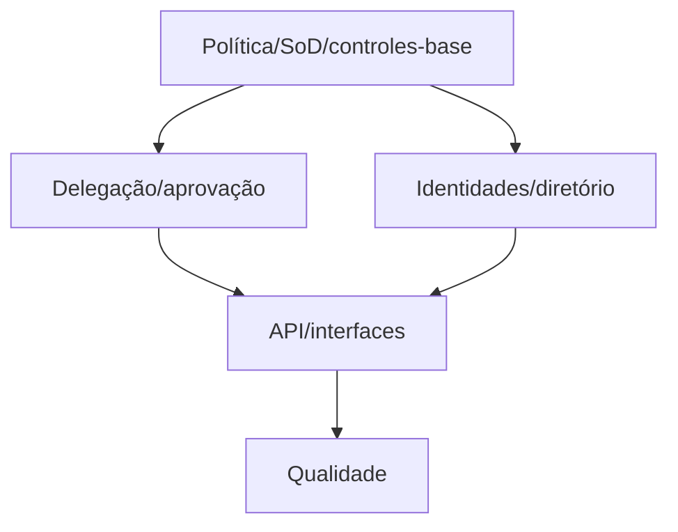

# Tarefas rinosOne — Políticas Avançadas de Autorização

Escopo: condições fechadas, delegação, aprovação temporária, SoD, service identities, SCIM e interfaces administrativas; sem scripts arbitrários ou fluxo de aprovação de negócio.

**Legenda de status:** `[ ]` pendente; `[x]` concluída.  
**Legenda de criticidade:** `[C]` crítico; `[A]` alto; `[M]` médio.

## FASE 1 - Modelo e Avaliadores Seguros

### 1.1 Persistir políticas e condições fechadas `[C]`

Ref: Spec FR-AAP-001 a 004, `data-model.md`.

- [x] 1.1.1 Criar migrations/modelos core com BIGINT, versão e índices de contexto. <!-- auth_policy e auth_policy_binding, com migration global aplicada e teste de persistência em 2026-09-27 -->
- [x] 1.1.2 Implementar catálogo fechado, parser/validador e limites de composição. <!-- catálogo explícito, validador de árvore limitada e testes contra expressão/atributo não confiável em 2026-09-27 -->
- [x] 1.1.3 Testar atributos confiáveis, ausentes, limites e auditoria sem segredo. <!-- validators e AuthorizationPolicyServiceTest cobrem atributos fechados, contexto ausente, publicação auditada sem definition e invalidação em 2026-09-27 -->

### 1.2 Integrar ordem canônica de decisão `[C]`

Ref: Regras transversais, contrato da fundação.

- [x] 1.2.1 Aplicar condições somente após grant/relation elegível. <!-- AuthorizationService aplica AuthorizationPolicyEvaluator somente após resolve() retornar allow em 2026-09-27 -->
- [x] 1.2.2 Preservar restriction, validação e default deny como precedência superior. <!-- AuthorizationPolicyEvaluationTest confirma restriction antes da avaliação condicional em 2026-09-27 -->
- [x] 1.2.3 Testar matriz combinada com resource, tenant e cache indisponível. <!-- AuthorizationPolicyEvaluationTest cobre policy por resource, tenant, restriction e falha do cache sem bypass em 2026-09-27 -->

### 1.3 Declarar separação de funções `[C]`

Ref: Spec FR-AAP-012.

- [x] 1.3.1 Persistir regras incompatíveis por escopo/tenant. <!-- auth_separation_rule usa BIGINT, escopo/contexto e migration global aplicada em 2026-09-27 -->
- [x] 1.3.2 Bloquear escrita e decisão incompatíveis de forma transacional. <!-- decisão e atribuição direta de role consultam regras SoD; tentativa incompatível é rejeitada em transação, em 2026-09-27 -->
- [ ] 1.3.3 Cobrir pares/conjuntos, concorrência e mensagem segura.

### 1.4 Completar controles estruturais do requisito-base `[C]`

Ref: Documento inicial de autorização, FR-AAP-017 a 019.

- [x] 1.4.1 Persistir e resolver implicações acíclicas de permission no mesmo escopo, preservando restriction como precedência superior. <!-- grafo BIGINT acíclico, resolução recursiva na decisão, invalidação e testes de restriction em 2026-09-27 -->
- [x] 1.4.2 Aplicar limite configurável de profundidade ao criar grupos aninhados e testar fronteiras/ciclos. <!-- AUTHORIZATION_MAX_GROUP_NESTING_DEPTH (padrão 5), validação de toda a cadeia sob lock e teste de fronteira/ciclo em 2026-09-27 -->
- [x] 1.4.3 Estender restriction para qualificar recurso validado e testar isolamento de resource/tenant. <!-- qualifier opcional por resource type/id, validação no registry e teste de isolamento por pasta em 2026-09-27 -->

## FASE 2 - Delegação e Acesso Temporário

### 2.1 Implementar cadeia de delegação `[C]`

Ref: Spec FR-AAP-005 a 008.

- [x] 2.1.1 Persistir origem, limites, vigência e estado de delegação. <!-- auth_delegation BIGINT com limites, vigência, estado, auditoria e migration aplicada em 2026-09-27 -->
- [x] 2.1.2 Validar delegabilidade, escopo, ciclos e profundidade. <!-- somente origem ROLE_ASSIGNMENT ativa do delegador, escopo/tenant estritos e repasse desabilitado (profundidade zero) em 2026-09-27 -->
- [x] 2.1.3 Auditar criação/revogação e testar revogação em cascata. <!-- criação/revogação auditadas e decisão invalida imediatamente; sem repasse na primeira versão, não há descendentes a revogar em 2026-09-27 -->

### 2.2 Implementar requests e aprovação independente `[C]`

Ref: Spec FR-AAP-009 a 011.

- [x] 2.2.1 Criar estados pendente/aprovado/rejeitado/expirado/revogado. <!-- auth_access_request persiste o ciclo de vida; criação inicia em PENDING em 2026-09-27 -->
- [x] 2.2.2 Validar independência do aprovador e preservar histórico imutável. <!-- aprovação/rejeição só por administrador direto distinto, com decisão auditada; APPROVED torna o acesso temporariamente efetivo em 2026-09-27 -->
- [x] 2.2.3 Criar job de expiração e testes de fronteira temporal. <!-- comando agendado a cada minuto expira PENDING/APPROVED com fim inclusivo e mantém decisão deny após o fim em 2026-09-27 -->

## FASE 3 - Identidades e Diretório Corporativo

### 3.1 Implementar service identities `[C]`

Ref: Spec FR-AAP-013.

- [x] 3.1.1 Criar subject não humano com proprietário, finalidade e vigência. <!-- auth_service_identity sem vínculo com credencial, com owner/finalidade/escopo/vigência e auditoria em 2026-09-27 -->
- [ ] 3.1.2 Integrar credenciais ao armazenamento seguro sem eventos secretos.
- [ ] 3.1.3 Testar escopo, expiração, rotação e auditoria segura. <!-- expiração automática e auditoria implementadas; rotação aguarda porta de cofre de segredos -->

### 3.2 Implementar porta e adaptador SCIM `[A]`

Ref: Spec FR-AAP-014 a 016, `advanced-policies-api.md`.

- [ ] 3.2.1 Registrar ADR do adaptador SCIM 2.0 e contrato `GroupDirectoryProvider`.
- [ ] 3.2.2 Implementar mapping explícito, validação e aplicação transacional de alterações.
- [ ] 3.2.3 Testar falha segura, atraso e proteção do último administrador direto.

## FASE 4 - API e Interfaces

### 4.1 Publicar API protegida `[A]`

Ref: `advanced-policies-api.md`.

- [ ] 4.1.1 Criar rotas, requests, DTOs camelCase e policies administrativas.
- [ ] 4.1.2 Validar contratos, erros seguros e invalidação de policy version.
- [ ] 4.1.3 Cobrir operações positivas/negativas com testes de integração.

### 4.2 Implementar INT-WEB-POLICY-001 `[A]`

Ref: `interface-spec.md` INT-WEB-POLICY-001.

- [ ] 4.2.1 Criar navegação e editor estruturado de políticas/SoD/delegação/identidade.
- [ ] 4.2.2 Cobrir validação, simulação segura, estados e i18n.
- [ ] 4.2.3 Testar API real, a11y, desktop/mobile e revisão visual do wireframe.

### 4.3 Implementar INT-WEB-POLICY-002 `[A]`

Ref: `interface-spec.md` INT-WEB-POLICY-002.

- [ ] 4.3.1 Criar solicitação, fila de aprovação e decisão segura.
- [ ] 4.3.2 Refletir pendência, aprovação, expiração/revogação sem exposição de cadeia.
- [ ] 4.3.3 Criar E2E de solicitante/aprovador independente e acessibilidade.

## FASE 5 - Qualidade Integrada

### 5.1 Consolidar a matriz de segurança `[C]`

Ref: Spec SC-AAP-001 a 004, `quickstart.md`.

- [ ] 5.1.1 Mapear cada FR/SC/INT para teste unitário, feature, contrato ou E2E.
- [ ] 5.1.2 Executar testes, formatação, typecheck, build e benchmark de decisão.
- [ ] 5.1.3 Revisar retenção de auditoria, métricas e logs para dados sensíveis.

## Matriz de Dependências

## Cobertura de Interfaces

| Interação | Tasks | Verificação |
| --- | --- | --- |
| INT-WEB-POLICY-001 | 4.2 e 4.3 | API real, estados, a11y, desktop/mobile e E2E |

## Resumo Quantitativo

| Fase | Tarefas | Subtarefas |
| --- | ---: | ---: |
| 1 | 4 | 12 |
| 2 | 2 | 6 |
| 3 | 2 | 6 |
| 4 | 3 | 9 |
| 5 | 1 | 3 |
| **Total** | **12** | **36** |

## Escopo Coberto

Condições, implicações, restrictions por recurso, profundidade de grupos, SoD, delegação, tempo/aprovação, service identities, diretório, API, web e auditoria.

## Escopo Excluído

Scripts de política, fornecedores fora de SCIM sem ADR e aprovação de transações de domínio.
