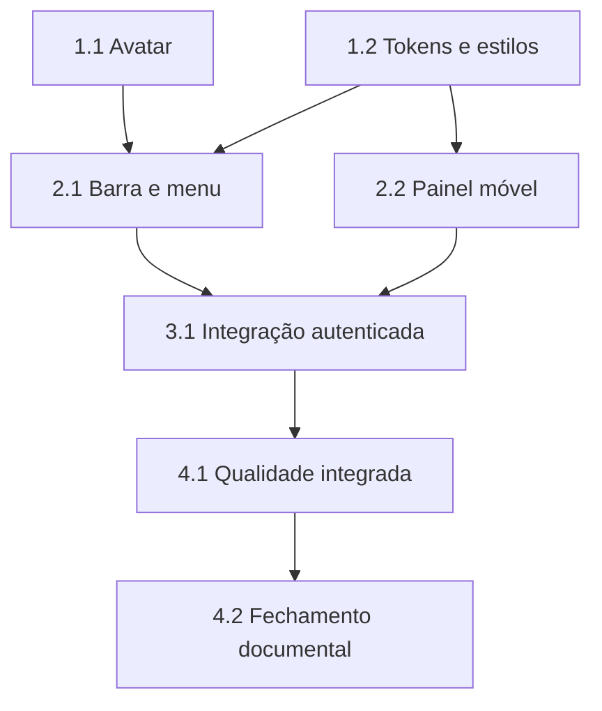

# Tarefas Rinos One — Casca da Aplicação Autenticada

Escopo: implementar a barra superior global, avatar de fallback, menu pessoal e painel móvel na área autenticada, reutilizando sessão, preferências e idioma existentes. Não inclui produtos, módulos, itens de navegação, perfil, envio de imagem ou API nova.

**Legenda de status:**

- `[ ]` Pendente
- `[~]` Em andamento
- `[x]` Concluído
- `[!]` Bloqueado

**Legenda de criticidade:**

- `[C]` Crítico — bloqueia segurança, integridade ou a entrega base
- `[A]` Alto — capacidade essencial da feature
- `[M]` Médio — melhoria necessária sem bloquear fundação

---

## FASE 1 - Fundação compartilhada

### 1.1 Avatar de usuário e contratos de apresentação `[A]`

Ref: spec.md US-002, FR-005–006; plan.md §Componentes e Estilos Compartilhados; interface-spec.md INT-WEB-SHELL-001

- [x] 1.1.1 Criar componente compartilhado de avatar que aceite imagem opcional e nome de exibição, sempre com rótulo acessível.
- [x] 1.1.2 Implementar derivação pura para nome composto, nome único com duas ou mais letras, nome de uma letra, vazio, espaços extras, acentos e caracteres não latinos.
- [x] 1.1.3 Aplicar fallback seguro quando imagem futura estiver ausente ou falhar, sem persistir iniciais nem alterar o dado da sessão.
- [x] 1.1.4 Criar testes unitários e de componente para todos os estados de avatar e seu contrato acessível.

### 1.2 Tokens e estilos reutilizáveis da casca `[A]`

Ref: spec.md FR-001–003, FR-013, FR-015; plan.md §Componentes e Estilos Compartilhados; interface-spec.md INT-WEB-SHELL-001–003

- [x] 1.2.1 Adicionar aliases semânticos e estilos compartilhados para barra superior, avatar circular, menu pessoal, divisor de utilitários, camada de fundo e painel lateral.
- [x] 1.2.2 Implementar reflow de desktop, tablet e telefone, preservando marca paisagem no desktop, ícone móvel, alvos de toque, zoom e ausência de rolagem horizontal.
- [x] 1.2.3 Aplicar foco visível, contraste, rolagem segura, safe areas e redução de movimento a todos os novos elementos estruturais.
- [x] 1.2.4 Verificar por teste ou inspeção automatizada que os estilos dependem dos tokens existentes e respeitam tema e três escalas visuais.

---

## FASE 2 - Interações globais autenticadas

### 2.1 Barra superior e menu pessoal `[A]`

Ref: spec.md US-001, US-003, FR-001–010; interface-spec.md INT-WEB-SHELL-001, INT-WEB-SHELL-002; wireframes/int-web-shell-001.md; wireframes/int-web-shell-002.md

- [x] 2.1.1 Criar barra superior compartilhada com marca reduzida à esquerda e avatar à direita, preparada para envolver qualquer conteúdo autenticado.
- [x] 2.1.2 Criar menu pessoal ancorado no avatar, com item de configurações reservado e região inferior separada para preferências visuais, idioma e saída.
- [x] 2.1.3 Reutilizar os componentes existentes de preferências e idioma dentro do menu sem alterar persistência local, rota ou sessão.
- [x] 2.1.4 Implementar abertura, fechamento, Escape, clique externo seguro, foco inicial e retorno ao avatar; impedir sobreposições estruturais concorrentes.
- [x] 2.1.5 Expor a intenção de saída ao componente raiz, preservar o fluxo de logout existente e manter estado visual em falhas recuperáveis.
- [x] 2.1.6 Criar testes de componente para conteúdo, acessibilidade, foco, idioma, preferências e intenção de saída do menu.

### 2.2 Painel de navegação móvel `[A]`

Ref: spec.md US-004, FR-011–015; interface-spec.md INT-WEB-SHELL-003; wireframes/int-web-shell-003.md

- [x] 2.2.1 Criar painel lateral móvel compartilhado com marca, nome de navegação, controle explícito de fechar e região sem destinos de produto.
- [x] 2.2.2 Exibir o acionador apenas no formato de telefone e preservar a marca de identificação adequada em tablet e desktop.
- [x] 2.2.3 Implementar camada de fundo, controle de foco, Escape, retorno ao acionador, clique externo quando aplicável e fechamento ao perder sessão.
- [x] 2.2.4 Garantir exclusividade entre painel móvel e menu pessoal, sem alteração de rota, sessão ou conteúdo principal.
- [x] 2.2.5 Criar testes de componente para abertura, fechamento, semântica, ausência de itens fictícios e redução de movimento.

---

## FASE 3 - Integração da área autenticada

### 3.1 Compor a casca sobre a sessão existente `[A]`

Ref: spec.md FR-004, FR-010, FR-014–015; plan.md §Fluxo de Estado e §Convenções de Borda; interface-spec.md INT-WEB-SHELL-001–002

- [x] 3.1.1 Evoluir a moldura autenticada existente para receber nome de exibição e intenção de saída, preservando composição de conteúdo por slots.
- [x] 3.1.2 Integrar a barra e os painéis à área autenticada atual sem duplicar consulta de sessão, endpoint de logout ou regras de autorização.
- [x] 3.1.3 Mover os utilitários globais do rodapé autenticado para o menu pessoal, preservando os controles públicos das telas de acesso.
- [x] 3.1.4 Adicionar todos os textos e rótulos acessíveis da casca aos catálogos pt-BR, en, es e fr, com paridade tipada de chaves.
- [x] 3.1.5 Validar o roundtrip real de sessão e saída, conferindo o nome de exibição recebido e a transição ao acesso público após logout.

---

## FASE 4 - Qualidade integrada e documentação final

### 4.1 Cobertura automatizada e inspeção responsiva `[A]`

Ref: spec.md SC-001–SC-005; quickstart.md Cenários 1–5; interface-spec.md INT-WEB-SHELL-001–003

- [x] 4.1.1 Ampliar a suíte unitária para avatar, barra, menu pessoal e painel móvel, incluindo estados de sessão, offline e fallback de imagem.
- [x] 4.1.2 Ampliar os cenários ponta a ponta autenticados para barra, menu, preferências, idioma, saída e painel móvel em telefone, tablet e desktop.
- [x] 4.1.3 Inspecionar visualmente ambos os temas e escalas extremas, verificando foco, teclado, leitor de tela, redução de movimento, alvos de toque e ausência de overflow horizontal.
- [x] 4.1.4 Executar verificação de tipos, testes de interface, testes de backend relevantes e build de produção; registrar evidências em `validation.md`.

### 4.2 Fechamento documental `[M]`

Ref: constitution.md V; checklists/interface.md CHK-INT-001–016; checklists/ux.md CHK-UX-001–014

- [x] 4.2.1 Atualizar a especificação de interface e wireframes apenas se a implementação revelar uma decisão material divergente. <!-- Não houve divergência material; a especificação foi atualizada para o estado implementado. -->
- [x] 4.2.2 Registrar comandos, evidências e limitações de ambiente em `validation.md`, sem copiar segredos ou dados pessoais.
- [x] 4.2.3 Marcar tarefas concluídas com evidências concisas e revisar rastreabilidade de todos os `INT-WEB-SHELL-*`.

## Matriz de Dependências

**Caminho crítico**: 1.1 e 1.2 → 2.1 e 2.2 → 3.1 → 4.1 → 4.2.

## Cobertura de Interfaces

| Surface ID | Coverage | Interaction IDs | Task IDs |
| --- | --- | --- | --- |
| SURF-WEB-ACCESS | FULL | INT-WEB-SHELL-001 | 1.1, 1.2, 2.1, 3.1, 4.1, 4.2 |
| SURF-WEB-ACCESS | FULL | INT-WEB-SHELL-002 | 1.1, 1.2, 2.1, 3.1, 4.1, 4.2 |
| SURF-WEB-ACCESS | FULL | INT-WEB-SHELL-003 | 1.2, 2.2, 3.1, 4.1, 4.2 |

## Resumo Quantitativo

| Fase | Tarefas | Subtarefas | Criticidade |
| --- | ---: | ---: | --- |
| 1 - Fundação compartilhada | 2 | 8 | A |
| 2 - Interações globais autenticadas | 2 | 11 | A |
| 3 - Integração da área autenticada | 1 | 5 | A |
| 4 - Qualidade e documentação | 2 | 7 | A, M |
| **Total** | **7** | **31** | — |

## Escopo Coberto

| Item | Descrição | Fase |
| --- | --- | --- |
| SHELL-001 | Avatar circular e fallback de identidade | 1 |
| SHELL-002 | Barra superior e menu pessoal reutilizáveis | 2 |
| SHELL-003 | Painel de navegação móvel sem módulos | 2 |
| SHELL-004 | Integração com sessão, saída, preferências, idioma e conteúdo atual | 3 |
| SHELL-005 | Testes, acessibilidade, responsividade e evidências | 4 |

## Escopo Excluído

| Item | Descrição | Motivo |
| --- | --- | --- |
| EXC-001 | Produtos, módulos, grupos de menu e atalhos de produto | Ainda não foram especificados ou autorizados. |
| EXC-002 | Perfil, edição de dados, upload, recorte ou persistência de imagem | Capacidade de perfil pertence a feature futura. |
| EXC-003 | API, banco, migração ou persistência adicional | A casca reutiliza somente a sessão e preferências existentes. |
| EXC-004 | Aplicativos nativos ou outra interface além da web responsiva | A cobertura aprovada é exclusivamente web. |
