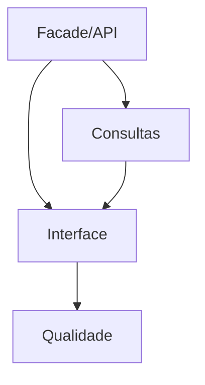

# Tarefas rinosOne — Administração de Autorização

Escopo: API e web protegidas para administrar o modelo base, consultar acesso efetivo/explain e auditoria; gestão web de PLATFORM e políticas avançadas são excluídas.

**Legenda de status:** `[ ]` pendente; `[x]` concluída.  
**Legenda de criticidade:** `[C]` crítico; `[A]` alto; `[M]` médio.

## FASE 1 - Fachada e Contratos Administrativos

### 1.1 Implementar autorização administrativa `[C]`

Ref: Spec FR-AA-001 a 005, `administration-api.md`.

- [ ] 1.1.1 Criar permissions administrativas por esfera e adaptar rotas/Policies.
- [ ] 1.1.2 Implementar facade transacional para roles, grupos, memberships, assignments e restrictions.
- [ ] 1.1.3 Testar escopo/tenant, compatibilidade e último administrador sem escrita parcial.

### 1.2 Publicar API JSON versionada `[A]`

Ref: Spec FR-AA-002 a 004/009/010.

- [ ] 1.2.1 Criar requests, controllers e DTOs camelCase para operações permitidas.
- [ ] 1.2.2 Validar envelope seguro e paridade com tipos TypeScript.
- [ ] 1.2.3 Cobrir endpoints com testes de contrato e autorização negativa.

## FASE 2 - Consultas Seguras

### 2.1 Projetar effective access e explain `[C]`

Ref: Spec FR-AA-006/007, `data-model.md`.

- [ ] 2.1.1 Resolver fatores diretos, grupos, restrictions e relations visíveis.
- [ ] 2.1.2 Aplicar filtro administrativo e redigir dados de terceiros.
- [ ] 2.1.3 Testar allow/deny explicado sem vazar recurso ou tenant externo.

### 2.2 Expor auditoria protegida `[A]`

Ref: Spec FR-AA-008/010.

- [ ] 2.2.1 Implementar filtros, paginação e ordenação segura de eventos.
- [ ] 2.2.2 Incluir operações recusadas por invariantes quando aplicável.
- [ ] 2.2.3 Testar imutabilidade, limites de consulta e isolamento de contexto.

## FASE 3 - Interface de Administração

### 3.1 Implementar gestão de segurança `[C]`

Ref: `interface-spec.md` INT-WEB-ADMIN-001.

- [ ] 3.1.1 Criar rota, navegação, abas e formulários usando design system/i18n.
- [ ] 3.1.2 Implementar estados, confirmação e erro do último administrador.
- [ ] 3.1.3 Testar API real, teclado, leitor de tela, mobile e desktop.

### 3.2 Implementar consultas de segurança `[A]`

Ref: `interface-spec.md` INT-WEB-ADMIN-001.

- [ ] 3.2.1 Criar visualização segura de effective access/explain.
- [ ] 3.2.2 Criar tabela de auditoria filtrável e paginada.
- [ ] 3.2.3 Cobrir estados vazio/erro/stale, responsividade e E2E.

### 3.3 Revalidar capabilities no backend `[A]`

Ref: Spec FR-AA-009, contrato de decisão da fundação.

- [ ] 3.3.1 Revalidar capabilities após mutações concluídas.
- [ ] 3.3.2 Indicar estado parcial/stale sem usar UI como autoridade.
- [ ] 3.3.3 Testar revogação refletida na próxima operação real.

## FASE 4 - Qualidade de Entrega

### 4.1 Consolidar matriz e gates `[C]`

Ref: Spec SC-AA-001 a 004, `quickstart.md`.

- [ ] 4.1.1 Mapear FR/SC e INT para evidência de teste.
- [ ] 4.1.2 Executar formatadores, testes, types e build.
- [ ] 4.1.3 Revisar visualmente os wireframes e fluxos responsivos implementados.

## Matriz de Dependências

## Cobertura de Interfaces

| Interação | Tasks | Verificação |
| --- | --- | --- |
| INT-WEB-ADMIN-001 | 3.1 a 3.3 | API, a11y, responsividade, E2E e revogação |

## Resumo Quantitativo

| Fase | Tarefas | Subtarefas |
| --- | ---: | ---: |
| 1 | 2 | 6 |
| 2 | 2 | 6 |
| 3 | 3 | 9 |
| 4 | 1 | 3 |
| **Total** | **8** | **24** |

## Escopo Coberto

Administração tenant, API, UI, effective access, explain, auditoria e revalidação de capabilities.

## Escopo Excluído

Delegação, approval workflow, edição de auditoria e gestão web de administrador PLATFORM.
