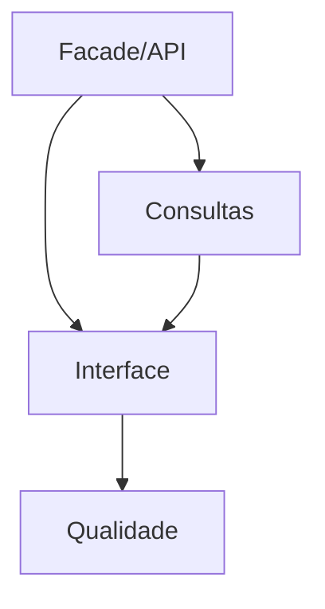

# Tarefas rinosOne — Administração de Autorização

Escopo: API e web protegidas para administrar o modelo base, consultar acesso efetivo/explain e auditoria; gestão web de PLATFORM e políticas avançadas são excluídas.

**Legenda de status:** `[ ]` pendente; `[x]` concluída.  
**Legenda de criticidade:** `[C]` crítico; `[A]` alto; `[M]` médio.

## FASE 1 - Fachada e Contratos Administrativos

### 1.1 Implementar autorização administrativa `[C]`

Ref: Spec FR-AA-001 a 005, `administration-api.md`.

- [x] 1.1.1 Criar permissions administrativas por esfera e adaptar rotas/Policies. <!-- catálogo versionado e AuthorizationAdministrationAuthorizer aplicam TENANT com membership e PLATFORM sem bypass em 2026-09-26 -->
- [x] 1.1.2 Implementar facade transacional para roles, grupos, memberships, assignments e restrictions. <!-- AuthorizationAdministrationFacade centraliza autorização, actor/correlação e delega alterações aos serviços transacionais em 2026-09-27 -->
- [x] 1.1.3 Testar escopo/tenant, compatibilidade e último administrador sem escrita parcial. <!-- facade cobre escopo TENANT/PLATFORM, role incompatível, transferência e retenção atômica do último administrador em 2026-09-27 -->

### 1.2 Publicar API JSON versionada `[A]`

Ref: Spec FR-AA-002 a 004/009/010.

- [x] 1.2.1 Criar requests, controllers e DTOs camelCase para operações permitidas. <!-- AuthorizationAdministrationController e requests cobrem roles, grupos, memberships, assignments e restrictions em 2026-09-27 -->
- [x] 1.2.2 Validar envelope seguro e paridade com tipos TypeScript. <!-- requests usam envelope seguro e administrationApi.ts valida DTOs camelCase em 2026-09-27 -->
- [x] 1.2.3 Cobrir endpoints com testes de contrato e autorização negativa. <!-- contrato exercita todas as escritas, envelopes e negação antes da resolução de alvos em 2026-09-27 -->

## FASE 2 - Consultas Seguras

### 2.1 Projetar effective access e explain `[C]`

Ref: Spec FR-AA-006/007, `data-model.md`.

- [x] 2.1.1 Resolver fatores diretos, grupos, restrictions e relations visíveis. <!-- EffectiveAccessQuery projeta fatores ativos no contexto TENANT sem carregar dados de perfil em 2026-09-27 -->
- [x] 2.1.2 Aplicar filtro administrativo e redigir dados de terceiros. <!-- facade exige leitura antes de resolver sujeito; EffectiveAccessQuery retorna somente fatores do tenant e sem perfis de terceiros em 2026-09-27 -->
- [x] 2.1.3 Testar allow/deny explicado sem vazar recurso ou tenant externo. <!-- API cobre allow, restriction deny e sujeito fora do tenant como indisponível em 2026-09-27 -->

### 2.2 Expor auditoria protegida `[A]`

Ref: Spec FR-AA-008/010.

- [x] 2.2.1 Implementar filtros, paginação e ordenação segura de eventos. <!-- AuthorizationAuditQuery restringe tenant, aplica filtros explícitos, paginação máxima de 50 e ordem determinística em 2026-09-27 -->
- [x] 2.2.2 Incluir operações recusadas por invariantes quando aplicável. <!-- fachadas registram authorization.administration.rejected para remoções administrativas recusadas pelo invariante em 2026-09-27 -->
- [x] 2.2.3 Testar imutabilidade, limites de consulta e isolamento de contexto. <!-- API cobre limite, isolamento e redaction; AuthorizationAuditEventTest cobre imutabilidade em 2026-09-27 -->

## FASE 3 - Interface de Administração

### 3.1 Implementar gestão de segurança `[C]`

Ref: `interface-spec.md` INT-WEB-ADMIN-001.

- [x] 3.1.1 Criar rota, navegação, abas e formulários usando design system/i18n. <!-- destino tenant.authorization-administration integra WorkspaceShell, abas adaptáveis e formulários iniciais em 2026-09-27 -->
- [x] 3.1.2 Implementar estados, confirmação e erro do último administrador. <!-- superfície confirma remoção de membership, preserva estado em conflito e comunica a proteção do último administrador em 2026-09-27 -->
- [x] 3.1.3 Testar API real, teclado, leitor de tela, mobile e desktop. <!-- homologação autenticada confirmou criação de role, confirmação de remoção, viewport desktop/390×844, teclado e árvore semântica com roles/labels/status em 2026-09-27 -->

### 3.2 Implementar consultas de segurança `[A]`

Ref: `interface-spec.md` INT-WEB-ADMIN-001.

- [x] 3.2.1 Criar visualização segura de effective access/explain. <!-- superfície apresenta fatores de autorização, decisão e motivo sem expor snapshots ou perfis de terceiros em 2026-09-27 -->
- [x] 3.2.2 Criar tabela de auditoria filtrável e paginada. <!-- filtro por operação e paginação usam a API tenant-scoped e mantêm a resposta redigida em 2026-09-27 -->
- [x] 3.2.3 Cobrir estados vazio/erro/stale, responsividade e E2E. <!-- testes de componente cobrem vazio/erro/stale; homologação autenticada confirmou criação, effective access e auditoria filtrada nos viewports desktop/390×844 em 2026-09-27 -->

### 3.3 Revalidar capabilities no backend `[A]`

Ref: Spec FR-AA-009, contrato de decisão da fundação.

- [x] 3.3.1 Revalidar capabilities após mutações concluídas. <!-- TenantCapabilityProjection é recalculada pela API após grant/revogação e não é persistida pela interface em 2026-09-27 -->
- [x] 3.3.2 Indicar estado parcial/stale sem usar UI como autoridade. <!-- superfície marca dados como stale durante mutações e só limpa após reconsulta protegida em 2026-09-27 -->
- [x] 3.3.3 Testar revogação refletida na próxima operação real. <!-- teste API confirma capability recalculada e negação da alteração de disponibilidade logo após remoção da role em 2026-09-27 -->

## FASE 4 - Qualidade de Entrega

### 4.1 Consolidar matriz e gates `[C]`

Ref: Spec SC-AA-001 a 004, `quickstart.md`.

- [x] 4.1.1 Mapear FR/SC e INT para evidência de teste. <!-- quickstart.md consolida rastreabilidade de requisitos, critérios e interação para testes em 2026-09-27 -->
- [x] 4.1.2 Executar formatadores, testes, types e build. <!-- Pint, 276 testes PHP/1.100 asserções (2 skips de Mailpit), 131 testes JS, vue-tsc e Vite build aprovados em 2026-09-27 -->
- [x] 4.1.3 Revisar visualmente os wireframes e fluxos responsivos implementados. <!-- revisão autenticada corrigiu a composição das abas e validou os fluxos desktop e mobile em 2026-09-27 -->

## Matriz de Dependências

## Cobertura de Interfaces

| Interação | Tasks | Verificação |
| --- | --- | --- |
| INT-WEB-ADMIN-001 | 3.1 a 3.3 | API, a11y, responsividade, E2E e revogação |

## Resumo Quantitativo

| Fase | Tarefas | Subtarefas |
| --- | ---: | ---: |
| 1 | 2 | 6 |
| 2 | 2 | 6 |
| 3 | 3 | 9 |
| 4 | 1 | 3 |
| **Total** | **8** | **24** |

## Escopo Coberto

Administração tenant, API, UI, effective access, explain, auditoria e revalidação de capabilities.

## Escopo Excluído

Delegação, approval workflow, edição de auditoria e gestão web de administrador PLATFORM.
