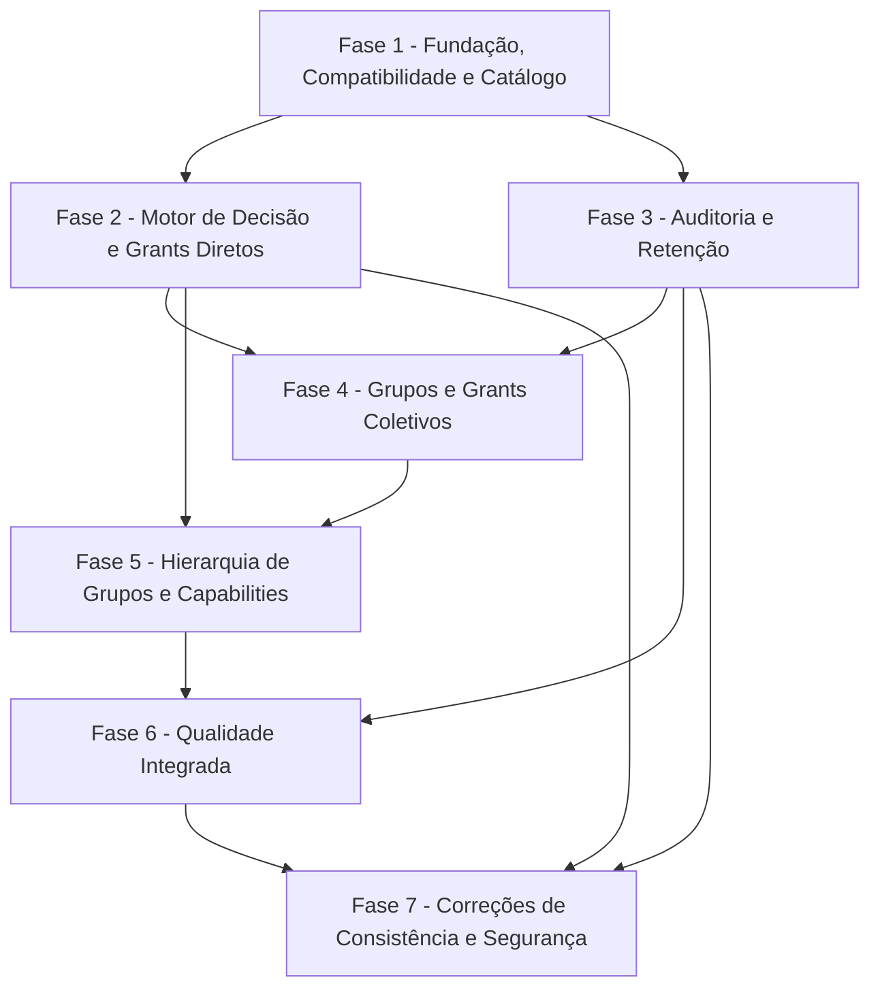

# Tarefas rinosOne — Fundação de Autorização

Escopo: entregar a fundação central de autorização para PLATFORM, PERSONAL e TENANT, com grants diretos e por grupos, auditoria, revogação imediata e capabilities de UX. A autorização por recurso, restrictions, cache distribuído, delegação e administração visual permanecem fora deste backlog.

**Legenda de status:**

- `[ ]` Pendente
- `[~]` Em andamento
- `[x]` Concluído
- `[!]` Bloqueado

**Legenda de criticidade:**

- `[C]` Crítico — impacto de segurança ou operação bloqueante.
- `[A]` Alto — funcionalidade essencial.
- `[M]` Médio — necessário, sem bloquear a fundação inicial.

---

## FASE 1 - Fundação, Compatibilidade e Catálogo

### 1.1 Remover a via legada de autorização OWNER `[C]`

Ref: [Spec §FR-AF-012 a FR-AF-014](spec.md), [Plan §Resumo](plan.md), [Research §Decisão 2](research.md)

- [x] 1.1.1 Remover `OWNER` de membership, contratos, tipos web, interface e documentação de tenants. <!-- validado na transição de 2026-09-25 -->
- [x] 1.1.2 Criar migration compatível que converte memberships existentes em assignments diretos de `tenant.administrator` e remove a coluna legada. <!-- validado em migration e testes de tenant -->
- [x] 1.1.3 Fazer a criação de tenant persistir membership e assignment administrativo na mesma transação. <!-- validado em TenantCreationServiceTest -->
- [x] 1.1.4 Cobrir a transição com testes de criação, listagem, contexto e alteração de disponibilidade. <!-- 14 testes direcionados aprovados em 2026-09-25 -->

### 1.2 Completar o catálogo e o modelo persistente de autorização `[C]`

Ref: [Spec §FR-AF-001, FR-AF-002, FR-AF-007 a FR-AF-011](spec.md), [Data Model §auth_permission a §Relações](data-model.md)

- [x] 1.2.1 Criar valores de domínio para esfera, tipo, estado e resultado de autorização. <!-- validado em enums de Authorization e testes direcionados em 2026-09-26 -->
- [x] 1.2.2 Evoluir migrations, modelos e constraints para permissions, roles, assignments diretos e composição role-permission com campos de estado, descrição e escopo. <!-- validado por migrations incrementais e modelos/serviços em 2026-09-26 -->
- [x] 1.2.3 Garantir no serviço de escrita que role, permission, assignment e tenant respeitam a mesma esfera e contexto. <!-- validado por AuthorizationRolePermissionServiceTest e AuthorizationRoleAssignmentServiceTest em 2026-09-26 -->
- [x] 1.2.4 Definir o catálogo como fonte única e sincronizar toda permission TENANT nova com `tenant.administrator`. <!-- validado em AuthorizationPermissionCatalogTest em 2026-09-26 -->
- [x] 1.2.5 Criar testes de persistência para unicidade, FKs, inativação e incompatibilidade de escopo. <!-- validado por suites de catálogo, role-permission, role-assignment e tenant em 2026-09-26 -->

### 1.3 Configurar retenção e bootstrap administrativo `[C]`

Ref: [Spec §FR-AF-019 a FR-AF-021](spec.md), [Research §Decisões 5 e 7](research.md), [Security Checklist CHK017-CHK018](checklists/security.md)

- [x] 1.3.1 Criar configuração de autorização com retenção de auditoria de 90 dias por padrão e substituição por ambiente. <!-- validado em AuthorizationConfigurationTest em 2026-09-26 -->
- [x] 1.3.2 Documentar o procedimento de infraestrutura para inserir o primeiro assignment PLATFORM diretamente no banco, com usuário verificado e trilha operacional. <!-- documentado em docs/operations/authorization-platform-bootstrap.md em 2026-09-26 -->
- [x] 1.3.3 Impedir no domínio que cadastro, autenticação ou criação de tenant concedam role PLATFORM automaticamente. <!-- validado em TenantCreationServiceTest em 2026-09-26 -->
- [x] 1.3.4 Criar testes de configuração segura e de ausência de promoção automática a PLATFORM. <!-- 13 testes direcionados aprovados em 2026-09-26 -->

---

## FASE 2 - Motor de Decisão e Grants Diretos

### 2.1 Implementar a porta única `check` `[C]`

Ref: [Spec §FR-AF-003 a FR-AF-006](spec.md), [Contract §check](contracts/authorization-decision.md), [Plan §Desenho da Arquitetura](plan.md)

- [x] 2.1.1 Definir o contrato de entrada e saída de decisão, incluindo código seguro de motivo. <!-- implementado por AuthorizationService e AuthorizationDecision em 2026-09-26 -->
- [x] 2.1.2 Resolver grants diretos por role ativa e permission ativa sem varrer usuários ou recursos não relacionados. <!-- implementado por consulta indexada de AuthorizationService em 2026-09-26 -->
- [x] 2.1.3 Validar tenant ativo e membership ativa exclusivamente nas decisões TENANT; rejeitar tenant em PLATFORM e PERSONAL. <!-- validado em AuthorizationServiceTest em 2026-09-26 -->
- [x] 2.1.4 Aplicar default deny em permission desconhecida, inativa ou sem assignment aplicável. <!-- validado em AuthorizationServiceTest em 2026-09-26 -->
- [x] 2.1.5 Criar testes unitários para ALLOW e DENY nas três esferas e para isolamento entre tenants. <!-- 10 testes direcionados aprovados em 2026-09-26 -->

### 2.2 Integrar Policies, Gates e operações contextuais `[C]`

Ref: [Spec §FR-AF-014 e FR-AF-016](spec.md), [Plan §Arquitetura das Superfícies](plan.md)

- [x] 2.2.1 Adaptar Policies/Gates para delegar ao contrato de autorização, sem consulta direta das tabelas pelos controllers. <!-- TenantController delega a AuthorizationService em 2026-09-26 -->
- [x] 2.2.2 Substituir o check provisório de disponibilidade por `check` e proteger toda nova operação contextual pela mesma porta. <!-- adaptador provisório removido em 2026-09-26 -->
- [x] 2.2.3 Reavaliar acesso em cada requisição protegida, sem gravar permissions ou decisões efetivas na sessão. <!-- validado por capability real e nova decisão no endpoint em 2026-09-26 -->
- [x] 2.2.4 Criar testes de feature para remoção de grant e negação na próxima requisição autenticada. <!-- validado em TenantApiTest em 2026-09-26 -->

### 2.3 Preservar o último administrador de tenant `[C]`

Ref: [Spec §User Story 4 e FR-AF-013](spec.md), [Data Model §auth_role](data-model.md)

- [x] 2.3.1 Implementar operações transacionais para atribuir, transferir, inativar e remover assignments diretos de `tenant.administrator`. <!-- implementado por AuthorizationRoleAssignmentService em 2026-09-26 -->
- [x] 2.3.2 Rejeitar remoção ou inativação que deixe tenant sem pessoa com membership ativa e role administrativa direta. <!-- validado em AuthorizationRoleAssignmentServiceTest em 2026-09-26 -->
- [x] 2.3.3 Impedir atribuição administrativa a pessoa sem membership ativa no tenant. <!-- validado em AuthorizationRoleAssignmentServiceTest em 2026-09-26 -->
- [x] 2.3.4 Criar testes de concorrência e de transferência do último administrador. <!-- transferência validada; serviço usa transação e lockForUpdate para serializar remoções concorrentes em 2026-09-26 -->

---

## FASE 3 - Auditoria e Retenção

### 3.1 Registrar eventos de alteração de autorização `[C]`

Ref: [Spec §FR-AF-015](spec.md), [Data Model §auth_audit_event](data-model.md), [Research §Decisão 5](research.md)

- [x] 3.1.1 Criar persistência append-only de evento com ator, tenant quando aplicável, operação, alvo, antes, depois e correlação. <!-- implementado por auth_audit_event e AuthorizationAuditEvent em 2026-09-26 -->
- [x] 3.1.2 Acoplar a escrita do evento à mesma transação de roles, memberships, groups e assignments. <!-- roles, assignments, groups e lifecycle administrativo de memberships usam eventos transacionais em 2026-09-26 -->
- [x] 3.1.3 Filtrar segredos, tokens, senhas e conteúdo desnecessário antes de persistir os campos de mudança. <!-- AuthorizationAuditLogger descarta chaves sensíveis recursivamente em 2026-09-26 -->
- [x] 3.1.4 Criar testes de atomicidade, imutabilidade aplicacional e ausência de campos sensíveis. <!-- validado em AuthorizationAuditEventTest em 2026-09-26 -->

### 3.2 Executar a retenção diária da auditoria `[A]`

Ref: [Spec §FR-AF-019](spec.md), [Plan §Configuração operacional](plan.md)

- [x] 3.2.1 Implementar comando de retenção que use `auditRetentionDays` e exclua somente eventos vencidos. <!-- implementado por AuthorizationAuditRetentionService e authorization:purge-audit-events em 2026-09-26 -->
- [x] 3.2.2 Registrar o comando no agendamento diário sem afetar o caminho de decisão de acesso. <!-- agendado diariamente em routes/console.php em 2026-09-26 -->
- [x] 3.2.3 Cobrir retenção padrão, valor substituído por ambiente e falha segura da rotina com testes. <!-- validado em AuthorizationAuditRetentionTest em 2026-09-26 -->

---

## FASE 4 - Grupos e Grants Coletivos

### 4.1 Introduzir grupos com membros pessoas `[A]`

Ref: [Spec §FR-AF-009 a FR-AF-011](spec.md), [Data Model §auth_group](data-model.md)

- [x] 4.1.1 Criar modelos, migrations e constraints para groups ativos e associação de pessoas. <!-- implementado por auth_group, auth_group_user e AuthorizationGroup em 2026-09-26 -->
- [x] 4.1.2 Validar compatibilidade de esfera, tenant e membership ao incluir pessoa em grupo TENANT. <!-- validado por AuthorizationGroupService em 2026-09-26 -->
- [x] 4.1.3 Criar serviços transacionais para adicionar, remover e inativar grupos e memberships de grupo. <!-- implementado por AuthorizationGroupService, com eventos de auditoria transacionais, em 2026-09-26 -->
- [x] 4.1.4 Criar testes de isolamento entre tenants, inativação e membro inválido. <!-- validado em AuthorizationGroupServiceTest em 2026-09-26 -->

### 4.2 Conceder roles a grupos `[A]`

Ref: [Spec §User Story 2 e FR-AF-009 a FR-AF-011](spec.md), [Data Model §Relações de grupo e assignment](data-model.md)

- [x] 4.2.1 Criar persistência e serviço para atribuir role compatível a grupo. <!-- implementado por auth_group_role_assignment e AuthorizationGroupRoleAssignmentService em 2026-09-26 -->
- [x] 4.2.2 Estender `check` para unir grants diretos e grants de grupos ativos. <!-- AuthorizationService resolve grants diretos ou por grupos ativos em 2026-09-26 -->
- [x] 4.2.3 Garantir revogação na próxima decisão após remover membro ou role de grupo. <!-- validado por remoção de membro e inativação de grant em AuthorizationGroupRoleAssignmentTest -->
- [x] 4.2.4 Criar testes unitários e de feature para multi-group, união de permissions e revogação. <!-- validado em AuthorizationGroupRoleAssignmentTest em 2026-09-26 -->

---

## FASE 5 - Hierarquia de Grupos e Capabilities

### 5.1 Suportar grupos aninhados sem ciclos `[C]`

Ref: [Spec §User Story 2, FR-AF-010 e FR-AF-011](spec.md), [Research §Decisão 4](research.md)

- [x] 5.1.1 Criar relação pai-filho entre grupos com FKs e compatibilidade de esfera e tenant. <!-- implementado por auth_group_group e AuthorizationGroupHierarchyService em 2026-09-26 -->
- [x] 5.1.2 Implementar verificação transacional de alcance antes de inserir relação que possa criar ciclo. <!-- verificação recursiva e locks determinísticos implementados em AuthorizationGroupHierarchyService -->
- [x] 5.1.3 Estender a resolução de grants para percorrer hierarquia válida e interromper ao encontrar elemento inativo. <!-- AuthorizationService usa CTE recursiva de filho para ancestrais ativos em 2026-09-26 -->
- [x] 5.1.4 Criar testes para herança direta, cadeia múltipla, ciclo direto, ciclo indireto e revogação por hierarquia. <!-- validado em AuthorizationGroupHierarchyTest em 2026-09-26 -->

### 5.2 Projetar capabilities mínimas para tenant e workspace `[A]`

Ref: [Spec §FR-AF-016](spec.md), [Contract §Capabilities de workspace](contracts/authorization-decision.md), [Quickstart §Cenário 5](quickstart.md)

- [x] 5.2.1 Remover role da resposta de tenant e expor `canManageAvailability` como capability de UX. <!-- validado em contratos, parser e testes de tenant -->
- [x] 5.2.2 Centralizar a projeção de capabilities por contexto para impedir duplicação de checks em controllers. <!-- TenantCapabilityProjection centraliza a derivação de canManageAvailability em 2026-09-26 -->
- [x] 5.2.3 Atualizar parser, tipos, store e componentes web para consumir somente capabilities necessárias. <!-- summaries e contextos exigem a capability booleana; TenantManagementDialog não infere privilégios em 2026-09-26 -->
- [x] 5.2.4 Criar testes de contrato e componente para capability presente, ausente e revogada durante sessão. <!-- validado por TenantApiTest, tenantContextStore.spec.ts e TenantManagementDialog.spec.ts em 2026-09-26 -->
- [x] 5.2.5 Executar roundtrip real API-web sem depender de fixture para validar shape e decisão repetida no backend. <!-- API real reavalia capability após revogação em TenantApiTest; parser e componentes validam o contrato obrigatório em 2026-09-26 -->

---

## FASE 6 - Qualidade Integrada e Prontidão de Entrega

### 6.1 Consolidar a matriz de testes de autorização `[C]`

Ref: [Spec §Critérios de Sucesso](spec.md), [Plan §Validação Planejada](plan.md), [Requirements Checklist CHK011-CHK014](checklists/requirements.md)

- [x] 6.1.1 Mapear cada FR-AF e SC-AF a teste unitário, feature, contrato, interface ou E2E. <!-- matriz criada em test-matrix.md em 2026-09-26 -->
- [x] 6.1.2 Cobrir default deny, allow, isolamento de tenant, grants diretos, grupos, grupos aninhados, revogação e último administrador. <!-- cobertura consolidada na matriz e validada pela suíte PHP em 2026-09-26 -->
- [x] 6.1.3 Cobrir auditoria, retenção, bootstrap PLATFORM e não enumeração de contexto inválido. <!-- AuthorizationAudit*, TenantCreationServiceTest e TenantApiTest cobrem os cenários em 2026-09-26 -->
- [x] 6.1.4 Executar suites backend, frontend, tipagem, lint/formatação e build de produção, registrando evidências. <!-- resultados em test-matrix.md; E2E executado no Chrome local em 2026-09-26 -->

### 6.2 Validar contratos e experiência de capability `[A]`

Ref: [Plan §Convenções de Borda](plan.md), [Quickstart §Cenário 5](quickstart.md)

- [x] 6.2.1 Validar que payloads reais usam `BIGINT` numérico, camelCase e booleans de capability conforme contrato. <!-- TenantApiTest valida o payload HTTP real em 2026-09-26 -->
- [x] 6.2.2 Executar cenário E2E de tenant com capability administrativa, remoção de grant e nova operação negada. <!-- Playwright no Chrome local valida a revogação e o 403; backend real é validado por TenantApiTest em 2026-09-26 -->
- [x] 6.2.3 Verificar teclado, toque, feedback seguro e textos localizados na ação de disponibilidade já existente. <!-- TenantManagementDialog.spec.ts valida botão nativo, clique, feedback seguro e localização em 2026-09-26 -->

### 6.3 Verificar custo de decisão inicial `[M]`

Ref: [Plan §Contexto Técnico](plan.md), [Spec §FR-AF-018](spec.md)

- [x] 6.3.1 Criar cenários representativos de decisão direta, por grupo e por grupo aninhado sem cache. <!-- três cenários executados em Authorization*Test em 2026-09-26 -->
- [x] 6.3.2 Verificar planos de consulta e garantir ausência de loop por recurso ou varredura global de usuários. <!-- EXPLAIN real em MySQL confirma buscas indexadas direta e por CTE; evidência em performance-baseline.md em 2026-09-26 -->
- [x] 6.3.3 Registrar baseline de resultados para orientar a futura spec `authorization-performance`. <!-- documentado em performance-baseline.md em 2026-09-26 -->

---

## FASE 7 - Correções de Consistência e Segurança

### 7.1 Delimitar roles próprias de tenant `[C]`

Ref: [Spec §FR-AF-008](spec.md), [Data Model §auth_role](data-model.md)

- [x] 7.1.1 Persistir o tenant proprietário de uma role customizada sem alterar roles globais de sistema ou da plataforma. <!-- migration 2026_09_26_000008 e AuthorizationRole em 2026-09-26 -->
- [x] 7.1.2 Recusar grants diretos e para grupos que tentem usar uma role própria fora do tenant proprietário. <!-- validado em AuthorizationRoleAssignmentServiceTest e AuthorizationGroupRoleAssignmentTest em 2026-09-26 -->
- [x] 7.1.3 Cobrir isolamento de role própria de tenant por testes automatizados. <!-- 2 testes de rejeição aprovados em 2026-09-26 -->

### 7.2 Tornar o ciclo de vida de membership transacional e auditável `[C]`

Ref: [Spec §FR-AF-013 a FR-AF-015](spec.md), [Data Model §auth_audit_event](data-model.md)

- [x] 7.2.1 Centralizar ativação, desativação e remoção de membership em serviço transacional com evento de auditoria. <!-- TenantMembershipService em 2026-09-26 -->
- [x] 7.2.2 Preservar administrador direto e ativo ao alterar membership, inclusive sob lock de escrita. <!-- TenantAdministratorInvariant e TenantMembershipServiceTest em 2026-09-26 -->
- [x] 7.2.3 Cobrir revogação imediata, reativação, auditoria e recusa do último administrador. <!-- TenantMembershipServiceTest: 3 cenários aprovados em 2026-09-26 -->

---

## Matriz de Dependências

## Cobertura de Interfaces

| Surface ID | Cobertura | IDs de interação | Tarefas |
| --- | --- | --- | --- |
| API-HTTP-V1 | FULL | N/A — sem nova superfície humana | 2.1, 2.2, 2.3, 3.1, 6.1 |
| SURF-WEB-ACCESS | PARTIAL | N/A — capabilities em superfície existente | 5.2, 6.2 |
| SURF-FUTURE-CONSUMERS | DEFERRED | N/A | Nenhuma nesta feature |

## Resumo Quantitativo

| Fase | Tarefas | Subtarefas | Criticidade |
| --- | ---: | ---: | --- |
| 1 - Fundação, Compatibilidade e Catálogo | 3 | 13 | C |
| 2 - Motor de Decisão e Grants Diretos | 3 | 13 | C |
| 3 - Auditoria e Retenção | 2 | 7 | C/A |
| 4 - Grupos e Grants Coletivos | 2 | 8 | A |
| 5 - Hierarquia de Grupos e Capabilities | 2 | 9 | C/A |
| 6 - Qualidade Integrada e Prontidão de Entrega | 3 | 10 | C/A/M |
| 7 - Correções de Consistência e Segurança | 2 | 6 | C |
| **Total** | **17** | **66** | - |

## Escopo Coberto

| Item | Descrição | Fase |
| --- | --- | --- |
| AUTH-FOUND-01 | Migração de OWNER para role administrativa protegida e catálogo de autorização | 1 |
| AUTH-FOUND-02 | Decisão central por escopo, grants diretos e último administrador | 2 |
| AUTH-FOUND-03 | Auditoria transacional e retenção configurável | 3 |
| AUTH-FOUND-04 | Groups, assignments coletivos e revogação | 4 |
| AUTH-FOUND-05 | Hierarquia de groups e capabilities de UX | 5 |
| AUTH-FOUND-06 | Testes, contratos, E2E e baseline de custo | 6 |
| AUTH-FOUND-07 | Isolamento de role própria e ciclo de vida seguro de membership | 7 |

## Escopo Excluído

| Item | Descrição | Motivo |
| --- | --- | --- |
| AUTH-EXC-01 | Restrictions e explicit deny | Pertencem à spec `authorization-restrictions`. |
| AUTH-EXC-02 | Autorizações e compartilhamentos por recurso | Pertencem à spec `resource-authorization`. |
| AUTH-EXC-03 | Interface de administração de segurança e `explain()` | Pertencem à spec `authorization-administration`. |
| AUTH-EXC-04 | Cache distribuído, policy version, métricas e otimização em escala | Pertencem à spec `authorization-performance`. |
| AUTH-EXC-05 | Regras contextuais, delegação avançada e integração com motor externo | Pertencem à spec `advanced-authorization-policies`. |
