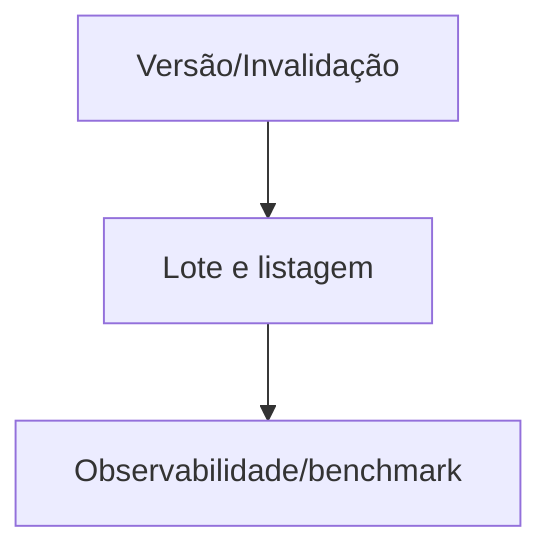

# Tarefas rinosOne — Performance de Autorização

Escopo: cache descartável, versionamento de política, lote, listagem agregada, benchmark e observabilidade segura.

**Legenda de status:** `[ ]` pendente; `[x]` concluída.  
**Legenda de criticidade:** `[C]` crítico; `[A]` alto; `[M]` médio.

## FASE 1 - Versão e Invalidação

### 1.1 Modelar versão de política `[C]`

Ref: Spec FR-AP-001 a 004, `data-model.md`.

- [ ] 1.1.1 Persistir/resolver versões por sujeito e contexto com BIGINT.
- [ ] 1.1.2 Associar toda decisão cacheável à versão atual.
- [ ] 1.1.3 Testar perda de cache e equivalência com fonte persistente.

### 1.2 Invalidar todas as origens de mudança `[C]`

Ref: Spec FR-AP-003/004.

- [ ] 1.2.1 Publicar invalidação transacional para grants, grupos, membership, restriction e relation.
- [ ] 1.2.2 Integrar políticas, delegações, aprovação, SoD, service account e directory sync.
- [ ] 1.2.3 Testar próxima operação após cada tipo de alteração concorrente.

## FASE 2 - Resoluções Agregadas

### 2.1 Implementar check em lote `[A]`

Ref: Spec FR-AP-005, `contracts/decision-performance.md`.

- [ ] 2.1.1 Definir limite e validação do payload de lote.
- [ ] 2.1.2 Reutilizar resolvedores sem alterar semântica individual.
- [ ] 2.1.3 Criar teste de equivalência por matriz de contexto/recurso.

### 2.2 Implementar listagem autorizada escalável `[C]`

Ref: Spec FR-AP-006/007.

- [ ] 2.2.1 Projetar consultas/adaptadores por tipo de recurso sem N+1 de check.
- [ ] 2.2.2 Preservar default deny e restrictions com/sem cache.
- [ ] 2.2.3 Validar subconjunto autorizado em massa e plano de consulta.

## FASE 3 - Observabilidade e Qualidade

### 3.1 Instrumentar métricas seguras `[M]`

Ref: Spec FR-AP-008/009.

- [ ] 3.1.1 Emitir métricas agregadas de decisão, duração, cache e lote.
- [ ] 3.1.2 Separar negação esperada de falha interna.
- [ ] 3.1.3 Testar ausência de labels ou logs de alta cardinalidade/sensíveis.

### 3.2 Manter benchmark de autorização `[A]`

Ref: Spec FR-AP-010 a 012, `quickstart.md`.

- [ ] 3.2.1 Criar cenários reprodutíveis de check, grupo, recurso, lote e listagem.
- [ ] 3.2.2 Registrar baseline e limiares de regressão.
- [ ] 3.2.3 Executar automação completa e documentar resultado.

## Matriz de Dependências

## Cobertura de Interfaces

N/A — mudanças são transparentes às telas existentes; não há interação humana nova.

## Resumo Quantitativo

| Fase | Tarefas | Subtarefas |
| --- | ---: | ---: |
| 1 | 2 | 6 |
| 2 | 2 | 6 |
| 3 | 2 | 6 |
| **Total** | **6** | **18** |

## Escopo Coberto

Correção com cache, invalidação, lote, listagem, benchmark e métricas.

## Escopo Excluído

Painel operacional externo, cache como autoridade e chaveiro de permissions em sessão.
