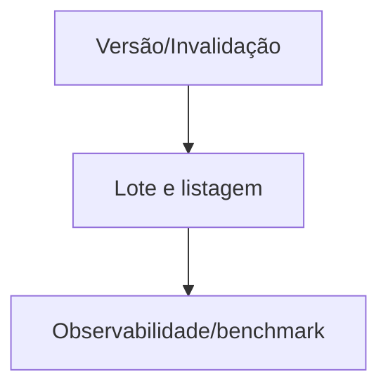

# Tarefas rinosOne — Performance de Autorização

Escopo: cache descartável, versionamento de política, lote, listagem agregada, benchmark e observabilidade segura.

**Legenda de status:** `[ ]` pendente; `[x]` concluída.  
**Legenda de criticidade:** `[C]` crítico; `[A]` alto; `[M]` médio.

## FASE 1 - Versão e Invalidação

### 1.1 Modelar versão de política `[C]`

Ref: Spec FR-AP-001 a 004, `data-model.md`.

- [x] 1.1.1 Persistir/resolver versões por sujeito e contexto com BIGINT. <!-- auth_policy_version e PolicyVersionService mantêm versão monotônica por esfera/contexto, com tenant BIGINT e teste de persistência em 2026-09-27 -->
- [x] 1.1.2 Associar toda decisão cacheável à versão atual. <!-- AuthorizationService usa chave SHA-256 com principal, contexto, recurso e versões de política tenant/global; cache é dispensável em 2026-09-27 -->
- [x] 1.1.3 Testar perda de cache e equivalência com fonte persistente. <!-- PolicyVersionServiceTest confirma allow após Cache::flush e deny imediato após restriction invalidar a versão em 2026-09-27 -->

### 1.2 Invalidar todas as origens de mudança `[C]`

Ref: Spec FR-AP-003/004.

- [x] 1.2.1 Publicar invalidação transacional para grants, grupos, membership, restriction e relation. <!-- serviços de role, grupo/hierarquia, membership, restriction e relation incrementam versão na mesma transação da mutação em 2026-09-27 -->
- [ ] 1.2.2 Integrar políticas, delegações, aprovação, SoD, service account e directory sync.
- [ ] 1.2.3 Testar próxima operação após cada tipo de alteração concorrente.

## FASE 2 - Resoluções Agregadas

### 2.1 Implementar check em lote `[A]`

Ref: Spec FR-AP-005, `contracts/decision-performance.md`.

- [x] 2.1.1 Definir limite e validação do payload de lote. <!-- CheckResourceAuthorizationBatchRequest limita a 100 verificações, valida referências opcionais e mantém envelope 422 em 2026-09-27 -->
- [x] 2.1.2 Reutilizar resolvedores sem alterar semântica individual. <!-- AuthorizationService::checkBatch pré-carrega permissions e delega cada decisão a check(), mantendo a fonte de semântica única em 2026-09-27 -->
- [x] 2.1.3 Criar teste de equivalência por matriz de contexto/recurso. <!-- ResourceAuthorizationApiTest cobre recurso compartilhado/privado e ação TENANT com e sem contexto, preservando ordem e códigos de decisão em 2026-09-27 -->

### 2.2 Implementar listagem autorizada escalável `[C]`

Ref: Spec FR-AP-006/007.

- [x] 2.2.1 Projetar consultas/adaptadores por tipo de recurso sem N+1 de check. <!-- AuthorizedPersonalWorkspaceFolderQuery mantém adaptador por personal.folder com CTEs de grupos, relações e descendentes em uma única consulta em 2026-09-27 -->
- [x] 2.2.2 Preservar default deny e restrictions com/sem cache. <!-- listagem usa fonte persistente, default deny e NOT EXISTS para restrictions ativas de usuário/grupo antes de retornar qualquer pasta em 2026-09-27 -->
- [x] 2.2.3 Validar subconjunto autorizado em massa e plano de consulta. <!-- ResourceAuthorizationApiTest compara subconjunto, cobre restriction e confirma uma query para 30 candidatos em 2026-09-27 -->

## FASE 3 - Observabilidade e Qualidade

### 3.1 Instrumentar métricas seguras `[M]`

Ref: Spec FR-AP-008/009.

- [x] 3.1.1 Emitir métricas agregadas de decisão, duração, cache e lote. <!-- AuthorizationMetrics registra contadores estáveis no cache e AuthorizationService instrumenta check/checkBatch em 2026-09-27 -->
- [x] 3.1.2 Separar negação esperada de falha interna. <!-- decision:deny representa negação esperada; failure:count só é registrado em exceção de resolução em 2026-09-27 -->
- [x] 3.1.3 Testar ausência de labels ou logs de alta cardinalidade/sensíveis. <!-- AuthorizationMetricsTest valida catálogo fechado de métricas sem IDs, tenant, permission ou resource labels em 2026-09-27 -->

### 3.2 Manter benchmark de autorização `[A]`

Ref: Spec FR-AP-010 a 012, `quickstart.md`.

- [x] 3.2.1 Criar cenários reprodutíveis de check, grupo, recurso, lote e listagem. <!-- AuthorizationPerformanceBenchmarkTest usa SQLite efêmero e cobre check direto, grupo aninhado, recurso, lote, listagem e invalidação em 2026-09-27 -->
- [x] 3.2.2 Registrar baseline e limiares de regressão. <!-- authorization.benchmarkMaxMilliseconds define orçamento reproduzível de 1.000 ms por cenário; não é SLA de produção, em 2026-09-27 -->
- [x] 3.2.3 Executar automação completa e documentar resultado. <!-- php artisan test: 284 aprovados, 2 integrações Mailpit ignoradas por configuração; benchmark, type-check, build e git diff --check passaram em 2026-09-27 -->

## Matriz de Dependências

## Cobertura de Interfaces

N/A — mudanças são transparentes às telas existentes; não há interação humana nova.

## Resumo Quantitativo

| Fase | Tarefas | Subtarefas |
| --- | ---: | ---: |
| 1 | 2 | 6 |
| 2 | 2 | 6 |
| 3 | 2 | 6 |
| **Total** | **6** | **18** |

## Escopo Coberto

Correção com cache, invalidação, lote, listagem, benchmark e métricas.

## Escopo Excluído

Painel operacional externo, cache como autoridade e chaveiro de permissions em sessão.
