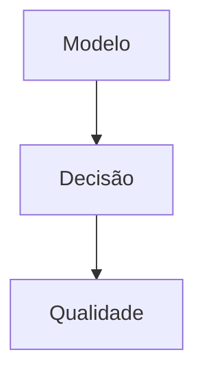

# Tarefas rinosOne — Restrições de Autorização

Escopo: implementar negação explícita por pessoa/grupo, esfera, tenant e vigência; administração web permanece em `authorization-administration`.

**Legenda de status:** `[ ]` pendente; `[x]` concluída.  
**Legenda de criticidade:** `[C]` crítico; `[A]` alto; `[M]` médio.

## FASE 1 - Modelo e Invariantes

### 1.1 Persistir restriction compatível `[C]`

Ref: Spec FR-AR-001 a 004, `data-model.md`.

- [x] 1.1.1 Criar migration/modelo core com BIGINT, sujeito exclusivo e índices de contexto. <!-- auth_restriction em 2026-09-26 -->
- [x] 1.1.2 Validar esfera, tenant, permission, grupo e sujeito no serviço transacional. <!-- AuthorizationRestrictionService em 2026-09-26 -->
- [x] 1.1.3 Cobrir unicidade lógica e isolamento entre tenants em testes de persistência. <!-- AuthorizationRestrictionServiceTest em 2026-09-26 -->

### 1.2 Controlar vigência e auditoria `[C]`

Ref: Spec FR-AR-008 a 011.

- [x] 1.2.1 Implementar estado, início inclusivo e fim exclusivo. <!-- AuthorizationRestriction::isEffectiveAt em 2026-09-26 -->
- [x] 1.2.2 Registrar eventos append-only para toda alteração e remoção. <!-- AuthorizationRestrictionService em 2026-09-26 -->
- [x] 1.2.3 Testar fronteiras temporais e ausência de dados sensíveis em auditoria. <!-- AuthorizationRestrictionServiceTest em 2026-09-26 -->

## FASE 2 - Decisão e Integração

### 2.1 Resolver restrictions aplicáveis `[C]`

Ref: Spec FR-AR-005 a 007, `contracts/restrictions.md`.

- [x] 2.1.1 Resolver vínculos diretos e por grupos ativos/hierárquicos. <!-- AuthorizationService resolve restriction direta e CTE de grupos em 2026-09-26 -->
- [x] 2.1.2 Integrar a consulta antes de grants na porta `check`. <!-- AuthorizationService retorna RESTRICTION_APPLIES antes de qualquer grant em 2026-09-26 -->
- [x] 2.1.3 Testar precedence contra role direta, grupo e `tenant.administrator`. <!-- AuthorizationServiceTest cobre role administrativa e restriction por grupo em 2026-09-26 -->

### 2.2 Garantir revogação imediata `[A]`

Ref: Spec FR-AR-010 a 014.

- [x] 2.2.1 Atualizar capabilities somente por decisão atual. <!-- TenantCapabilityProjection usa AuthorizationService a cada contexto em 2026-09-26 -->
- [x] 2.2.2 Verificar desativação/remoção na próxima operação real. <!-- TenantApiTest valida capability e endpoint após desativação/remoção em 2026-09-26 -->
- [x] 2.2.3 Testar motivo seguro sem enumeração de vínculos. <!-- TenantApiTest valida envelope 403 sem detalhe de restriction em 2026-09-26 -->

## FASE 3 - Qualidade Integrada

### 3.1 Consolidar matriz de regressão `[C]`

Ref: Spec SC-AR-001 a 004, `quickstart.md`.

- [x] 3.1.1 Mapear cada FR/SC para testes unitários, feature ou contrato. <!-- matriz criada em test-matrix.md em 2026-09-26 -->
- [x] 3.1.2 Executar formatação, testes backend/frontend, tipos e build. <!-- validação final registrada em test-matrix.md em 2026-09-26 -->
- [x] 3.1.3 Verificar que não há dependência de sessão, job ou credencial externa. <!-- decisão recalculada pelo AuthorizationService em cada operação em 2026-09-26 -->

## Matriz de Dependências

## Cobertura de Interfaces

N/A — não há interação nova; a interface administrativa é entregue por `authorization-administration`.

## Resumo Quantitativo

| Fase | Tarefas | Subtarefas |
| --- | ---: | ---: |
| 1 | 2 | 6 |
| 2 | 2 | 6 |
| 3 | 1 | 3 |
| **Total** | **5** | **15** |

## Escopo Coberto

Restrictions por pessoa/grupo, escopo, vigência, precedência, auditoria e revogação.

## Escopo Excluído

Restrictions por recurso, condições contextuais, delegação, agendamento e gestão web.
