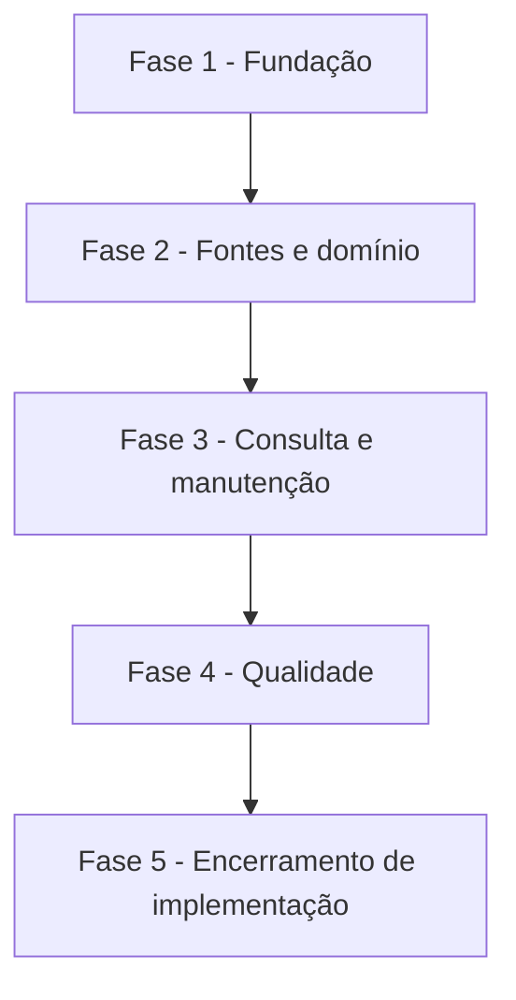

# Backlog — Serviço Indicadores Econômicos

**Origem**: `economic-indicators/spec.md` e `plan.md`
**Legenda**: `[C]` crítico, `[A]` alto, `[M]` médio.

## FASE 1 - Fundação global

### 1.1 Persistência e catálogo de séries [C]

Ref: spec.md FR-EI-001 a 006; data-model.md.

- [x] 1.1.1 Criar migration core para séries, observações e cotações PTAX. <!-- Migration 2026_10_01_000001 validada com migrate:global --pretend. O histórico de execução existente é a evidência operacional da sincronização. -->
- [x] 1.1.2 Criar modelos globais e constraints de vigência, revisão e identidade de fonte. <!-- Modelos globais criados; revisão e vigência usam chave única de corrente. -->
- [x] 1.1.3 Semear o catálogo aprovado de indicadores e PTAX USD/EUR de modo idempotente. <!-- O catálogo é reconciliado em cada sincronização; teste cobre as sete séries. -->
- [x] 1.1.4 Criar testes de migration, índices e invariantes de revisão. <!-- Migration validada em modo pretend; teste cobre identidade, vigência e revisão. -->

## FASE 2 - Fontes e domínio [C]

### 2.1 Adaptadores BCB e sincronização [C]

Ref: spec.md FR-EI-002 a 006, 009 a 012; research.md.

- [x] 2.1.1 Criar contratos e registros normalizados para SGS e PTAX.
- [x] 2.1.2 Implementar adaptador SGS para SELIC, IPCA, IGP-M, INCC e poupança.
- [x] 2.1.3 Implementar adaptador PTAX de fechamento para USD e EUR.
- [x] 2.1.4 Implementar sincronização idempotente, revisão preservada e falha segura.
- [x] 2.1.5 Criar testes de fonte simulada, repetição, revisão e dados inválidos.
- [x] 2.1.6 Carregar o histórico completo na primeira sincronização, em janelas idempotentes compatíveis com o limite da fonte. <!-- Datas iniciais por série e janelas de até 3.650 dias; teste cobre o percurso de janelas. -->

## FASE 3 - Consulta interna e manutenção [A]

### 3.1 Serviços internos e integração ao Hub [A]

Ref: spec.md FR-EI-007, FR-EI-INFRA-SCHED e FR-EI-INFRA-IDEMP; contracts/economic-indicator-internal.md.

- [x] 3.1.1 Criar serviço interno de consulta de indicador e PTAX sem acesso direto por consumidores.
- [x] 3.1.2 Criar rotina de manutenção com lock, histórico, auditoria manual e retenção existente.
- [x] 3.1.3 Registrar permissões, integrar rotina ao Hub e expor apenas estado técnico seguro.
- [x] 3.1.4 Agendar a atualização diária idempotente e validar o scheduler. <!-- schedule:list confirmou maintenance.economic-indicators diariamente. -->
- [x] 3.1.5 Criar testes de consulta, rotina, autorização, Hub e agenda.

## FASE 4 - Qualidade [A]

### 4.1 Validação integrada [A]

Ref: quickstart.md; critérios SC-EI-001 a SC-EI-004.

- [x] 4.1.1 Executar testes PHP focados e registrar evidência dos cenários críticos. <!-- 19 testes focados, 102 assertions. -->
- [x] 4.1.2 Executar migrations em ambiente de teste e validar o schema global. <!-- migrate:global --pretend validado. -->
- [x] 4.1.3 Executar formatação, testes e build aplicáveis, registrando falhas fora de escopo. <!-- Pint e git diff --check sem pendências. -->
- [x] 4.1.4 Validar a execução operacional limitada da SELIC contra a fonte oficial, com aplicação e workers ativos. <!-- Execução 8 carregou 10.110 observações; execução 11 confirmou Created 0; revised 0 e normalizou automaticamente as revisões de escala, sem correção manual. -->
- [x] 4.1.5 Validar as cargas históricas oficiais restantes e adaptar janelas que a fonte não aceite. <!-- IPCA (559), IGP-M (448), INCC (447), Poupança (4.841), PTAX USD (10.471 vigentes) e EUR (6.219) carregados. Janelas mensais sem lacunas; consultas recentes conferem com BCB. Poupança teve falha transitória; o SGS usa HTTP 200 com envelope 404 e HTTP 404 para período sem publicação. -->

### 4.2 Pré-produção — acumulados de índices [C]

Ref: research.md, seção "Regras matemáticas candidatas".

- [x] 4.2.1 Especificar e implementar a consulta/projeção de acumulado por série, incluindo intervalo, fórmula, precisão, arredondamento, calendário, tratamento de revisão e contrato interno. <!-- Migration 2026_10_01_000003 aplicada; recomposição usa 36 casas internas e persiste 18 com HALF_UP, sem ler acumulados persistidos. Execução 33 recompôs SELIC (10.111), IPCA (559), IGP-M (448) e INCC (447) sem nulos; Poupança (4.841) permanece NO_GLOBAL_ACCUMULATION. -->

## FASE 5 - Encerramento de implementação [A]

### 5.1 Observabilidade, promoção e regressão [A]

- [x] 5.1.1 Registrar e expor pelo Hub detalhes seguros por série, fonte, intervalo, criação, revisão, recomposição e falha. <!-- Testes de rotina, Hub e contrato interno cobrem o resultado por série. -->
- [x] 5.1.2 Atualizar status e métricas do SDD para refletir a implementação concluída. <!-- Spec marcada como validada localmente; totais reconciliados abaixo. -->
- [x] 5.1.3 Documentar e validar o roteiro de promoção controlada no ambiente atual, incluindo migrations, TLS e sincronização idempotente. <!-- Migration 000003 aplicada; execuções 32, 33 e 34 concluídas contra BCB; health check HTTP 200. -->
- [x] 5.1.4 Cobrir por teste automatizado a seleção da CA nativa e a precedência de bundle explícito. <!-- BcbEconomicIndicatorSourceTest cobre as duas políticas sem desativar validação TLS. -->

## Matriz de Dependências

## Cobertura de Interfaces

Não há interface humana nova. A rotina reutiliza o Hub de Manutenções; não há tela de consulta/listagem de valores.

## Resumo Quantitativo

| Fase | Subtarefas | Concluídas |
| --- | ---: | ---: |
| 1 - Fundação global | 4 | 4 |
| 2 - Fontes e domínio | 6 | 6 |
| 3 - Consulta interna e manutenção | 5 | 5 |
| 4 - Qualidade | 6 | 6 |
| 5 - Encerramento de implementação | 4 | 4 |
| Total | 25 | 25 |

## Escopo Coberto

Indicadores globais aprovados, PTAX USD/EUR, sincronização diária, consulta interna e integração ao Hub.

## Escopo Excluído

Conversão financeira, telas de valores, índices adicionais, PTAX de outras moedas e qualquer cálculo de rentabilidade individual de poupança.
