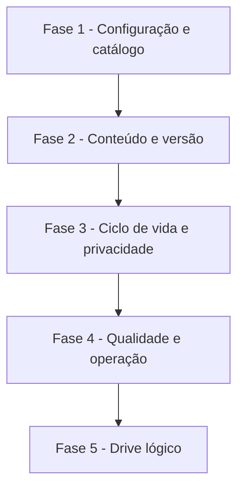

# Tarefas Rinos One — Fundação de armazenamento de arquivos

Escopo: implementar o catálogo global e privado de arquivos, conteúdos, versões, posses, retenção, backends e operações internas, sem interface de drive.

**Legenda de status:**

- `[ ]` Pendente
- `[~]` Em andamento
- `[x]` Concluído
- `[!]` Bloqueado

**Legenda de criticidade:**

- `[C]` Crítico - Impacto financeiro direto, regulatório, segurança, SLA ou operação bloqueante
- `[A]` Alto - Funcionalidade essencial
- `[M]` Médio - Necessário, mas sem urgência imediata

---

## FASE 1 - Configuração e catálogo global

### 1.1 Configurar backends privados e política de retenção `[A]`

Ref: [Plan §Configuração de implantação](plan.md#configuração-de-implantação), Spec FR-FILE-011, 013 e 014

- [x] 1.1.1 Criar configuração versionada de arquivos, disco privado e modelo de variáveis de ambiente comentado.
- [x] 1.1.2 Validar backend padrão, disponibilidade para escrita e relação entre retenção técnica e período de backup.
- [x] 1.1.3 Implementar resolução de backend por chave sem persistir caminho, credencial ou segredo no banco.
- [x] 1.1.4 Cobrir validação de configuração e indisponibilidade de backend por testes automatizados.

### 1.2 Criar migrations do catálogo `file_*` `[A]`

Ref: [Data Model](data-model.md), Spec FR-FILE-001 a FR-FILE-010

- [x] 1.2.1 Criar entidades e migrations core para arquivo, versão, conteúdo, backend e objeto físico com FKs e índices definidos.
- [x] 1.2.2 Criar entidades e migrations core para posse, binding de sistema, uso por proprietário, metadados e relação de derivadas de versão.
- [x] 1.2.3 Garantir invariantes de proprietário exclusivo, versão atual, chave de binding e unicidade de hashes no domínio e persistência.
- [x] 1.2.4 Escrever testes de migration e persistência para relações, índices e invariantes críticos.

## FASE 2 - Conteúdo, versão e armazenamento físico

### 2.1 Implementar ingestão deduplicada e promoção atômica `[A]`

Ref: [Plan §Arquitetura de ingestão](plan.md#arquitetura-de-ingestão), Spec FR-FILE-001 a FR-FILE-005

- [x] 2.1.1 Criar staging privado, cálculo de SHA-256 lógico e detecção confiável de MIME/extensão.
- [x] 2.1.2 Implementar árvore física content-addressed e promoção atômica para o backend resolvido.
- [x] 2.1.3 Resolver concorrência de conteúdo idêntico, garantindo um conteúdo/objeto ativo por representação sem perder pedidos válidos.
- [x] 2.1.4 Cobrir deduplicação, integridade, concorrência e falha durante promoção com testes unitários e de integração.

### 2.2 Implementar versões, posses e contabilidade lógica `[A]`

Ref: [Contrato interno](contracts/file-storage-internal.md), Spec FR-FILE-003 a FR-FILE-010

- [x] 2.2.1 Definir a porta e DTOs `FileStorageV1`, com política de compatibilidade e operações internas versionadas.
- [x] 2.2.2 Implementar ativação e substituição atômica de posse e bindings `SYSTEM_MANAGED`.
- [x] 2.2.3 Atualizar totais workspace, sistema, lixeira e total em todas as transições de posse.
- [x] 2.2.4 Cobrir a compatibilidade de contrato V1 e os cenários A/B de ramificação e múltiplas posses do Quickstart com testes automatizados.

## FASE 3 - Ciclo de vida, privacidade e manutenção

### 3.1 Implementar lixeira, liberação e retenção `[A]`

Ref: Spec FR-FILE-009 a FR-FILE-011, [Plan §Versões, posses e retenção](plan.md#versões-posses-e-retenção)

- [x] 3.1.1 Implementar `trashPossession`, `restorePossession` e `releasePossession`, recusando operações genéricas sobre área gerenciada.
- [x] 3.1.2 Calcular `purgeAfter` e `retentionUntil` pelo maior prazo aplicável, preservando quota na lixeira.
- [x] 3.1.3 Criar jobs agendados para expurgo seguro de versões e objetos sem referência elegível.
- [x] 3.1.4 Cobrir limpeza manual, retenção de backup e preservação de outra posse em testes de integração.

### 3.2 Implementar leitura privada, metadados e reconciliação `[C]`

Ref: Spec FR-FILE-015 a FR-FILE-018, [Research §6](research.md#6-retenção-e-limpeza-são-assíncronas)

- [x] 3.2.1 Implementar `authorizePrivateRead` sem revelar caminhos físicos ou permitir acesso fora do contexto autorizado.
- [x] 3.2.2 Persistir metadados extraídos ou declarados por versão, sem antecipar thumbnails ou listagem de galeria.
- [x] 3.2.3 Reservar e validar a relação de derivada por versão, sem criar gerador, endpoint ou listagem de thumbnails.
- [x] 3.2.4 Criar reconciliação de objetos órfãos e estados `WRITING`/`ORPHANED`, protegida por prazo configurado.
- [x] 3.2.5 Cobrir negação de acesso, integridade, derivadas reservadas e reconciliação em testes de serviço e integração.

### 3.3 Implementar política de compressão reversível `[M]`

Ref: Spec FR-FILE-012, [Research §4](research.md#4-compressão-técnica-é-opcional-e-reversível)

- [x] 3.3.1 Modelar regras configuráveis por MIME type e extensão, com decisão de promover somente quando houver ganho de tamanho.
- [x] 3.3.2 Implementar representação `IDENTITY` e `GZIP` sem alterar hash ou tamanho lógico.
- [x] 3.3.3 Criar job idempotente de reprocessamento retroativo e retenção segura da representação substituída.
- [x] 3.3.4 Cobrir elegibilidade, ausência de ganho e troca de representação com testes automatizados.

## FASE 4 - Qualidade e operação

### 4.1 Validar contratos, jobs e observabilidade técnica `[A]`

Ref: [Quickstart](quickstart.md), Checklist CHK001 a CHK013

- [x] 4.1.1 Implementar testes end-to-end de serviço para dedup, ramificação, binding, lixeira, retenção e leitura privada.
- [x] 4.1.2 Registrar logs técnicos seguros para falhas de backend, integridade, reconciliação e expurgo, sem dados de conteúdo.
- [x] 4.1.3 Documentar comandos operacionais e variáveis de armazenamento para homologação e produção.
- [x] 4.1.4 Executar formatação, testes relevantes, análise estática e build conforme a pipeline do repositório.

---

## FASE 5 - Drive lógico para workspaces

### 5.1 Persistir árvore e vínculo de posse `[C]`

Ref: Spec FR-FILE-022/023; Plan §Drive e pastas lógicas.

- [x] 5.1.1 Criar migration incremental, modelos e constraints para pasta com proprietário exclusivo, pai compatível e nome único entre irmãos ativos. <!-- migration 000011 e WorkspaceFolder em 2026-09-26 -->
- [x] 5.1.2 Vincular posse `WORKSPACE` à pasta opcional do mesmo proprietário, mantendo raiz implícita quando nula. <!-- idWorkspaceFolder e validação de proprietário em 2026-09-26 -->
- [x] 5.1.3 Cobrir isolamento usuário/tenant, ciclos, unicidade e referência de posse inválida em testes de persistência. <!-- FileWorkspaceFolderPersistenceTest em 2026-09-26 -->

### 5.2 Implementar lifecycle recursivo `[C]`

Ref: Spec FR-FILE-023; Plan §Drive e pastas lógicas.

- [x] 5.2.1 Criar, mover, renomear e listar árvore de pastas com transações e locks. <!-- WorkspaceFolderService serializa alterações pelo lock do proprietário em 2026-09-26 -->
- [x] 5.2.2 Enviar e restaurar recursivamente pasta, descendentes e posses em conjunto com a lixeira. <!-- WorkspaceFolderService em 2026-09-26 -->
- [x] 5.2.3 Testar restauro, retenção, concorrência e ausência de alteração parcial. <!-- restauro, retenção e rollback cobertos; lock transacional confirmado em duas conexões MySQL em 2026-09-26 -->

### 5.3 Integrar como recurso compartilhável `[A]`

Ref: resource-authorization FR-RA-002/004/009; Plan §Drive e pastas lógicas.

- [x] 5.3.1 Registrar adaptadores `personal.folder` e `tenant.folder` no registry de recursos. <!-- WorkspaceFolderAuthorizationResourceAdapter em 2026-09-26 -->
- [x] 5.3.2 Validar existência, proprietário e herança de relation para descendentes sem confiar no cliente. <!-- adapter e decisão canônica validam recurso e herança em 2026-09-26 -->
- [x] 5.3.3 Cobrir compartilhamento de leitura/escrita, herança e revogação em testes de integração. <!-- AuthorizationResourceRelationServiceTest cobre READ/EDIT herdados e revogação independente em 2026-09-26 -->

---

## Matriz de Dependências

## Resumo Quantitativo

| Fase | Tarefas | Subtarefas | Criticidade |
| --- | ---: | ---: | --- |
| 1 - Configuração e catálogo global | 2 | 8 | A |
| 2 - Conteúdo, versão e armazenamento físico | 2 | 8 | A |
| 3 - Ciclo de vida, privacidade e manutenção | 3 | 13 | C, A, M |
| 4 - Qualidade e operação | 1 | 4 | A |
| 5 - Drive lógico para workspaces | 3 | 9 | C, A |
| **Total** | **11** | **42** | - |

## Escopo Coberto

| Item | Descrição | Fase |
| --- | --- | --- |
| FR-FILE-001 a 010 | Catálogo, deduplicação, versões, posses, quota e lixeira. | 1 a 3 |
| FR-FILE-011 a 014 | Retenção, compressão e backends configuráveis. | 1 a 3 |
| FR-FILE-015 a 020 | Acesso privado, metadados, reconciliação e recurso gerenciado. | 3 e 4 |
| FR-FILE-022 a 024 | Árvore de pastas, vínculo de posse e lixeira recursiva. | 5 |

## Escopo Excluído

| Item | Descrição | Motivo |
| --- | --- | --- |
| Navegador visual de drive | Interface de listagem e operações interativas de workspace. | Pertence à interface de `resource-authorization`. |
| Compartilhamento externo | Links públicos, permissões e revogação. | Requer spec própria de acesso contextual. |
| Thumbnails e mídia | Geração e interface de miniaturas. | Depende de álbuns/drive. |
| Gestão visual de backends | Interface administrativa de volumes. | Configuração de implantação é suficiente nesta fase. |
