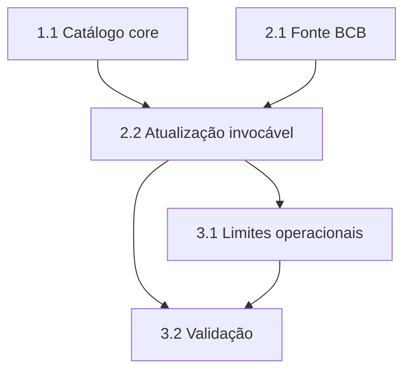

# Tarefas Rinos One — Catálogo de Instituições Financeiras

Escopo: catálogo global BCB, operação de atualização invocável e testável, sem agendamento autônomo.

**Legenda de status:**
- `[ ]` Pendente
- `[~]` Em andamento
- `[x]` Concluído
- `[!]` Bloqueado

**Legenda de criticidade:**
- `[C]` Crítico — impacto financeiro direto, regulatório, segurança, SLA ou operação bloqueante
- `[A]` Alto — funcionalidade essencial
- `[M]` Médio — necessário, mas sem urgência imediata

---

## FASE 1 - Persistência Global

### 1.1 Criar o catálogo core `[A]`

Ref: spec.md FR-FI-001 a FR-FI-009; data-model.md; plan.md "Modelo e relacionamentos".

- [x] 1.1.1 Criar migration core com `financialInstitution`, PK BIGINT, campos e índices definidos.
- [x] 1.1.2 Garantir unicidade somente em `bcbEntityIdentifier` e ausência de restrição única no CNPJ.
- [x] 1.1.2.1 Criar migration incremental para o índice de consulta de `sisbacenCode`. <!-- ajuste emergente identificado na revisão do schema -->
- [x] 1.1.3 Criar modelo Eloquent com os casts e atributos permitidos pelo contrato.
- [x] 1.1.4 Validar a migration contra o schema local e registrar a evidência. <!-- `php artisan db:table financialinstitution --database=coreMigration` -->

## FASE 2 - Fonte e Sincronização

### 2.1 Integrar a fonte oficial BCB `[A]`

Ref: spec.md FR-FI-002 a FR-FI-006; research.md decisões 1 e 2; plan.md "Fluxo de atualização".

- [x] 2.1.1 Definir contrato de fonte e DTO/objeto de dados normalizado para a entidade supervisionada.
- [x] 2.1.2 Implementar adaptador HTTP paginado para BcBase v2 com data de referência injetável.
- [x] 2.1.3 Configurar URL e timeout públicos sem incluir credenciais no repositório.
- [x] 2.1.4 Criar testes do adaptador com respostas OData simuladas e falha externa.

### 2.2 Implementar atualização invocável `[A]`

Ref: spec.md FR-FI-006 a FR-FI-012 e FR-FI-INFRA-IDEMP; plan.md "Fluxo de atualização".

- [x] 2.2.1 Criar serviço de sincronização e objeto de resultado efêmero.
- [x] 2.2.2 Fazer upsert pela chave BCB preservando a identidade BIGINT interna.
- [x] 2.2.3 Aplicar disponibilidade apenas ao status BCB `3` e preservar registros ausentes.
- [x] 2.2.4 Registrar início, fim, contagens e falhas em log estruturado, sem tabela de cargas.
- [x] 2.2.5 Cobrir criação, atualização, repetição idempotente, inativação oficial, ausência e falha por testes.

## FASE 3 - Limites Operacionais e Qualidade

### 3.1 Preservar a centralização futura de manutenção `[A]`

Ref: spec.md FR-FI-INFRA-SCHED; plan.md "Limites desta fase".

- [x] 3.1.1 Confirmar que a feature não registra cron, scheduler, evento recorrente ou fila periódica.
- [x] 3.1.2 Manter a chamada de teste diretamente no serviço para uso futuro pela central de manutenção.
- [x] 3.1.3 Documentar a integração futura sem antecipar painel, endpoint ou comando operacional.

### 3.2 Validar a entrega `[A]`

Ref: spec.md SC-FI-001 a SC-FI-004; quickstart.md.

- [x] 3.2.1 Executar testes PHP focados e as verificações estáticas aplicáveis. <!-- PHP 102 passed/2 skipped; Pint passed; type-check, Vitest and build passed -->
- [x] 3.2.2 Executar a migration no banco local com a conta de migration configurada. <!-- batches 6 e 7 em `coreMigration` -->
- [x] 3.2.3 Revisar o diff e confirmar que arquivos de outros escopos não foram alterados nem incluídos.

---

## Matriz de Dependências

## Cobertura de Interfaces

Não aplicável nesta entrega: a superfície de manutenção está parcial e não inclui interface humana, endpoint ou CLI operacional. A única interação é a chamada interna do serviço, coberta por 2.2 e 3.1.

## Resumo Quantitativo

| Fase | Tarefas | Subtarefas | Criticidade |
|------|---------|------------|-------------|
| 1 - Persistência Global | 1 | 4 | A |
| 2 - Fonte e Sincronização | 2 | 9 | A |
| 3 - Limites Operacionais e Qualidade | 2 | 6 | A |
| **Total** | **5** | **19** | - |

## Escopo Coberto

| Item | Descrição | Fase |
|------|-----------|------|
| FR-FI-001 a FR-FI-009 | Catálogo global, persistência e reconciliação BCB | 1 e 2 |
| FR-FI-010 | Logs de execução sem rastreabilidade persistida | 2 |
| FR-FI-011 | Sem edição manual ordinária | 3 |
| FR-FI-012 | Sem dados Pix | 1 e 3 |
| FR-FI-INFRA-SCHED | Atualização invocável sem agenda autônoma | 3 |

## Escopo Excluído

| Item | Descrição | Motivo |
|------|-----------|--------|
| Central de agendamentos e manutenções | Agenda diária, autorização operacional, painel e histórico de execuções | Próxima feature aprovada pelo usuário |
| Administração web e API pública | Solicitação visual de atualização e consulta administrativa | Depende da central de manutenção |
| Seleção em Pessoas e vínculos tenant | Consumo do catálogo por telas de negócio | Pertence à futura feature de Pessoas |
| Dados de participação Pix | Participação e roteamento Pix | Fora do escopo funcional desta fase |
