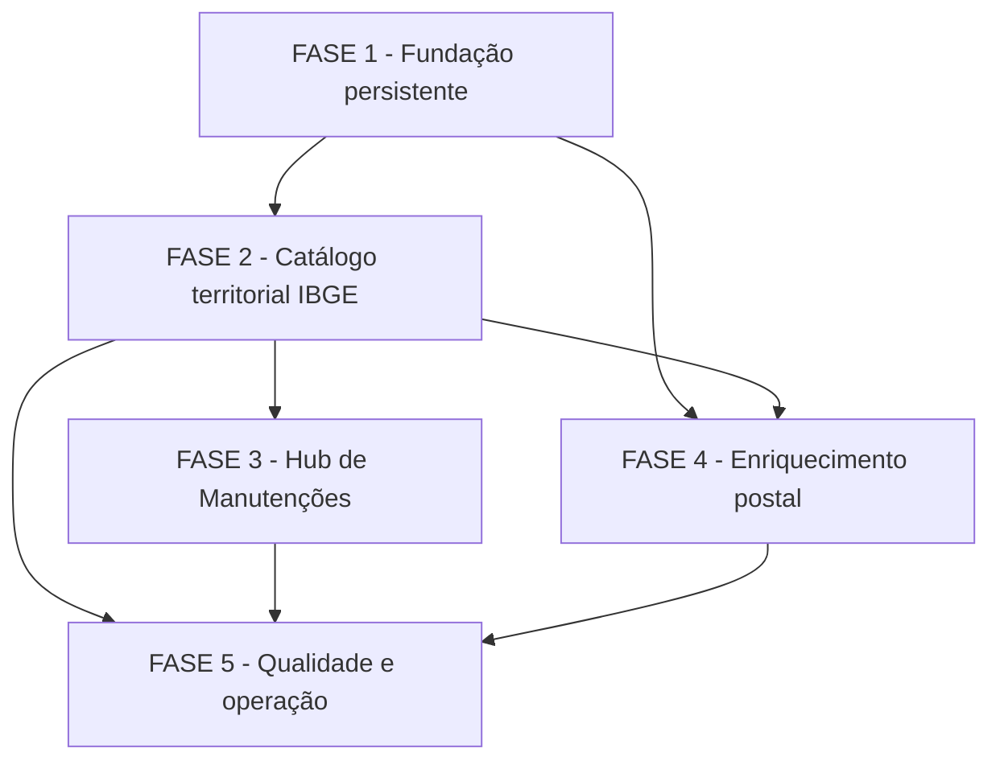

# Tarefas Fundação de Localidades - Backlog de Implementação

Escopo: implementar o catálogo core de localidades, atualização territorial IBGE, consulta postal assíncrona com ViaCEP e BrasilAPI, e a integração de leitura da rotina no Hub de Manutenções.

**Legenda de status:**

- `[ ]` Pendente
- `[~]` Em andamento
- `[x]` Concluído
- `[!]` Bloqueado

**Legenda de criticidade:**

- `[C]` Crítico - Impacto financeiro direto, regulatório, segurança, SLA ou operação bloqueante
- `[A]` Alto - Funcionalidade essencial
- `[M]` Médio - Necessário, mas sem urgência imediata

> [!IMPORTANT]
> Este backlog não autoriza uma tela de endereço final, cadastro manual de localidades, remoção/reativação administrativa ou expansão internacional. Esses itens exigem features posteriores.

---

## FASE 1 - Fundação Persistente do Catálogo

### 1.1 Schema core de territórios e referências postais `[A]`

Ref: [Modelo de dados](data-model.md); FR-LOC-001 a FR-LOC-008, FR-LOC-019 e FR-LOC-INFRA-IDEMP.

- [x] 1.1.1 Criar migrations core para `country`, `brazilState`, `brazilMunicipality`, `postalCode`, `localityReference`, `postalCodeLocalityReference` e `localityReferenceObservation` com PKs BIGINT, colunas, índices, unicidades e `equivalenceSignature` opcional aprovados. <!-- migration 2026_09_27_000100 criada e aplicada em coreMigration no batch 31 -->
- [x] 1.1.2 Declarar todas as FKs com nomes `pk`/`fk`/`uk`, `ON UPDATE CASCADE` e ações de exclusão `CASCADE` ou `SET NULL`, sem `RESTRICT` ou `NO ACTION`. <!-- SQL gerado e inspeção MySQL confirmam somente CASCADE/SET NULL -->
- [x] 1.1.3 Criar testes de schema que validem tipos, índices, PK composta N:N, chaves de idempotência e direção exclusiva core sem referência a tenant. <!-- LocalityCatalogPersistenceConstraintsTest: 8 testes, 20 assertions -->
- [x] 1.1.4 Aplicar migrations em banco de teste limpo e validar `migrate:fresh` sem depender de dados externos. <!-- RefreshDatabase em SQLite em memória e migration aplicada em coreMigration -->

### 1.2 Modelos e consultas locais do domínio `[A]`

Ref: [Modelo de dados](data-model.md), seção “Regras de persistência”; FR-LOC-002, FR-LOC-006 a FR-LOC-008.

- [x] 1.2.1 Criar modelos Eloquent, *casts*, relações e *fillable* com nomenclatura alinhada às tabelas core. <!-- Country, BrazilState, BrazilMunicipality, PostalCode, LocalityReference e LocalityReferenceObservation -->
- [x] 1.2.2 Implementar normalização de país e código postal, sem tratar CEP como identidade de logradouro. <!-- LocalityPostalCodeNormalizer com testes unitários -->
- [x] 1.2.3 Implementar consulta determinística de candidatos `ACTIVE` por país e CEP, incluindo relações N:N e dados territoriais reconciliados. <!-- LocalityReferenceQueryService -->
- [x] 1.2.4 Cobrir normalização, relações N:N, referências sem rua e exclusão de candidatos `REMOVED` em testes unitários/feature. <!-- 13 testes focalizados, 35 assertions incluindo schema -->

---

## FASE 2 - Catálogo Territorial Oficial IBGE

### 2.1 Adaptador e sincronização territorial `[A]`

Ref: [Pesquisa técnica](research.md), decisões de fonte territorial; FR-LOC-001 a FR-LOC-004, FR-LOC-009, SC-LOC-001.

- [x] 2.1.1 Definir contrato interno de fonte territorial e implementar o adaptador HTTP do IBGE com limites de tempo, validação de resposta e logs seguros. <!-- IbgeTerritorySource/ApiSource; timeout, validação de coleção e CA confiável configurável -->
- [x] 2.1.2 Implementar sincronização transacional por ISO/IBGE para País Brasil, UFs e Municípios, atualizando nome sem alterar identidade técnica. <!-- IbgeTerritorySynchronizationService -->
- [x] 2.1.3 Garantir que resposta parcial, ausência de item ou falha do IBGE não apague nem inative referências territoriais existentes. <!-- Sem exclusão/inativação; transação e resultado seguro de falha -->
- [x] 2.1.4 Criar testes HTTP simulados para criação, atualização de nome, idempotência, ausência e falha da fonte. <!-- IbgeTerritorySynchronizationTest: 5 testes, 32 assertions -->

### 2.2 Rotina automática, agenda e singleton `[A]`

Ref: [Plano técnico](plan.md), fluxo “Atualização territorial IBGE”; [Contrato da rotina](contracts/maintenance-routine.md); FR-LOC-009, FR-LOC-010, FR-LOC-INFRA-SCHED.

- [x] 2.2.1 Criar configuração versionável para lock, periodicidade mensal, atraso de retentativa pós-falha e valores seguros de timeout, sem segredos. <!-- config/localities.php e .env.example -->
- [x] 2.2.2 Implementar `IbgeTerritoryMaintenanceService` que avalia estado de devido, registra histórico técnico e usa lock compartilhado singleton. <!-- Histórico existente, sem auditoria administrativa ou ação manual -->
- [x] 2.2.3 Registrar avaliação horária em `routes/console.php`, delegando ao serviço a decisão de primeira execução, mensalidade e retentativa. <!-- maintenance.locality-ibge-territory-catalog -->
- [x] 2.2.4 Testar primeira execução automática, intervalo mensal, falha com retentativa, histórico seguro e recusa de concorrência. <!-- IbgeTerritoryMaintenanceServiceTest: 3 testes, 16 assertions -->

---

## FASE 3 - Central de Manutenções

### 3.1 Autorização e composição explícita da rotina IBGE `[A]`

Ref: [Contrato da rotina](contracts/maintenance-routine.md); FR-LOC-011, FR-LOC-012, FR-LOC-024, SC-LOC-006.

- [x] 3.1.1 Registrar a permissão de leitura `platform.maintenance.locality-ibge.read` no escopo Plataforma, sem cadastrar permissão de sincronização manual. <!-- migration 2026_09_27_000101 aplicada em coreMigration -->
- [x] 3.1.2 Estender `MaintenanceHubService` por composição direta para listar e detalhar `locality-ibge-territory-catalog` somente para principal autorizado. <!-- leitor próprio e administrador de plataforma -->
- [x] 3.1.3 Estender o controlador de manutenção para detalhe, histórico e respostas seguras, mantendo a ação manual indisponível para essa `routineKey`. <!-- detalhes filtrados; ação responde 404 -->
- [x] 3.1.4 Criar testes de autorização, `NOT_EXECUTED`, histórico, `canSynchronize = false` e resposta 404 para tentativa de ação. <!-- 12 testes de Hub/API, 62 assertions -->

### 3.2 Apresentação responsiva da rotina no Hub `[M]`

Ref: `SURF-WEB-MAINTENANCE`; `INT-WEB-MAINTENANCE-001` em [interface-spec.md](interface-spec.md); [Contrato da rotina](contracts/maintenance-routine.md); US-5.

- [x] 3.2.1 Adaptar tipos e cliente do Hub para a rotina IBGE, incluindo agenda “Inicial automática e mensal” e capacidade manual falsa. <!-- Tipo de execução aceita detalhes seguros; apresentação mapeia a routineKey -->
- [x] 3.2.2 Exibir título, estado, última execução e histórico usando componentes existentes, sem criar controles de disparo ou edição de agenda. <!-- MaintenanceHubSurface reutilizada; botão condicionado a canSynchronize -->
- [x] 3.2.3 Cobrir estados `NOT_EXECUTED`, `RUNNING`, sucesso e falha com mensagens seguras e localização existente. <!-- textos IBGE traduzidos em pt-BR, en, es e fr; sucesso/falha não expõem infraestrutura -->
- [~] 3.2.4 Executar testes de componente e inspeção responsiva desktop/mobile da tela existente, incluindo teclado e ausência de ação manual. <!-- Vitest cobre a rotina, retorno móvel e ausência de ação; falta somente inspeção visual em Chrome, não executada sem autorização de controle do computador -->

---

## FASE 4 - Enriquecimento Postal Sob Demanda

### 4.1 Contratos internos e adaptadores de provedores `[A]`

Ref: [Pesquisa técnica](research.md); [Contrato postal](contracts/postal-reference-lookup.md); FR-LOC-014, FR-LOC-021 e FR-LOC-022.

- [x] 4.1.1 Definir `PostalReferenceSource` e DTO interno único que preservem campos observados, código IBGE e identidade da fonte sem vazar DTO externo. <!-- PostalReferenceSourceRecord e assinatura SHA-256 específica da fonte -->
- [x] 4.1.2 Implementar adaptadores ViaCEP e BrasilAPI habilitáveis por configuração, com timeout, validação e isolamento de erro por fonte. <!-- ViaCepPostalReferenceSource e BrasilApiPostalReferenceSource -->
- [x] 4.1.3 Executar fontes habilitadas em paralelo e consolidar seus resultados técnicos sem eleger vencedor por ordem de resposta. <!-- PostalReferenceSourceBatchService usa HTTP pool e preserva todos os resultados -->
- [x] 4.1.4 Criar testes HTTP simulados de resposta válida, vazia, incompleta, lenta e com falha isolada para cada adaptador. <!-- PostalReferenceSourceTest: 7 testes, 28 assertions -->

### 4.2 Job assíncrono e estado efêmero da consulta `[A]`

Ref: [Plano técnico](plan.md), fluxo “Consulta e enriquecimento de CEP”; FR-LOC-013, FR-LOC-015, FR-LOC-016 e FR-LOC-021.

- [x] 4.2.1 Implementar estado de atualização no cache compartilhado, indexado por país e CEP normalizados, com TTL e estados públicos `PENDING`, `COMPLETED` e `COMPLETED_WITH_ERRORS`. <!-- PostalReferenceRefreshStateService -->
- [x] 4.2.2 Implementar `PostalReferenceEnrichmentJob` após *commit*, com lock por chave postal e continuidade independente do ciclo HTTP. <!-- Job persistente e dispatch afterCommit -->
- [x] 4.2.3 Impedir que requisições repetidas enfileirem trabalho equivalente enquanto já houver atualização pendente para a mesma chave. <!-- Cache::add no marcador pendente -->
- [x] 4.2.4 Testar consulta local imediata, abandono do consumidor, conclusão posterior do job, locks e falha parcial sem perda de candidato local. <!-- PostalReferenceEnrichmentJobTest e PostalReferenceLookupApiTest; consulta local responde antes de qualquer fonte externa -->

### 4.3 Consolidação, proveniência e qualidade de dados `[A]`

Ref: [Pesquisa técnica](research.md), “Estratégia de equivalência inicial”; [Modelo de dados](data-model.md); FR-LOC-017 a FR-LOC-020, FR-LOC-INFRA-IDEMP, SC-LOC-003 e SC-LOC-004.

- [x] 4.3.1 Implementar reconciliação de Município apenas por código IBGE existente e preservação de textos observados quando a reconciliação não for segura.
- [x] 4.3.2 Implementar *upsert* de CEP, referência, associação N:N e observação por identidade específica da fonte, atualizando somente a última observação quando apropriado.
- [x] 4.3.3 Implementar assinatura de equivalência forte somente com campos completos e remoção automática conservadora com `DUPLICATE_AUTOMATIC`, sem estado `MERGED` nem redirecionamento técnico.
- [x] 4.3.4 Garantir que reencontro de observação ligada a referência `REMOVED` não a reative; cobrir duplicidade comprovada, conflito territorial e reexecução idempotente em testes. <!-- PostalReferenceConsolidationTest: 3 testes, 10 assertions -->

### 4.4 Fronteira JSON de consulta e acompanhamento `[A]`

Ref: [Contrato postal](contracts/postal-reference-lookup.md); FR-LOC-013 a FR-LOC-016, FR-LOC-022.

- [x] 4.4.1 Implementar validação e endpoint `POST` de consulta, retornando imediatamente candidatos locais e estado de atualização seguro.
- [x] 4.4.2 Implementar endpoint `GET` de estado, com dados consolidados atuais e intervalo de *polling* de até um segundo enquanto pendente.
- [x] 4.4.3 Proteger os endpoints pelo middleware autenticado existente, sem criar permissão nova; documentar que o futuro consumidor aplica sua própria autorização de negócio.
- [x] 4.4.4 Criar testes de contrato para validação, resposta imediata, *polling*, conclusão parcial, saída sem dados locais e não exposição de provedor/erro bruto.

---

## FASE 5 - Observabilidade e Garantia de Qualidade

### 5.1 Logs e proteção operacional `[A]`

Ref: FR-LOC-023, FR-LOC-024; [Plano técnico](plan.md), “Segurança, privacidade e observabilidade”.

- [ ] 5.1.1 Definir eventos de log estruturado para início, resultado, contagens e falhas de IBGE e provedores postais, sem *payloads* ou segredos.
- [ ] 5.1.2 Classificar `failureCode` seguro e confirmar que detalhes internos permanecem fora dos contratos HTTP e do Hub.
- [ ] 5.1.3 Validar que a retenção de `maintenanceExecutionHistory` usa as configurações existentes de manutenção e que o catálogo não sofre expiração indevida.
- [ ] 5.1.4 Criar testes de falha e revisão de logs para impedir vazamento de URL sensível, cabeçalhos, exceções ou credenciais.

### 5.2 Regressão integrada e evidências de entrega `[A]`

Ref: [Guia de validação](quickstart.md); SC-LOC-001 a SC-LOC-006; Princípios V e VI da Constituição.

- [ ] 5.2.1 Executar os cenários de primeira carga, mensalidade, lock, falha, enriquecimento paralelo, supressão e Hub descritos no guia de validação.
- [ ] 5.2.2 Executar testes backend, testes frontend, análise estática/formatação, verificação de tipos e build de produção conforme scripts do repositório.
- [ ] 5.2.3 Validar migrations em banco de teste novo e ambiente atualizado, registrando evidência de ausência de `ULID`, FK inversa e ações restritivas.
- [ ] 5.2.4 Atualizar documentação de implementação com limitações confirmadas e marcar subtarefas concluídas com evidência objetiva.

---

## Matriz de Dependências

**Caminho crítico**: 1.1 → 1.2 → 2.1 → 2.2 → 3.1 → 4.1 → 4.2 → 4.3 → 4.4 → 5.2. A tarefa 3.2 pode avançar depois de 3.1 e não bloqueia o domínio postal.

## Cobertura de Interfaces

| Surface ID | Cobertura | Interaction IDs | Task IDs |
| --- | --- | --- | --- |
| SURF-WEB-MAINTENANCE | PARTIAL | INT-WEB-MAINTENANCE-001 | 3.1, 3.2, 5.2 |
| SURF-FUTURE-CONSUMERS | API | Não aplicável: contrato API sem interface humana entregue | 4.2, 4.4, 5.2 |

## Resumo Quantitativo

| Fase | Tarefas | Subtarefas | Criticidade |
| --- | ---: | ---: | --- |
| 1 - Fundação persistente | 2 | 8 | A |
| 2 - Catálogo territorial IBGE | 2 | 8 | A |
| 3 - Hub de Manutenções | 2 | 8 | A, M |
| 4 - Enriquecimento postal | 4 | 16 | A |
| 5 - Qualidade e operação | 2 | 8 | A |
| **Total** | **12** | **48** | **A, M** |

## Escopo Coberto

| Item | Descrição | Fase |
| --- | --- | --- |
| FR-LOC-001 a FR-LOC-008 | Catálogo global, identidade BIGINT, território e CEP/referências N:N | 1, 2 |
| FR-LOC-009 a FR-LOC-012 | Atualização IBGE automática e Hub sem disparo manual | 2, 3 |
| FR-LOC-013 a FR-LOC-016 | Consulta local, enriquecimento paralelo, fila e acompanhamento | 4 |
| FR-LOC-017 a FR-LOC-020 | Proveniência, duplicidade conservadora e remoção persistente | 4 |
| FR-LOC-021 a FR-LOC-024 | Resiliência, segurança de resposta, logs e retenção do Hub | 2 a 5 |
| SC-LOC-001 a SC-LOC-006 | Critérios de sucesso e validação integrada | 2 a 5 |

## Escopo Excluído

| Item | Descrição | Motivo |
| --- | --- | --- |
| Endereço final | Número, complemento, vínculos com Pessoas, organizações ou tenants | Feature de negócio posterior. |
| Administração de localidades | Tela, filtros, remoção e reativação por administrador | Exige padrão visual e requisitos próprios futuros. |
| Nacionalidades | Catálogo e integração de gentílicos | Explicitamente removido do escopo. |
| Internacional detalhado | Carga de estados, municípios ou equivalentes fora do Brasil | Estrutura preparada; fonte e regra futuras ainda não aprovadas. |
| Correios | Adaptador com credenciais e condições comerciais | Não é provedor inicial aprovado. |
| Hub genérico | Registro, descoberta ou definição central de rotina | Contraria a decisão de integração explícita por implementação. |
