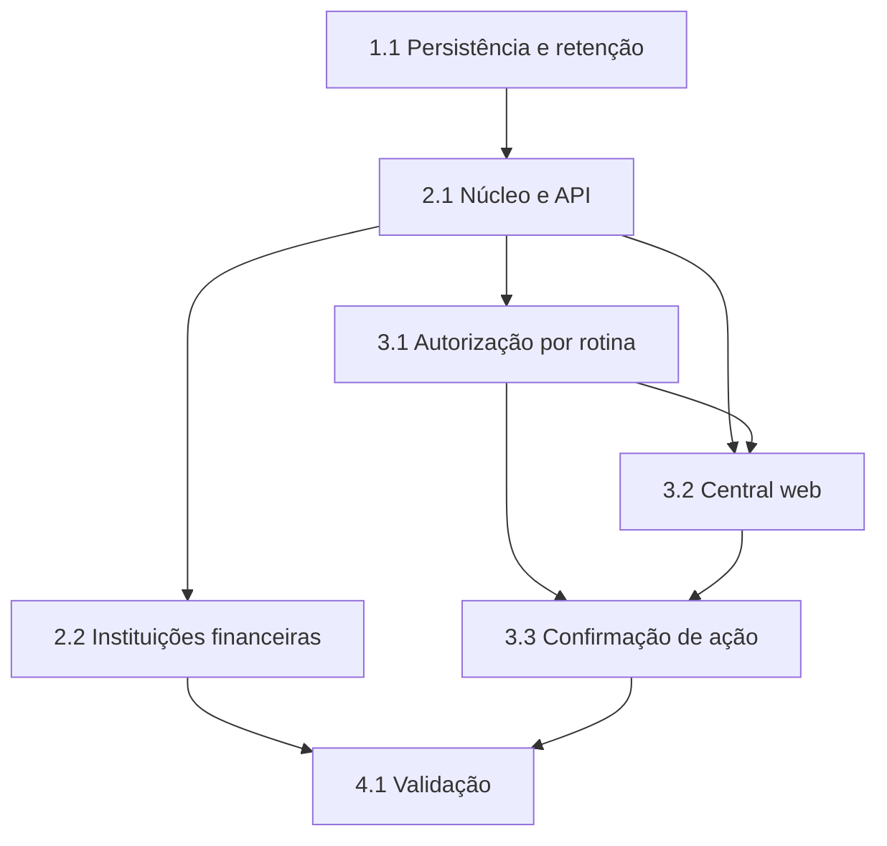

# Tarefas Rinos One — Central de Manutenções

Escopo: hub administrativo para rotinas específicas, auditoria imutável, histórico técnico e primeira integração de instituições financeiras.

**Legenda de status:**
- `[ ]` Pendente
- `[~]` Em andamento
- `[x]` Concluído
- `[!]` Bloqueado

**Legenda de criticidade:**
- `[C]` Crítico — impacto financeiro direto, regulatório, segurança, SLA ou operação bloqueante
- `[A]` Alto — funcionalidade essencial
- `[M]` Médio — necessário, mas sem urgência imediata

---

## FASE 1 - Persistência e Retenção

### 1.1 Criar histórico técnico e auditoria administrativa `[C]`

Ref: spec.md FR-MH-007 a 010; data-model.md; checklists/requirements.md CHK005 a CHK008.

- [x] 1.1.1 Criar migrations core para histórico técnico e auditoria administrativa com PK BIGINT, campos seguros, índices e FK global para usuário.
- [x] 1.1.2 Garantir que a auditoria seja somente de inserção e não exponha atualização ou remoção manual.
- [x] 1.1.3 Adicionar configurações independentes de retenção, ambas com padrão de 90 dias.
- [x] 1.1.4 Implementar limpeza explícita e segura por expiração para cada conjunto de dados.
- [x] 1.1.5 Cobrir schema, retenção independente e imutabilidade com testes. <!-- 3 testes focados e 9 asserções aprovados -->

## FASE 2 - Integrações Específicas e API

### 2.1 Implementar núcleo explícito do hub `[A]`

Ref: spec.md FR-MH-001 a 006 e INFRA-SCHED; research.md Decisões 1 e 3.

- [x] 2.1.1 Criar serviços internos do hub e integrações explícitas sem contrato plugável ou cadastro dinâmico de rotinas.
- [x] 2.1.2 Expor internamente listagem e detalhe com capacidades, estados e dados seguros definidos por cada integração. A rota autenticada aguarda a conciliação de permissões.
- [x] 2.1.3 Encaminhar internamente a ação permitida ao motor da rotina, registrando histórico técnico e resultado seguro. A autorização de transporte permanece pendente.
- [x] 2.1.4 Registrar auditoria administrativa para solicitação aceita, recusada ou com falha segura.
- [x] 2.1.5 Implementar contratos e testes de integração para listagem, detalhe, auditoria e ações.

### 2.2 Integrar instituições financeiras `[A]`

Ref: spec.md FR-MH-011 e 012; plan.md §Arquitetura de Integração; financial-institution-catalog/spec.md FR-FI-INFRA-SCHED.

- [x] 2.2.1 Criar integração específica que apresente estado e histórico seguro da sincronização financeira.
- [x] 2.2.2 Centralizar o disparo diário no ponto de agenda desta integração, reutilizando o serviço existente e sem segunda agenda.
- [x] 2.2.3 Implementar o motor singleton da rotina e encaminhar solicitação manual permitida uma única vez; a exposição pela interface aguarda a fundação de permissões.
- [x] 2.2.4 Cobrir execução diária, manual e recusa concorrente sem perda de dados no catálogo. A indisponibilidade de capacidade será coberta junto à interface autorizada.

## FASE 3 - Autorização e Interface

### 3.1 Conciliar autorização por rotina `[C]`

Ref: spec.md FR-MH-011; research.md Decisão 4; checklists/requirements.md CHK010 e CHK011.

- [x] 3.1.1 Mapear ações declaradas pelas integrações ao modelo definitivo da fundação de permissões.
- [x] 3.1.2 Restringir descoberta, leitura e ação por rotina, sem revelar integrações não autorizadas.
- [x] 3.1.3 Reavaliar autorização no momento da ação e registrar recusa administrativa segura.
- [x] 3.1.4 Criar testes de autorização por rotina e ação após a dependência estar disponível.

### 3.2 Implementar INT-WEB-MAINTENANCE-001 — Central de Manutenções `[A]`

Ref: interface-spec.md INT-WEB-MAINTENANCE-001; contracts/maintenance-administration.md.

- [x] 3.2.1 Adicionar destino administrativo na Área de Trabalho e tela de lista/detalhe de rotinas.
- [x] 3.2.2 Implementar filtros, histórico técnico, auditoria e estados inicial, vazio, pronto, erro, offline e desatualizado.
- [x] 3.2.3 Implementar reflow desktop/tablet/telefone, teclado, foco, anúncios e localização definidos na interface spec.
- [x] 3.2.4 Integrar dados reais da API e verificar paridade dos tipos TypeScript com o contrato.
- [x] 3.2.5 Criar testes de componente, integração e E2E com inspeção responsiva documentada. <!-- Executado no Chrome instalado: lista, confirmação, retorno de sucesso, reflow e histórico rolável em telefone. -->

### 3.3 Implementar INT-WEB-MAINTENANCE-002 — Confirmação de Ação `[A]`

Ref: interface-spec.md INT-WEB-MAINTENANCE-002; contracts/maintenance-administration.md.

- [x] 3.3.1 Implementar confirmação com descrição segura e parâmetros permitidos pela integração.
- [x] 3.3.2 Implementar estados de processamento, recusa, falha, sucesso e preservação de parâmetros em erro.
- [x] 3.3.3 Implementar foco modal, teclado, toque e comportamento de folha móvel definidos na interface spec.
- [x] 3.3.4 Integrar a solicitação real, atualizar histórico/auditoria e criar testes de componente e E2E. <!-- Executado no Chrome instalado com contrato simulado da API. -->

## FASE 4 - Qualidade e Evolução Controlada

### 4.1 Validar a entrega e preparar próximas rotinas `[A]`

Ref: spec.md SC-MH-001 a 005; quickstart.md; checklists/requirements.md.

- [x] 4.1.1 Executar os cenários de validação de consulta, ação permitida, recusa, agenda diária e retenção. <!-- 14 testes focados e 71 asserções; agenda diária confirmada por `schedule:list`. -->
- [x] 4.1.2 Executar formatação, testes PHP e JavaScript, verificação de tipos e build de produção. <!-- PHP: 222 aprovados/2 ignorados; JavaScript: 98 aprovados; type-check e build aprovados. -->
- [x] 4.1.3 Revisar segurança de dados em logs, telemetria, respostas e auditoria. <!-- Evidências registradas em validation.md. -->
- [x] 4.1.4 Documentar a revisão individual necessária antes de integrar limpeza de autenticações vencidas e demais rotinas. <!-- Consultar routine-integration-review.md. -->

---

## Matriz de Dependências

## Cobertura de Interfaces

| Surface ID | Coverage | Interaction IDs | Task IDs |
| --- | --- | --- | --- |
| SURF-WEB-MAINTENANCE | FULL | INT-WEB-MAINTENANCE-001, INT-WEB-MAINTENANCE-002 | 3.2, 3.3 |
| SURF-FUTURE-CONSUMERS | PARTIAL | — | 2.1 |

## Resumo Quantitativo

| Fase | Tarefas | Subtarefas | Criticidade |
| --- | --- | --- | --- |
| 1 - Persistência e Retenção | 1 | 5 | C |
| 2 - Integrações Específicas e API | 2 | 9 | A |
| 3 - Autorização e Interface | 3 | 13 | C, A |
| 4 - Qualidade e Evolução Controlada | 1 | 4 | A |
| **Total** | **7** | **31** | - |

## Escopo Coberto

| Item | Descrição | Fase |
| --- | --- | --- |
| FR-MH-001 a 006 | Hub e capacidades específicas | 2 |
| FR-MH-007 a 010 | Auditoria, histórico e retenções | 1 e 2 |
| FR-MH-011 | Autorização por rotina | 3.1 |
| FR-MH-012 | Integração de instituições financeiras | 2.2 |
| FR-MH-013 | Feedback seguro | 2 e 3 |
| FR-MH-014 | Singleton da rotina de instituições financeiras | 2.2 |
| INT-WEB-MAINTENANCE-001 e 002 | Central e confirmação de ação | 3.2 e 3.3 |

## Escopo Excluído

| Item | Descrição | Motivo |
| --- | --- | --- |
| Contrato genérico de manutenção | Interface plugável, catálogo dinâmico ou motor universal | Contraria a decisão aprovada de integrações específicas |
| Rotinas não revisadas | Limpeza de autenticações e demais manutenções existentes | Cada uma exige análise individual antes da integração |
| Permissões definitivas antes da fundação | Chaves, papéis e regras finais de autorização | Dependência explícita de `authorization-foundation` |
