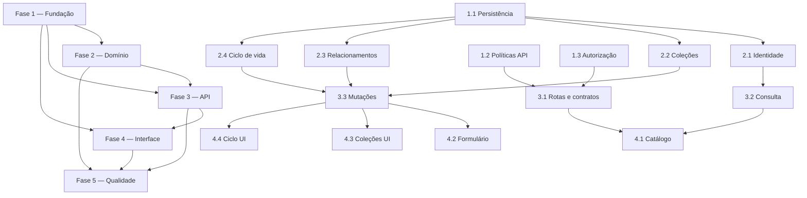

# Tarefas Cadastro de Pessoas por Organização - Implementação

Escopo: implementar o módulo organizacional de Pessoas, suas coleções, relacionamentos, ciclo de vida, contratos API, interface responsiva e controles operacionais definidos no SDD.

**Legenda de status:**

- `[ ]` Pendente
- `[~]` Em andamento
- `[x]` Concluído
- `[!]` Bloqueado

**Legenda de criticidade:**

- `[C]` Crítico - Impacto financeiro direto, regulatório, segurança, SLA ou operação bloqueante
- `[A]` Alto - Funcionalidade essencial
- `[M]` Médio - Necessário, mas sem urgência imediata

> [!IMPORTANT]
> Cada tarefa deve preservar o isolamento por schema de tenant, IDs `BIGINT`, a direção tenant → core e FKs sem `RESTRICT`/`NO ACTION`. A implementação somente começa após conciliar as permissões nomeadas abaixo com o modelo definitivo de permissões da plataforma.

---

## FASE 1 - Fundação de dados e políticas transversais

### 1.1 Persistência isolada do agregado Pessoa `[C]`

Ref: [spec.md](spec.md) FR-001, FR-004 a FR-020; [data-model.md](data-model.md); [plan.md](plan.md) seção Modelo de dados.

- [x] 1.1.1 Criar migrations de tenant para `person`, endereços, contatos, contas bancárias, chaves Pix, relacionamentos e eventos de auditoria, com PKs `BIGINT` e convenções de nomes do projeto.
- [x] 1.1.2 Configurar índices, unicidade condicional de CPF/CNPJ normalizados por schema e restrições de integridade compatíveis com remoções em cascata ou `SET NULL`.
- [x] 1.1.3 Implementar modelos, relações Eloquent e casts do agregado, incluindo `version` para concorrência otimista e referências apenas de tenant para os catálogos core.
- [x] 1.1.4 Criar enums e validações estruturais persistentes para tipo de pessoa, estado, contato, conta, Pix, endereço e relacionamento.
- [x] 1.1.5 Cobrir a migration e o mapeamento com testes de schema, integridade, cascata de dados filhos e isolamento entre dois schemas de tenant.

### 1.2 Políticas gerais reutilizáveis da API `[C]`

Ref: [spec.md](spec.md) Clarificações; [plan.md](plan.md) seções Políticas operacionais e Segurança; [contracts/people-api.md](contracts/people-api.md) Políticas transversais.

- [x] 1.2.1 Adicionar configuração global por ambiente para paginação padrão `50`, máximo `200`, tamanho JSON máximo `1 MiB`, taxa autenticada `120/min` e retenção de chave de idempotência `24 h`.
- [x] 1.2.2 Implementar ou adaptar middleware reutilizável de paginação, rate limit por usuário e tenant e limitação de corpo JSON, com respostas localizadas e seguras.
- [x] 1.2.3 Implementar armazenamento e replay idempotente de mutações por `Idempotency-Key` UUID v4, escopado a usuário, tenant e operação.
- [x] 1.2.4 Aplicar as políticas às rotas de Pessoas sem criar exceções locais incompatíveis e sem expor dados da requisição nos logs. <!-- Todas as mutações usam idempotência; leitura e escrita usam limite e tamanho JSON; respostas de política respeitam o envelope do contrato. -->
- [x] 1.2.5 Criar testes de contrato para valores padrão/máximo, chave ausente ou inválida, repetição idempotente, expiração e limitação de taxa.

### 1.3 Fundamentos de autorização e contexto organizacional `[C]`

Ref: [spec.md](spec.md) FR-001, FR-027; [plan.md](plan.md) seções Segurança e API; [interface-spec.md](interface-spec.md) Actors and Permissions.

- [x] 1.3.1 Conciliar capacidades `tenant.people.*` com o modelo definitivo de permissões, sem inventar papéis ou grupos nesta feature.
- [x] 1.3.2 Registrar políticas de leitura, criação, atualização, duplicação, inativação, reativação e exclusão de Pessoas no contexto do tenant ativo.
- [x] 1.3.3 Garantir que resolução de rota, consulta e escrita selecionem exclusivamente o schema do tenant de contexto e invalidem dados na troca de organização.
- [x] 1.3.4 Padronizar respostas `401`, `403` e `404` sem revelar existência de Pessoa ou referência de outro tenant. <!-- Validado por PersonApiAuthenticationTest: envelope seguro e idêntico para autenticação ausente, acesso negado/tenant desconhecido e rota inválida. -->
- [x] 1.3.5 Criar testes de autorização negativa, contexto ausente e tentativa de acesso cruzado entre organizações.

---

## FASE 2 - Serviços do domínio e ciclo de vida

### 2.1 Identidade, validação e atualização de Pessoa `[A]`

Ref: [spec.md](spec.md) FR-002 a FR-008, FR-020, FR-024, FR-026; [research.md](research.md) Decisões 3, 7 e 9.

- [x] 2.1.1 Implementar normalização e validação de CPF/CNPJ, impondo documento aplicável ao tipo PF/PJ apenas quando informado.
- [x] 2.1.2 Implementar cálculo consistente de nome de exibição e validação dos demais documentos, datas e observações permitidos.
- [x] 2.1.3 Criar serviço de criação e atualização que rejeite duplicidade de documento inclusive em Pessoa inativa e aceite Pessoa sem documento.
- [x] 2.1.4 Implementar controle otimista por `version`, recusando gravação desatualizada com contrato de conflito para recarregar e refazer a alteração.
- [x] 2.1.5 Cobrir PF, PJ, documento opcional, normalização, duplicidade inter/intra-tenant, reativação e conflito concorrente em testes unitários e de serviço. <!-- Validado por PersonIdentityValidatorTest, PersonIdentityServiceTest e PersonLifecycleServiceTest. -->

### 2.2 Coleções de endereço, contato, conta e Pix `[A]`

Ref: [spec.md](spec.md) FR-009 a FR-016, FR-026; [data-model.md](data-model.md); [contracts/people-api.md](contracts/people-api.md) Payloads de escrita.

- [x] 2.2.1 Implementar regras de endereço com país obrigatório, UF e município obrigatórios para Brasil e rua textual independente de localidade cadastrada.
- [x] 2.2.2 Implementar validação tipada e normalização de contatos, preservando múltiplos itens sem campo de principal.
- [x] 2.2.3 Implementar contas bancárias com referência opcional à instituição financeira core, número/agência textuais e situação própria.
- [x] 2.2.4 Implementar chaves Pix tipadas (CPF, CNPJ, e-mail, telefone e aleatória), sem principal ou finalidade, e impedir duplicação na mesma Pessoa.
- [x] 2.2.5 Criar testes de serviço para combinações brasileiras/internacionais, catálogos inativos, formatos inválidos, coleções múltiplas e regras proibidas nesta fase.

### 2.3 Relacionamento direcional e duplicação `[A]`

Ref: [spec.md](spec.md) FR-017 a FR-019A, FR-025; [data-model.md](data-model.md) `personRelationship`; [research.md](research.md) Decisão 4.

- [x] 2.3.1 Definir enums de relacionamento e pares opostos, incluindo `OUTROS` como próprio oposto, em um ponto único do domínio.
- [x] 2.3.2 Implementar criação, edição, consulta e remoção de relacionamento direcional entre duas Pessoas do mesmo tenant, em qualquer combinação PF/PJ.
- [x] 2.3.3 Impedir auto-relacionamento, cruzamento de tenant e duplicidade lógica conforme a regra definida para o par direcional.
- [x] 2.3.4 Implementar serviço de duplicação com escolhas explícitas por coleção, cópias independentes e exclusão de documentos/identificadores exclusivos.
- [x] 2.3.5 Criar testes para rótulo inverso sem linha recíproca, `OUTROS`, quatro combinações PF/PJ e cópia segura de coleções.

### 2.4 Inativação, exclusão assistida, auditoria e retenção `[C]`

Ref: [spec.md](spec.md) FR-020 a FR-023; [plan.md](plan.md) seções Exclusão, Auditoria e Manutenção; [contracts/people-api.md](contracts/people-api.md) Erros.

- [x] 2.4.1 Implementar transições idempotentes de ativo/inativo e seus efeitos nas seleções comuns, preservando consulta autorizada.
- [x] 2.4.2 Criar inspeção extensível de usos conhecidos antes da exclusão física, com mensagens acionáveis sem detalhes técnicos ou dados de outro módulo.
- [x] 2.4.3 Implementar exclusão transacional que remova dados filhos e relacionamentos da Pessoa, preserve a contraparte e converta conflitos imprevistos em erro seguro.
- [x] 2.4.4 Registrar eventos mínimos de criação, alteração, inativação, reativação e exclusão, sem documentos, contas, Pix, endereços ou payloads sensíveis.
- [x] 2.4.5 Integrar rotina explícita diária de retenção de auditoria ao Hub de Manutenções, com padrão configurável de 90 dias, e testá-la com eventos vencidos e preservados.

---

## FASE 3 - API de Pessoas e contratos de integração

### 3.1 Rotas, requests e representação segura `[C]`

Ref: [contracts/people-api.md](contracts/people-api.md); [plan.md](plan.md) Arquitetura e API; [spec.md](spec.md) FR-002, FR-024, FR-027.

- [x] 3.1.1 Registrar rotas versionadas `/api/v1/people` e vinculá-las a autenticação, contexto de tenant, capacidades e políticas transversais.
- [x] 3.1.2 Criar requests e DTOs para criação, atualização completa, criação rápida, duplicação, ciclo de vida e exclusão.
- [x] 3.1.3 Criar resources/projeções para lista, detalhe e coleções, apresentando dados sem mascarar CPF/CNPJ, conta ou Pix e sem expor atributos internos.
- [x] 3.1.4 Mapear erros de validação, documento duplicado, conflito de versão, uso bloqueante e integridade inesperada aos códigos e formatos do contrato. <!-- Inclui conflito de relacionamento e erros das políticas transversais no envelope de Pessoas. -->
- [x] 3.1.5 Criar testes de contrato para autenticação, autorização, formato JSON, localization e ausência de detalhes técnicos/sensíveis em erros e logs. <!-- Validado por PersonApiAuthenticationTest, PersonApiErrorContractTest, PersonRouteContractTest e ApiPolicyMiddlewareTest. -->

### 3.2 Consulta, filtros e paginação `[A]`

Ref: [spec.md](spec.md) FR-002, FR-003, CS-005; [contracts/people-api.md](contracts/people-api.md) Consulta; [interface-spec.md](interface-spec.md) INT-WEB-PEOPLE-001.

- [x] 3.2.1 Implementar busca estável por nome, nome de exibição, apelido/nome fantasia, CPF/CNPJ e valores de contato apenas no tenant atual.
- [x] 3.2.2 Implementar filtros por tipo e situação, ordenação estável padrão `displayName, id` e paginação geral por página.
- [x] 3.2.3 Implementar consulta de detalhe com versão, coleções e apresentação contextual de relacionamento oposto.
- [x] 3.2.4 Criar índices e testes de integração para filtro, ordenação, paginação, registros inativos e não vazamento entre tenants.

### 3.3 Mutações e diagnósticos de exclusão `[C]`

Ref: [contracts/people-api.md](contracts/people-api.md) Operações de mutação; [spec.md](spec.md) FR-020 a FR-026; [interface-spec.md](interface-spec.md) INT-WEB-PEOPLE-004 a 006.

- [x] 3.3.1 Expor criação completa e rápida, atualização com `version`, duplicação e persistência atômica das coleções selecionadas.
- [x] 3.3.2 Expor inativação, reativação e diagnóstico de usos antes da confirmação de exclusão física.
- [x] 3.3.3 Expor exclusão física com revalidação no servidor, cascata de relacionamentos e fallback de conflito de integridade compreensível.
- [x] 3.3.4 Garantir `Idempotency-Key` em toda mutação e retorno consistente em nova tentativa ou concorrência desatualizada. <!-- Middleware em todas as mutações e cliente de criação/edição envia UUID v4. -->
- [x] 3.3.5 Criar testes de integração para todas as mutações, erros de campo por item, duplicação segura, diagnóstico e rollback transacional. <!-- Validado pela suíte de serviços de Pessoas e PersonApiErrorContractTest; PersonAggregateServiceTest cobre rollback integral ao falhar um item de coleção. -->

---

## FASE 4 - Espaço de trabalho e experiência responsiva

### 4.1 Catálogo de Pessoas e navegação organizacional `[A]`

Ref: [interface-spec.md](interface-spec.md) INT-WEB-PEOPLE-001; [wireframes/people-catalog.md](wireframes/people-catalog.md); [spec.md](spec.md) História 1 e História 5.

- [x] 4.1.1 Registrar destino único `tenant.people` no catálogo de workspace, menu e instância de janela, condicionado a tenant ativo e permissão de leitura.
- [x] 4.1.2 Implementar catálogo com busca, filtros, paginação, ordenação, indicadores de status e ações permitidas para desktop/tablet. <!-- A ordenação é a ordem estável contratada pelo backend; PeopleCatalog exibe busca, filtros, paginação, situação e ações condicionadas a capability. -->
- [x] 4.1.3 Adaptar o catálogo para telefone com cards, filtros acessíveis, paginação e todas as ações sem depender de hover. <!-- Cards e menus explícitos substituem a tabela sob 700px, preservando as mesmas ações por toque/teclado. -->
- [x] 4.1.4 Implementar estados loading, vazio, erro remoto, offline, acesso negado e atualização após mudança de organização conforme a especificação de interface.
- [x] 4.1.5 Criar testes de componente e integração para navegação, estados, busca atrasada, permissão e paridade desktop/móvel. <!-- Validado por PeopleCatalog.spec.ts: filtros, debounce, paginação, estados seguros, capabilities, ações nas duas apresentações e retorno de foco. -->

### 4.2 Formulário de Pessoa e cadastro rápido `[A]`

Ref: [interface-spec.md](interface-spec.md) INT-WEB-PEOPLE-002 e INT-WEB-PEOPLE-006; [wireframes/person-form.md](wireframes/person-form.md); [spec.md](spec.md) FR-004 a FR-008, FR-024, FR-026.

- [x] 4.2.1 Implementar formulário de dados básicos PF/PJ, campos condicionais, documento opcional, versão de leitura e erros localizados por campo. <!-- Validado por PersonForm.spec.ts e pelo contrato de erro da API; inclui PF/PJ, documento opcional, versão e apresentação de erros por campo. -->
- [x] 4.2.2 Implementar criação e edição com prevenção de duplo envio, tratamento de conflito de versão e retorno explícito para recarregar e refazer a alteração.
- [x] 4.2.3 Implementar cadastro rápido em diálogo desktop e sheet de tela cheia no telefone, devolvendo a nova Pessoa ao fluxo de origem.
- [x] 4.2.4 Garantir foco, ordem de teclado, leitor de tela, zoom, teclado virtual e anúncios de sucesso/erro nas duas apresentações. <!-- Focus trap testado, retorno de foco e regiões status/alert; sheets móveis usam 100dvh, safe area e controles de 16px. -->
- [x] 4.2.5 Criar testes de componente para PF/PJ, documento opcional/conflitante, validação, conflito, cancelamento e retorno do cadastro rápido.

### 4.3 Editores de dados relacionados `[A]`

Ref: [interface-spec.md](interface-spec.md) INT-WEB-PEOPLE-003; [wireframes/person-form.md](wireframes/person-form.md); [spec.md](spec.md) FR-009 a FR-019A, FR-026.

- [x] 4.3.1 Implementar seções resumidas e editores de endereço, contato, conta bancária, Pix e relacionamento no formulário de Pessoa.
- [x] 4.3.2 Integrar lookups core de país, UF, município, localidade e instituição financeira, preservando entrada textual de rua e referências indisponíveis já gravadas.
- [x] 4.3.3 Implementar editor de relacionamento com seleção no tenant, proibição visual de auto-vínculo e rótulo oposto somente para apresentação.
- [x] 4.3.4 Adaptar editores a painel/sheet por viewport, com confirmação de remoção, foco seguro e erros no item/campo correto.
- [x] 4.3.5 Criar testes de componente e integração para coleções vazias/múltiplas, validações condicionais, remoção, catálogos e acessibilidade básica.

### 4.4 Duplicação, ciclo de vida e exclusão na interface `[A]`

Ref: [interface-spec.md](interface-spec.md) INT-WEB-PEOPLE-004 e INT-WEB-PEOPLE-005; [wireframes/people-catalog.md](wireframes/people-catalog.md); [spec.md](spec.md) FR-020 a FR-025.

- [x] 4.4.1 Implementar diálogo/sheet de duplicação com escolhas explícitas por coleção e aviso de identidade não copiada.
- [x] 4.4.2 Implementar confirmações de inativar e reativar, atualizando lista, formulário e estado de seleção sem recarregamento indevido.
- [x] 4.4.3 Implementar fluxo de exclusão física com diagnóstico de usos conhecidos, confirmação destrutiva e mensagem segura de conflito imprevisto.
- [x] 4.4.4 Garantir paridade responsiva, ações alcançáveis por teclado/toque e retorno de foco ao item, menu ou catálogo após cada resultado.
- [x] 4.4.5 Criar testes de componente para confirmação/cancelamento, perda de permissão, erro remoto, diagnóstico bloqueante e atualização de estado.

---

## FASE 5 - Qualidade, desempenho e prontidão operacional

### 5.1 Suíte automatizada de domínio, integração e segurança `[C]`

Ref: [checklists/requirements.md](checklists/requirements.md); [checklists/api.md](checklists/api.md); [checklists/security.md](checklists/security.md).

- [x] 5.1.1 Consolidar factories, builders e fixtures de Pessoa e catálogos core adequados a schemas de tenant. <!-- PersonFactory e PersonFixtureBuilder usam somente dados sintéticos e suportam a massa determinística de desempenho. -->
- [x] 5.1.2 Executar e completar testes unitários de normalização, enums, validações, versionamento e serviços de domínio. <!-- Suíte PHP completa passou; evidências em validation-evidence.md. -->
- [x] 5.1.3 Executar e completar testes de integração de migrations, API, auditoria, idempotência e exclusão com integridade. <!-- Suíte PHP completa passou; PersonAggregateServiceTest cobre rollback integral. -->
- [x] 5.1.4 Executar cenários de segurança para isolamento de tenant, capacidades, logs/telemetria sem dados pessoais e respostas de erro seguras. <!-- Coberto por testes de autenticação/contrato e PersonApiMetricsTest. -->
- [x] 5.1.5 Registrar evidências dos cenários P1 e P2 da especificação e corrigir regressões encontradas antes da liberação. <!-- Evidências reproduzíveis registradas em validation-evidence.md. -->

### 5.2 Validação responsiva, acessível e localizada `[A]`

Ref: [checklists/interface.md](checklists/interface.md); [interface-spec.md](interface-spec.md) Cross-Surface Rules; [spec.md](spec.md) Cobertura de interfaces.

- [x] 5.2.1 Executar testes end-to-end dos seis fluxos de interface em desktop, tablet e telefone, com permissões positivas e negativas. <!-- Matriz E2E aprovada nos viewports desktop, tablet e telefone, com contraprova somente-leitura em todos eles. -->
- [x] 5.2.2 Validar navegação por teclado, foco de diálogos/sheets, anúncios, contraste, zoom, movimento reduzido e áreas seguras. <!-- Coberto por focusTrap.spec.ts, componentes, CSS responsivo e E2E de contraste, movimento reduzido e overflow. -->
- [x] 5.2.3 Validar todos os estados previstos: loading, empty, ready, processing, success, validation-error, remote-error, offline, access-denied e partial-stale quando aplicável. <!-- PeopleCatalog e componentes de formulário cobrem cada estado e preservam dados válidos em falha subsequente. -->
- [x] 5.2.4 Revisar localization de rótulos, erros, status e pluralização, confirmando que valores fornecidos pelo usuário não são traduzidos nem enviados à telemetria. <!-- PeopleCatalog cobre singular/plural; rótulos e erros usam i18n, enquanto telemetria agrega somente operação, status e buckets. -->
- [x] 5.2.5 Registrar inspeção visual e corrigir divergências em relação aos wireframes e componentes de design existentes. <!-- Aceite funcional e de navegação registrado em 2026-09-30. A evolução visual, incluindo layouts e padrões de componentes, será conduzida em SDD próprio de UI. -->

### 5.3 Desempenho, métricas e operação `[A]`

Ref: [spec.md](spec.md) CS-005; [plan.md](plan.md) Desempenho, observabilidade e manutenção; [checklists/performance.md](checklists/performance.md).

- [x] 5.3.1 Preparar massa de teste com 100 mil Pessoas por tenant e dados relacionados representativos, sem usar dados pessoais reais. <!-- PersonFixtureBuilder prepara 100.000 identidades sintéticas determinísticas. -->
- [x] 5.3.2 Medir busca paginada com `perPage=50` e 25 consultas autorizadas concorrentes, verificando p95 inferior a 2 segundos. <!-- PersonQueryPerformanceBenchmarkTest passou com 25 processos concorrentes e o orçamento configurável de p95. -->
- [x] 5.3.3 Instrumentar métricas agregadas de latência, volume, erros, rate limit e conflitos de versão, sem valores pessoais ou financeiros. <!-- PersonApiMetrics e MeasurePersonApiRequest usam somente operação, status e buckets de latência com TTL. -->
- [x] 5.3.4 Configurar alerta operacional para p95 acima de 2 segundos por cinco minutos, parametrizado por ambiente. <!-- PERSON_PERFORMANCE_ALERT_P95_MILLISECONDS e PERSON_PERFORMANCE_ALERT_WINDOW_MINUTES definem o alerta. -->
- [x] 5.3.5 Validar a rotina de retenção no Hub de Manutenções, suas mensagens de execução e sua integração ao agendador da rotina. <!-- O Hub apresenta a rotina; o scheduler chama o motor específico, conforme a arquitetura aprovada. -->

---

## Matriz de Dependências

## Cobertura de Interfaces

| Surface ID | Coverage | Interaction IDs | Task IDs |
|------------|----------|-----------------|----------|
| SURF-WEB-PEOPLE | FULL | INT-WEB-PEOPLE-001 | 3.2, 4.1, 5.2 |
| SURF-WEB-PEOPLE | FULL | INT-WEB-PEOPLE-002 | 2.1, 3.3, 4.2, 5.2 |
| SURF-WEB-PEOPLE | FULL | INT-WEB-PEOPLE-003 | 2.2, 2.3, 3.3, 4.3, 5.2 |
| SURF-WEB-PEOPLE | FULL | INT-WEB-PEOPLE-004 | 2.3, 3.3, 4.4, 5.2 |
| SURF-WEB-PEOPLE | FULL | INT-WEB-PEOPLE-005 | 2.4, 3.3, 4.4, 5.2 |
| SURF-WEB-PEOPLE | FULL | INT-WEB-PEOPLE-006 | 2.1, 3.1, 3.3, 4.2, 5.2 |

## Resumo Quantitativo

| Fase | Tarefas | Subtarefas | Criticidade |
|------|---------|------------|-------------|
| 1 - Fundação de dados e políticas transversais | 3 | 15 | C |
| 2 - Serviços do domínio e ciclo de vida | 4 | 20 | C, A |
| 3 - API de Pessoas e contratos de integração | 3 | 14 | C, A |
| 4 - Espaço de trabalho e experiência responsiva | 4 | 20 | A |
| 5 - Qualidade, desempenho e prontidão operacional | 3 | 15 | C, A |
| **Total** | **17** | **84** | - |

## Escopo Coberto

| Item | Descrição | Fase |
|------|-----------|------|
| ISOLAMENTO | Pessoas e dados relacionados exclusivos por schema de tenant, com referências permitidas a catálogos core. | 1 a 5 |
| PESSOA | PF/PJ, documento opcional e único no tenant, status, concorrência e cadastro rápido. | 1 a 5 |
| COLEÇÕES | Endereços, contatos, contas bancárias, chaves Pix e relacionamentos direcionais. | 1 a 5 |
| CICLO | Inativação, reativação, exclusão física assistida, auditoria e retenção integrada ao Hub. | 2 a 5 |
| API | Consulta, paginação, idempotência, limitação de taxa, mutações e erros seguros. | 1 a 5 |
| INTERFACE | Catálogo, formulário, editores, duplicação e ciclo de vida com paridade responsiva completa. | 4 e 5 |

## Escopo Excluído

| Item | Descrição | Motivo |
|------|-----------|--------|
| FISCAL E PROFISSIONAL | Dados fiscais e profissionais de Pessoas. | Fora da fase aprovada. |
| DEPENDENTES | Cadastro de dependentes separado. | Substituído pelo relacionamento genérico entre Pessoas. |
| PRINCIPALIDADE | Contato principal e chave Pix principal/finalidade. | Adiado para definição futura. |
| AUDITORIA VISUAL | Tela de consulta de histórico de auditoria. | A feature registra e retém eventos, mas a UI fica para outra feature. |
| PAPÉIS | Definição de papéis e grupos de permissão. | Depende do modelo definitivo de permissões da plataforma. |
| MIGRAÇÃO EXTERNA | Importação ou migração de cadastros anteriores. | Explicitamente fora do escopo. |
