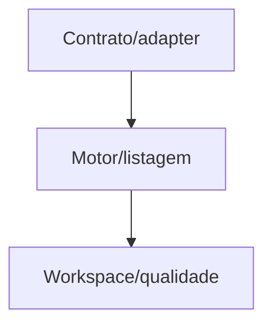

# Tarefas rinosOne — Autorização por Recurso

Escopo: referências tipadas, relations auditáveis, decisão/listagem por recurso e atualização parcial do workspace; editor de compartilhamento é adiado.

**Legenda de status:** `[ ]` pendente; `[x]` concluída.  
**Legenda de criticidade:** `[C]` crítico; `[A]` alto; `[M]` médio.

## FASE 1 - Contrato e Modelo de Recurso

### 1.1 Criar registry de tipos e referências `[C]`

Ref: Spec FR-RA-001 a 005, `data-model.md`, `resource-decision.md`.

- [x] 1.1.1 Persistir tipos/relation core com BIGINT e índices de contexto. <!-- migrations 000010 e modelos em 2026-09-26 -->
- [x] 1.1.2 Definir `ResourceReference` e registry de adaptadores por tipo. <!-- ResourceReference e AuthorizationResourceRegistry em 2026-09-26 -->
- [x] 1.1.3 Testar validação de esfera, tenant e inexistência segura. <!-- AuthorizationResourceRegistryTest em 2026-09-26 -->

### 1.2 Implementar adaptador inicial de pasta `[A]`

Ref: US-RA-001, FR-RA-002/008.

- [x] 1.2.1 Registrar actions e relations de leitura/edição para pasta pessoal. <!-- WorkspaceFolderAuthorizationResourceAdapter em 2026-09-26 -->
- [x] 1.2.2 Resolver proprietário/disponibilidade sem confiança no cliente. <!-- adaptadores pessoal e tenant consultam file_workspaceFolder em 2026-09-26 -->
- [~] 1.2.3 Cobrir compartilhamento e isolamento entre pastas em testes de feature. <!-- isolamento de tipo, estado e tenant coberto; compartilhamento depende do motor de relation da fase 2 -->

## FASE 2 - Motor, Relation e Listagem

### 2.1 Estender decisão canônica `[C]`

Ref: Spec FR-RA-005 a 009, contrato da fundação.

- [x] 2.1.1 Exigir relation quando action/tipo a declarar necessária. <!-- AuthorizationService e adapters de pasta em 2026-09-26 -->
- [x] 2.1.2 Aplicar restriction antes de grants/relation e negar por recurso inválido. <!-- fluxo canônico em AuthorizationService em 2026-09-26 -->
- [~] 2.1.3 Testar revogação imediata, grupo e `tenant.administrator` sem bypass. <!-- grupo coberto; faltam cenários de revogação na decisão e administrador tenant -->

### 2.2 Expor lote e listagem autorizada `[C]`

Ref: Spec FR-RA-010 a 013.

- [ ] 2.2.1 Criar contrato/endpoint protegido para lista e check em lote.
- [ ] 2.2.2 Implementar consulta agregada sem loop de decisão individual.
- [ ] 2.2.3 Testar anti-IDOR, paginação e equivalência com check de referência.

### 2.3 Auditar mudanças de relation `[A]`

Ref: Spec FR-RA-002/009/012.

- [~] 2.3.1 Criar serviços transacionais para criar, alterar, desativar e remover relation. <!-- criação, reativação, desativação e remoção implementadas; alteração explícita de relation pendente -->
- [x] 2.3.2 Registrar evento seguro na mesma transação. <!-- AuthorizationResourceRelationService em 2026-09-26 -->
- [x] 2.3.3 Validar imutabilidade e ausência de conteúdo sensível em teste. <!-- snapshots de relation e audit event imutável cobertos em 2026-09-26 -->

## FASE 3 - Workspace e Qualidade

### 3.1 Implementar INT-WEB-RESOURCE-001 `[A]`

Ref: `interface-spec.md` INT-WEB-RESOURCE-001.

- [ ] 3.1.1 Integrar lista real e parser TypeScript do contrato.
- [ ] 3.1.2 Cobrir loading, vazio, erro, offline/stale e acesso negado.
- [ ] 3.1.3 Verificar teclado, leitor de tela e viewport desktop/mobile.

### 3.2 Implementar INT-WEB-RESOURCE-002 `[A]`

Ref: `interface-spec.md` INT-WEB-RESOURCE-002.

- [ ] 3.2.1 Associar ações de detalhe à resposta protegida da API.
- [ ] 3.2.2 Remover ação/item após negação ou revogação confirmada.
- [ ] 3.2.3 Criar E2E com recurso real e inspeção visual responsiva.

### 3.3 Consolidar qualidade `[C]`

Ref: Spec SC-RA-001 a 005, `quickstart.md`.

- [ ] 3.3.1 Mapear FR/SC para testes unitários, feature, contrato e E2E.
- [ ] 3.3.2 Executar formatação, testes backend/frontend, tipos e build.
- [ ] 3.3.3 Verificar que core não possui FK para dados de tenant.

## Matriz de Dependências

## Cobertura de Interfaces

| Interação | Tasks | Verificação |
| --- | --- | --- |
| INT-WEB-RESOURCE-001 | 3.1 | componente, API real, a11y e responsividade |
| INT-WEB-RESOURCE-002 | 3.2 | E2E, negação e inspeção visual |

## Resumo Quantitativo

| Fase | Tarefas | Subtarefas |
| --- | ---: | ---: |
| 1 | 2 | 6 |
| 2 | 3 | 9 |
| 3 | 3 | 9 |
| **Total** | **8** | **24** |

## Escopo Coberto

References, types, relations, decision, lote, listagem, auditoria e workspace parcial.

## Escopo Excluído

Editor genérico de relation, condições contextuais, limites, delegação e cache de escala.
