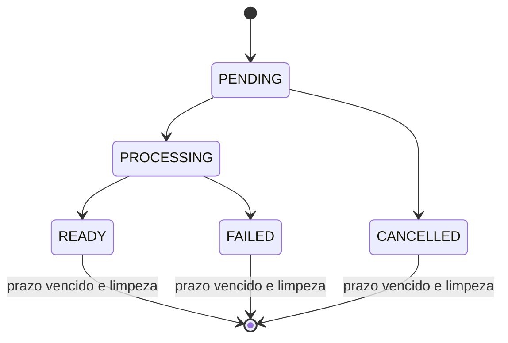
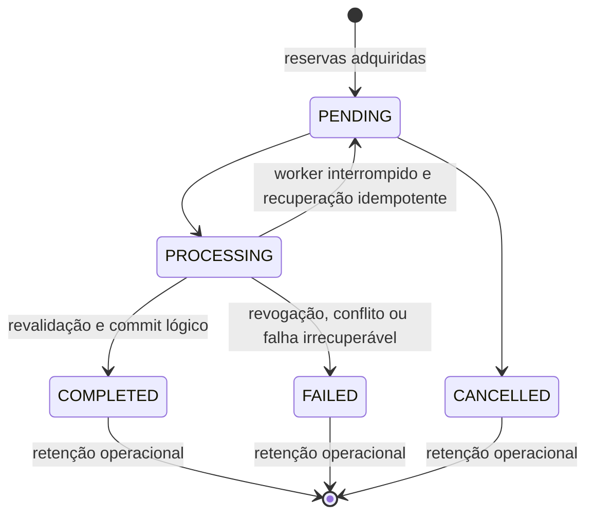

# Modelo de dados — Rinos Drive

## Reutilização da fundação

O Drive reutiliza `file_workspaceFolder`, `file_filePossession`, `file_fileVersion`, `file_fileContent` e `file_ownerUsage`. Não duplica arquivo, versão, objeto físico, quota, lixeira ou relação de autorização. Pastas e posses `SYSTEM_MANAGED` permanecem fora da projeção do navegador.

## Reserva concorrente de nome

Não há nova entidade ou migração para resolver colisões de nomes. A alocação do `displayName` final é uma operação transacional centralizada: o servidor serializa a decisão por workspace e localização de destino, consulta os irmãos no estado protegido e só então persiste o item com um nome reservado. Assim, requisições simultâneas recebem nomes distintos sem depender de um nome provisório do cliente.

## Nova entidade: `file_workspaceExport`

Representa uma exportação compactada efêmera. Ela não é arquivo lógico, versão, posse, binding nem item visível do workspace.

| Campo | Tipo lógico | Regras |
| --- | --- | --- |
| `id` | BIGINT UNSIGNED | Identidade interna. |
| `publicId` | identificador opaco | Único; pode ser usado apenas com sessão autorizada. |
| `idRequestingUser` | BIGINT UNSIGNED | Usuário que solicitou a exportação. |
| `idTenant` | BIGINT UNSIGNED nulo | Tenant do contexto Work; nulo no contexto pessoal. |
| `workspaceScope` | enum | `PERSONAL` ou `TENANT`; compatível com o contexto e solicitante. |
| `selectionManifest` | JSON | Referências de pastas e posses solicitadas; nunca é considerado autorização final. |
| `state` | enum | `PENDING`, `PROCESSING`, `READY`, `FAILED` ou `CANCELLED`. A expiração é uma condição temporal, não um estado persistente. |
| `displayName` | texto limitado | Nome sugerido do pacote entregue. |
| `storageKey` | texto limitado nulo | Chave privada temporária; ausente antes de pronto e removida na expiração. |
| `storedSizeBytes` | inteiro nulo | Tamanho do pacote pronto, para diagnóstico operacional e aplicação do limite configurado de tamanho por exportação temporária. |
| `expiresAt` | data/hora | Prazo estrito de disponibilidade. |
| `failureCode` | texto limitado nulo | Código seguro, sem caminho, nome de item inacessível ou erro interno. |
| `createdAt`, `updatedAt` | data/hora | Auditoria operacional. |

### Índices e invariantes

- `publicId` é único.
- Índices por `state, expiresAt`, por solicitante e por `idTenant, workspaceScope` suportam limpeza e consulta segura.
- Uma exportação só se torna `READY` depois de revalidar cada item do manifesto.
- `storageKey` não identifica usuário, tenant, arquivo, pasta nem versão e nunca sai no payload da API.
- Cancelamento só é aceito enquanto o job está `PENDING`; a expiração torna qualquer estado indisponível e a limpeza remove bytes e registro em execução idempotente.

## Projeções sem persistência própria

| Projeção | Origem | Regra |
| --- | --- | --- |
| Árvore acessível | pastas e relações efetivas | Exibe somente raízes autorizadas e descendentes permitidos. |
| Conteúdo da localização | pasta ativa, posses e autorização | Exclui posses de sistema, itens liberados e itens fora do ramo autorizado. |
| Capabilities do item | decisão de autorização | Calculadas por item/localização; não são gravadas na sessão. |
| Uso do workspace | `file_ownerUsage` | Informa consumo existente; exportações não participam do total. |

## Transições de exportação

Após `expiresAt`, qualquer estado é indisponível logicamente; a rotina remove o registro e a representação privada. A remoção física pode ser repetida com segurança.

## Evolução unificada: relações diretas de arquivo

Não há nova tabela de compartilhamento. A tabela genérica `auth_resource_relation` passa a referenciar também uma posse de arquivo ativa:

| Campo existente | Regra para arquivo |
| --- | --- |
| `idResourceType` | Tipo registrado `personal.file` ou `tenant.file`. |
| `resourceId` | `file_filePossession.id`, nunca content, versão, caminho ou chave de backend. |
| `relationKey` | Somente `READ` nesta fase. |
| `scope`, `idTenant` | Devem corresponder exatamente ao owner da posse. |
| `idUser` | Destinatário único obrigatório nesta entrega; relação direta e revogável. `idGroup` não é aceito para recursos de arquivo nesta fase. |
| `active` | Somente relação ativa é projetada em Compartilhados comigo. |

O adapter de arquivo confirma posse `WORKSPACE` ativa, não `SYSTEM_MANAGED`, no owner e scope corretos. Diferentemente da pasta, a relação de arquivo não herda para pai, irmãos ou descendentes e não concede edição.

## Nova entidade: `file_workspaceTransfer`

Representa uma cópia ou movimento lógico persistente entre workspaces. Não representa arquivo, versão, conteúdo físico ou item navegável.

| Campo | Tipo lógico | Regras |
| --- | --- | --- |
| `id` | BIGINT UNSIGNED | Identidade interna. |
| `publicId` | identificador opaco | Único; exposto somente ao solicitante autorizado. |
| `idRequestingUser` | BIGINT UNSIGNED | Principal que iniciou a operação. |
| `sourceScope`, `sourceUserId`, `sourceTenantId` | enum + BIGINT nulo | Alvo de origem; exatamente um owner compatível com o escopo. Preserva a origem pessoal de uma concessão direta. |
| `destinationScope`, `destinationUserId`, `destinationTenantId` | enum + BIGINT nulo | Alvo de destino; exatamente um owner compatível com o escopo. |
| `destinationFolderId` | BIGINT nulo | Pasta de destino autorizada, ou nulo para a raiz; persiste a localização do job independentemente da interface. |
| `mode` | enum | `COPY` ou `MOVE`. |
| `selectionManifest` | JSON | Itens de uma única origem; revalidado, nunca autoridade de acesso. |
| `state` | enum | `PENDING`, `PROCESSING`, `COMPLETED`, `FAILED` ou `CANCELLED`. |
| `totalItems`, `processedItems` | inteiros sem sinal | Progresso seguro por quantidade, sem nomes. |
| `idempotencyKey` | string limitada nula | Espelho de auditoria da chave recebida na API; a autoridade de idempotência é `api_idempotency_records`, nunca um índice parcial na transferência. |
| `correlationId` | string limitada nula | Correlação operacional/auditoria. |
| `leaseExpiresAt`, `heartbeatAt` | data/hora nula | Lease renovável durante processamento. |
| `failureCode` | string limitada nula | Código seguro, sem item, caminho ou dado de terceiro. |
| `startedAt`, `completedAt`, `createdAt`, `updatedAt` | data/hora | Auditoria e recuperação. |

### Entidade dependente: `file_workspaceTransferReservation`

| Campo | Tipo lógico | Regras |
| --- | --- | --- |
| `id` | BIGINT UNSIGNED | Identidade interna. |
| `idWorkspaceTransfer` | BIGINT UNSIGNED | FK para a operação, com cascade delete. |
| `side` | enum | `SOURCE` ou `DESTINATION`. |
| `workspaceScope`, `idTenant` | enum + BIGINT nulo | Workspace reservado. |
| `rootFolderId` | BIGINT UNSIGNED nulo | Nulo reserva a raiz inteira; valor reserva a pasta e seus descendentes. |
| `leaseExpiresAt` | data/hora | Igual ou derivado do lease da transferência; só reserva válida bloqueia mutação. |
| `createdAt`, `updatedAt` | data/hora | Auditoria operacional. |

### Índices e invariantes de transferência

- `publicId` é único. A criação usa o middleware `api.idempotency`, cuja chave única inclui solicitante, escopo e operação; o campo de auditoria da transferência não recebe índice de unicidade próprio.
- Índices por `state, leaseExpiresAt` suportam recuperação; por contexto e solicitante suportam status seguro; reservas são indexadas por `workspaceScope, idTenant, rootFolderId, leaseExpiresAt`.
- Antes de criar a operação, a transação normaliza raízes, adquire locks em ordem estável `(scope, tenant, folder)` e rejeita qualquer interseção com reserva ativa.
- O destino só recebe posses/pastas ativas no commit lógico; `MOVE` libera a origem na mesma confirmação ou a mantém intacta.
- Falha, cancelamento ou lease vencido não preservam reserva nem item de destino parcial.

## Projeções adicionais sem persistência própria

| Projeção | Origem | Regra |
| --- | --- | --- |
| Catálogo de drives | usuário, membership, administradores e relações efetivas | Lista Meu Drive, roots Work de administrador ou relação de pasta navegável e Compartilhados comigo; arquivo diretamente concedido não cria root Work. Não carrega árvores. |
| Compartilhados comigo | relações diretas ativas de folder/file | Agrupa somente itens diretamente concedidos, com alvo de origem e capabilities read-only para arquivo. |
| Estado de transferência | `file_workspaceTransfer` | Expõe somente id opaco, modo, estado, contadores, destino seguro e erro categorizado ao solicitante. |

## Transições de transferência

