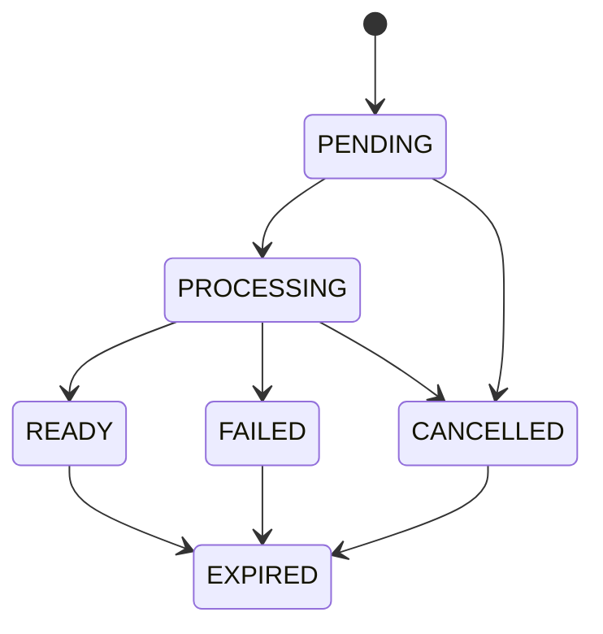

# Modelo de dados — Rinos Drive

## Reutilização da fundação

O Drive reutiliza `file_workspaceFolder`, `file_filePossession`, `file_fileVersion`, `file_fileContent` e `file_ownerUsage`. Não duplica arquivo, versão, objeto físico, quota, lixeira ou relação de autorização. Pastas e posses `SYSTEM_MANAGED` permanecem fora da projeção do navegador.

## Reserva concorrente de nome

Não há nova entidade ou migração para resolver colisões de nomes. A alocação do `displayName` final é uma operação transacional centralizada: o servidor serializa a decisão por workspace e localização de destino, consulta os irmãos no estado protegido e só então persiste o item com um nome reservado. Assim, requisições simultâneas recebem nomes distintos sem depender de um nome provisório do cliente.

## Nova entidade: `file_workspaceExport`

Representa uma exportação compactada efêmera. Ela não é arquivo lógico, versão, posse, binding nem item visível do workspace.

| Campo | Tipo lógico | Regras |
| --- | --- | --- |
| `id` | BIGINT UNSIGNED | Identidade interna. |
| `publicId` | identificador opaco | Único; pode ser usado apenas com sessão autorizada. |
| `idRequestingUser` | BIGINT UNSIGNED | Usuário que solicitou a exportação. |
| `idTenant` | BIGINT UNSIGNED nulo | Tenant do contexto Work; nulo no contexto pessoal. |
| `workspaceScope` | enum | `PERSONAL` ou `TENANT`; compatível com o contexto e solicitante. |
| `selectionManifest` | JSON | Referências de pastas e posses solicitadas; nunca é considerado autorização final. |
| `state` | enum | `PENDING`, `PROCESSING`, `READY`, `FAILED`, `EXPIRED`, `CANCELLED`. |
| `displayName` | texto limitado | Nome sugerido do pacote entregue. |
| `storageKey` | texto limitado nulo | Chave privada temporária; ausente antes de pronto e removida na expiração. |
| `storedSizeBytes` | inteiro nulo | Tamanho do pacote pronto, para controlar capacidade temporária. |
| `expiresAt` | data/hora | Prazo estrito de disponibilidade. |
| `failureCode` | texto limitado nulo | Código seguro, sem caminho, nome de item inacessível ou erro interno. |
| `createdAt`, `updatedAt` | data/hora | Auditoria operacional. |

### Índices e invariantes

- `publicId` é único.
- Índices por `state, expiresAt`, por solicitante e por `idTenant, workspaceScope` suportam limpeza e consulta segura.
- Uma exportação só se torna `READY` depois de revalidar cada item do manifesto.
- `storageKey` não identifica usuário, tenant, arquivo, pasta nem versão e nunca sai no payload da API.
- A expiração ou o cancelamento removem bytes temporários e anulam a disponibilidade mesmo que a limpeza física seja reexecutada.

## Projeções sem persistência própria

| Projeção | Origem | Regra |
| --- | --- | --- |
| Árvore acessível | pastas e relações efetivas | Exibe somente raízes autorizadas e descendentes permitidos. |
| Conteúdo da localização | pasta ativa, posses e autorização | Exclui posses de sistema, itens liberados e itens fora do ramo autorizado. |
| Capabilities do item | decisão de autorização | Calculadas por item/localização; não são gravadas na sessão. |
| Uso do workspace | `file_ownerUsage` | Informa consumo existente; exportações não participam do total. |

## Transições de exportação

`EXPIRED` é terminal e representa a indisponibilidade lógica; a remoção física pode ser repetida com segurança pela rotina de limpeza.
