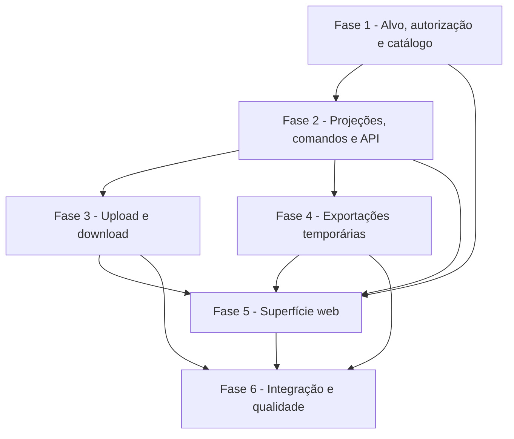

# Tarefas Rinos One — Rinos Drive

Escopo: implementar Rinos Drive Pessoal e Rinos Drive Work sobre a fundação de arquivos e autorização existentes, incluindo navegador responsivo, árvore, operações de workspace, upload, download, lixeira e exportações privadas temporárias.

**Legenda de status:**

- `[ ]` Pendente
- `[~]` Em andamento
- `[x]` Concluído
- `[!]` Bloqueado

**Legenda de criticidade:**

- `[C]` Crítico — isolamento, autorização, privacidade ou retenção cuja falha expõe conteúdo ou deixa bytes indevidos.
- `[A]` Alto — fluxo essencial de Drive sem o qual o módulo não é utilizável.
- `[M]` Médio — qualidade, ergonomia, observabilidade ou refinamento necessário, mas não bloqueante ao núcleo.

---

## FASE 1 — Fundação de alvo, autorização e catálogo `[C]`

### 1.1 Consolidar alvo de workspace e decisão efetiva `[C]`

Ref: [Spec](spec.md) FR-DRIVE-002 a 004, 018 a 025; [Plan](plan.md) §Resolução de alvo e autorização; [Checklist de segurança](checklists/security.md) CHK001 a CHK006.

- [x] 1.1.1 Criar resolvedor tipado de alvo pessoal e Work que derive usuário/tenant da sessão e do contexto válido, sem aceitar proprietário livre do cliente.
- [x] 1.1.2 Estender a decisão de recurso de pasta para reconhecer administrador ativo do tenant como principal integral após aplicar restrições válidas.
- [x] 1.1.3 Preservar `READ` e `EDIT` diretos ou por grupo para membros não administrativos, com herança aos descendentes e sem grant global implícito.
- [x] 1.1.4 Cobrir em testes unitários e de feature: administrador, membro com READ, membro com EDIT, membro sem relation, restriction, revogação e isolamento entre tenants.

### 1.2 Registrar destinos e ícone do módulo `[A]`

Ref: [Spec](spec.md) FR-DRIVE-001 a 004; [Interface](interface-spec.md) INT-WEB-DRIVE-001; [Plan](plan.md) §Estrutura do projeto.

- [x] 1.2.1 Registrar o ativo raster `drive` no catálogo central, com variantes publicadas e preload ocioso automático.
- [x] 1.2.2 Substituir o destino pessoal “Arquivos e anexos” por “Arquivos”, com título Rinos Drive Pessoal e ícone Drive.
- [x] 1.2.3 Registrar destino Work de instância única por tenant, título Rinos Drive Work e encerramento automático na troca de contexto.
- [x] 1.2.4 Cobrir catálogo, política de instância, filtro de contexto e resolução de ícone com testes TypeScript.

---

## FASE 2 — Projeções, comandos e API de workspace `[C]`

### 2.1 Implementar projeções privadas de árvore, localização e detalhes `[C]`

Ref: [Spec](spec.md) FR-DRIVE-005, 016, 020 a 025 e 027; [Contrato](contracts/drive-workspace-api.md) §Leitura e navegação; [Interface](interface-spec.md) INT-WEB-DRIVE-001 e 005.

- [x] 2.1.1 Criar serviços de projeção para árvore acessível, raiz, pasta, lixeira e detalhes, excluindo posses `SYSTEM_MANAGED`, liberadas ou não autorizadas.
- [x] 2.1.2 Projetar breadcrumbs para acesso parcial sem permitir enumeração de raiz, ancestrais ou irmãos fora do ramo concedido.
- [x] 2.1.3 Expor controllers, requests e rotas versionadas pessoal/Work no formato do contrato, com envelopes seguros de erro.
- [x] 2.1.4 Criar parsers TypeScript para projeções de árvore, localização, item, usage e details, recusando payloads inválidos.
- [x] 2.1.5 Cobrir leitura, árvore parcial, lixeira, detalhes, negação segura e payloads com testes HTTP, contrato e frontend.

### 2.2 Implementar comandos de pasta, arquivo e lixeira `[A]`

Ref: [Spec](spec.md) FR-DRIVE-006, 009 e 015; [Contrato](contracts/drive-workspace-api.md) §Operações de organização; [Interface](interface-spec.md) INT-WEB-DRIVE-002.

- [x] 2.2.1 Criar resolvedor central de nomes que preserve ambos os itens, produza sufixo seguro e determinístico em conflitos e reserve o nome final na transação serializada por workspace e localização de destino.
- [x] 2.2.2 Expor criação, renomeação e movimentação de pasta e de posse com validação de destino, capabilities e invariantes existentes.
- [x] 2.2.3 Expor lixeira, restauro e limpeza definitiva em lote como operações integrais, com confirmação explícita apenas na interface.
- [x] 2.2.4 Validar nomes inválidos, reservados e excessivos, além de ações mistas sem edição, antes de alterar qualquer item.
- [x] 2.2.5 Cobrir concorrência real de nomes (operações simultâneas recebem nomes distintos), conflitos, ciclos, isolamento, atomicidade, prazos de lixeira e atualização de uso em testes de serviço e feature.

---

## FASE 3 — Ingestão e entrega privada `[C]`

### 3.1 Implementar upload múltiplo para workspace `[C]`

Ref: [Spec](spec.md) FR-DRIVE-007 a 009, 019, 021 e 026; [Plan](plan.md) §Pastas, arquivos e uploads; [Interface](interface-spec.md) INT-WEB-DRIVE-003.

- [x] 3.1.1 Adicionar configuração comentada de limites por arquivo, lote, tipo permitido, tamanho total e temporários de upload no modelo de ambiente.
- [x] 3.1.2 Criar requests e serviço de ingestão de workspace que validem cada arquivo e destino autorizado antes de chamar `FileStorageV1`.
- [x] 3.1.3 Persistir posses `WORKSPACE` na pasta ou raiz selecionada, aplicando o resolvedor transacional de nome final seguro e resultados individuais sem ativar item parcial.
- [x] 3.1.4 Expor endpoint de upload múltiplo com resposta individual estável, sem caminho local, hash ou backend.
- [x] 3.1.5 Cobrir lotes válidos, falhas individuais, limites, MIME real, revogação durante envio, conflitos inclusive em lote concorrente e ausência de posse parcial em testes de integração.

### 3.2 Implementar download unitário privado `[C]`

Ref: [Spec](spec.md) FR-DRIVE-010, 020, 027; [Contrato](contracts/drive-workspace-api.md) §Upload e download.

- [x] 3.2.1 Adaptar leitura privada de posse para download HTTP com nome seguro, tipo detectado e stream sem URL pública.
- [x] 3.2.2 Revalidar contexto, relação e restrição imediatamente antes de iniciar o stream.
- [x] 3.2.3 Definir respostas seguras para item ausente, lixeira indisponível, acesso revogado e backend indisponível.
- [x] 3.2.4 Cobrir download pessoal, Work administrativo, acesso parcial, negação, revogação e ausência de dados físicos no cabeçalho/payload.

---

## FASE 4 — Exportações temporárias e manutenção `[C]`

### 4.1 Persistir e gerar exportação privada em lote `[C]`

Ref: [Spec](spec.md) FR-DRIVE-010 a 014; [Data Model](data-model.md) §Nova entidade e §Transições; [Interface](interface-spec.md) INT-WEB-DRIVE-004.

- [ ] 4.1.1 Criar migration, modelo e índices para `file_workspaceExport`, com identificador opaco, manifesto, estados, prazo, tamanho e código seguro de falha.
- [ ] 4.1.2 Criar serviço de seleção/exportação que valide integralmente itens, contexto, autorização e limites antes de enfileirar o job.
- [ ] 4.1.3 Criar job idempotente que revalide cada item, escreva ZIP em área privada temporária, preserve hierarquia e resolva colisões internas.
- [ ] 4.1.4 Expor criação, consulta, cancelamento e download de exportação, revalidando solicitante e acesso no download.
- [ ] 4.1.5 Cobrir seleção parcial, expiração, cancelamento, revogação, limite de espaço, ZIP seguro e indisponibilidade de pacote parcial em testes de feature.

### 4.2 Operar limpeza, limites e recuperação de exportação `[C]`

Ref: [Spec](spec.md) FR-DRIVE-013 e 014; [Plan](plan.md) §Exportação múltipla; [Checklist de segurança](checklists/security.md) CHK010 e CHK011.

- [ ] 4.2.1 Adicionar política configurável de prazo, capacidade, quantidade e tamanho máximo de exportações ao arquivo de configuração e `.env.example` comentado.
- [ ] 4.2.2 Criar comando ou job agendado para expirar registros e apagar bytes temporários com locks e repetição segura.
- [ ] 4.2.3 Garantir que cancelamento, falha e expiração invalidem o download antes da remoção física e não afetem quota de workspace.
- [ ] 4.2.4 Documentar operação, observabilidade segura e recuperação de falha em `docs/operations/file-storage.md`.
- [ ] 4.2.5 Cobrir limpeza concorrente, reinício, órfão temporário, configuração inválida e ausência de quota em testes automatizados.

---

## FASE 5 — Superfície Rinos Drive `[A]`

### 5.1 Implementar navegador, árvore e coleções `[A]`

Ref: [Interface](interface-spec.md) INT-WEB-DRIVE-001 e INT-WEB-DRIVE-005; [Wireframes](wireframes/drive-desktop.md) e [mobile](wireframes/drive-mobile.md).

- [ ] 5.1.1 Substituir a superfície provisória por `DriveExplorer` reutilizável com alvo tipado, store local por instância e dados reais da API.
- [ ] 5.1.2 Implementar árvore acessível, breadcrumbs, raiz, lixeira, atualização e estados loading/empty/stale/access-denied.
- [ ] 5.1.3 Implementar grade, lista, detalhes e tabela com ícones por tipo, seleção consistente e preferência visual local.
- [ ] 5.1.4 Implementar painel de detalhes seguro e drawers móveis para árvore/detalhes, preservando canvas, safe area e rolagem interna.
- [ ] 5.1.5 Cobrir teclado, foco, leitor de tela, i18n, desktop, telefone, troca de tenant, payload real e inspeção visual dos wireframes.

### 5.2 Implementar diálogos locais, upload e seleção `[A]`

Ref: [Interface](interface-spec.md) INT-WEB-DRIVE-002 a 004; [Contrato](contracts/drive-workspace-api.md).

- [ ] 5.2.1 Implementar diálogos reutilizáveis de pasta, mover e confirmação destrutiva na pilha local da janela.
- [ ] 5.2.2 Implementar trigger, zona de soltar e fila de upload múltiplo com progresso individual, cancelamento e resultado por item.
- [ ] 5.2.3 Implementar seleção por ponteiro, toque e teclado, barra contextual e ações condicionadas a capabilities reais.
- [ ] 5.2.4 Implementar diálogo de exportação com consulta de estado limitada à instância e limpeza em fechamento, troca de contexto ou expiração.
- [ ] 5.2.5 Cobrir diálogos sobrepostos, formulários, seleção, fila, offline, revogação, responsividade, acessibilidade e quatro idiomas com Vitest e testes integrados.

---

## FASE 6 — Integração, qualidade e documentação final `[A]`

### 6.1 Validar ponta a ponta e consolidar documentação `[A]`

Ref: [Quickstart](quickstart.md); [Checklists](checklists/); [Spec](spec.md) SC-DRIVE-001 a 006.

- [ ] 6.1.1 Executar e registrar cenários pessoais, Work administrativo, Work parcial, revogação, upload, lixeira, download e exportação do quickstart.
- [ ] 6.1.2 Criar testes de roundtrip contrato–interface com API real para upload, listagem e atualização de localização.
- [ ] 6.1.3 Executar PHPUnit, Vitest, type-check, build e inspeção visual desktop/mobile, corrigindo regressões encontradas.
- [ ] 6.1.4 Atualizar README, catálogo de ícones, arquitetura de superfícies e operação de arquivos com somente o comportamento efetivamente entregue.
- [ ] 6.1.5 Marcar evidências de conclusão no backlog e reexecutar a análise cross-artifact antes de encerrar a feature.

---

## Matriz de Dependências

## Cobertura de Interfaces

| Interaction ID | Tarefas | Cobertura |
| --- | --- | --- |
| INT-WEB-DRIVE-001 | 1.2, 2.1, 5.1 | Navegador pessoal/Work, árvore, estados e contexto. |
| INT-WEB-DRIVE-002 | 2.2, 5.2 | Pastas, movimentação, lixeira e confirmações locais. |
| INT-WEB-DRIVE-003 | 3.1, 5.2 | Upload múltiplo, validação, fila e feedback. |
| INT-WEB-DRIVE-004 | 4.1, 4.2, 5.2 | Seleção, exportação, expiração e download temporário. |
| INT-WEB-DRIVE-005 | 2.1, 5.1 | Modos de visualização e painel de detalhes. |

## Resumo Quantitativo

| Fase | Tarefas | Subtarefas | Criticidade |
| --- | ---: | ---: | --- |
| 1 - Fundação de alvo, autorização e catálogo | 2 | 8 | C, A |
| 2 - Projeções, comandos e API | 2 | 10 | C, A |
| 3 - Ingestão e entrega privada | 2 | 9 | C |
| 4 - Exportações temporárias e manutenção | 2 | 10 | C |
| 5 - Superfície Rinos Drive | 2 | 10 | A |
| 6 - Integração, qualidade e documentação | 1 | 5 | A |
| **Total** | **11** | **52** | - |

## Escopo Coberto

| Item | Descrição | Fases |
| --- | --- | --- |
| FR-DRIVE-001 a 006 | Módulo, alvos, árvore, navegação e organização segura. | 1, 2, 5 |
| FR-DRIVE-007 a 011 | Upload, conflitos, download e seleção. | 2, 3, 5 |
| FR-DRIVE-012 a 014 | Exportações efêmeras, limites e limpeza agendada. | 4, 5 |
| FR-DRIVE-015 a 017 | Lixeira, visualizações, acessibilidade e responsividade. | 2, 5, 6 |
| FR-DRIVE-018 a 025 | Relações por pasta, administrador integral e restrições. | 1, 2, 3, 4 |
| FR-DRIVE-026 a 028 | Sem bloqueio de quota, sem ativos de sistema ou funcionalidades adiadas. | Todas |

## Escopo Excluído

| Item | Descrição | Motivo |
| --- | --- | --- |
| Gestão visual de permissões e convites | Criar, revogar e auditar relations pela interface. | Capability de compartilhamento terá SDD própria. |
| Compartilhamento externo | Links públicos, convidados e revogação externa. | Requer política específica de acesso contextual. |
| Prévia e thumbnails | Imagens, PDF, vídeo, áudio ou documentos renderizados. | Depende de cadeia de derivadas e requisitos próprios. |
| Edição de conteúdo | Alterar documentos ou criar versões por editor. | Módulos consumidores definirão editores e fluxos de versão. |
| Bloqueio por quota e planos | Impedir operações por contratação/consumo. | A fundação apenas contabiliza consumo nesta fase. |
