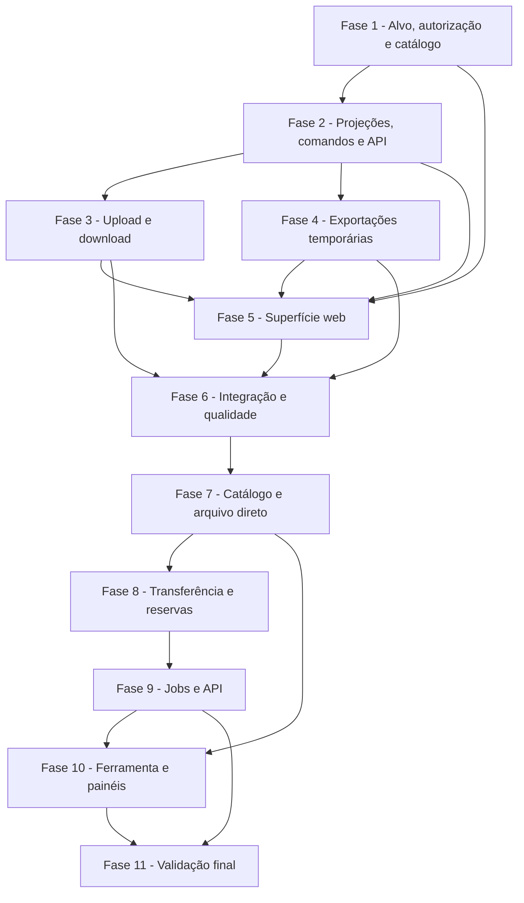

# Tarefas Rinos One — Rinos Drive

Escopo: implementar Rinos Drive Pessoal e Rinos Drive Work sobre a fundação de arquivos e autorização existentes, incluindo navegador responsivo, árvore, operações de workspace, upload, download, lixeira e exportações privadas temporárias.

**Legenda de status:**

- `[ ]` Pendente
- `[~]` Em andamento
- `[x]` Concluído
- `[!]` Bloqueado

**Legenda de criticidade:**

- `[C]` Crítico — isolamento, autorização, privacidade ou retenção cuja falha expõe conteúdo ou deixa bytes indevidos.
- `[A]` Alto — fluxo essencial de Drive sem o qual o módulo não é utilizável.
- `[M]` Médio — qualidade, ergonomia, observabilidade ou refinamento necessário, mas não bloqueante ao núcleo.

---

## FASE 1 — Fundação de alvo, autorização e catálogo `[C]`

### 1.1 Consolidar alvo de workspace e decisão efetiva `[C]`

Ref: [Spec](spec.md) FR-DRIVE-002 a 004, 018 a 025; [Plan](plan.md) §Resolução de alvo e autorização; [Checklist de segurança](checklists/security.md) CHK001 a CHK006.

- [x] 1.1.1 Criar resolvedor tipado de alvo pessoal e Work que derive usuário/tenant da sessão e do contexto válido, sem aceitar proprietário livre do cliente.
- [x] 1.1.2 Estender a decisão de recurso de pasta para reconhecer administrador ativo do tenant como principal integral após aplicar restrições válidas.
- [x] 1.1.3 Preservar `READ` e `EDIT` diretos ou por grupo para membros não administrativos, com herança aos descendentes e sem grant global implícito.
- [x] 1.1.4 Cobrir em testes unitários e de feature: administrador, membro com READ, membro com EDIT, membro sem relation, restriction, revogação e isolamento entre tenants.

### 1.2 Registrar destinos e ícone do módulo `[A]`

Ref: [Spec](spec.md) FR-DRIVE-001 a 004; [Interface](interface-spec.md) INT-WEB-DRIVE-001; [Plan](plan.md) §Estrutura do projeto.

- [x] 1.2.1 Registrar o ativo raster `drive` no catálogo central, com variantes publicadas e preload ocioso automático.
- [x] 1.2.2 Substituir o destino pessoal “Arquivos e anexos” por “Arquivos”, com título Rinos Drive Pessoal e ícone Drive.
- [x] 1.2.3 Registrar destino Work de instância única por tenant, título Rinos Drive Work e encerramento automático na troca de contexto.
- [x] 1.2.4 Cobrir catálogo, política de instância, filtro de contexto e resolução de ícone com testes TypeScript.

---

## FASE 2 — Projeções, comandos e API de workspace `[C]`

### 2.1 Implementar projeções privadas de árvore, localização e detalhes `[C]`

Ref: [Spec](spec.md) FR-DRIVE-005, 016, 020 a 025 e 027; [Contrato](contracts/drive-workspace-api.md) §Leitura e navegação; [Interface](interface-spec.md) INT-WEB-DRIVE-001 e 005.

- [x] 2.1.1 Criar serviços de projeção para árvore acessível, raiz, pasta, lixeira e detalhes, excluindo posses `SYSTEM_MANAGED`, liberadas ou não autorizadas.
- [x] 2.1.2 Projetar breadcrumbs para acesso parcial sem permitir enumeração de raiz, ancestrais ou irmãos fora do ramo concedido.
- [x] 2.1.3 Expor controllers, requests e rotas versionadas pessoal/Work no formato do contrato, com envelopes seguros de erro.
- [x] 2.1.4 Criar parsers TypeScript para projeções de árvore, localização, item, usage e details, recusando payloads inválidos.
- [x] 2.1.5 Cobrir leitura, árvore parcial, lixeira, detalhes, negação segura e payloads com testes HTTP, contrato e frontend.

### 2.2 Implementar comandos de pasta, arquivo e lixeira `[A]`

Ref: [Spec](spec.md) FR-DRIVE-006, 009 e 015; [Contrato](contracts/drive-workspace-api.md) §Operações de organização; [Interface](interface-spec.md) INT-WEB-DRIVE-002.

- [x] 2.2.1 Criar resolvedor central de nomes que preserve ambos os itens, produza sufixo seguro e determinístico em conflitos e reserve o nome final na transação serializada por workspace e localização de destino.
- [x] 2.2.2 Expor criação, renomeação e movimentação de pasta e de posse com validação de destino, capabilities e invariantes existentes.
- [x] 2.2.3 Expor lixeira, restauro e limpeza definitiva em lote como operações integrais, com confirmação explícita apenas na interface.
- [x] 2.2.4 Validar nomes inválidos, reservados e excessivos, além de ações mistas sem edição, antes de alterar qualquer item.
- [x] 2.2.5 Cobrir concorrência real de nomes (operações simultâneas recebem nomes distintos), conflitos, ciclos, isolamento, atomicidade, prazos de lixeira e atualização de uso em testes de serviço e feature.

---

## FASE 3 — Ingestão e entrega privada `[C]`

### 3.1 Implementar upload múltiplo para workspace `[C]`

Ref: [Spec](spec.md) FR-DRIVE-007 a 009, 019, 021 e 026; [Plan](plan.md) §Pastas, arquivos e uploads; [Interface](interface-spec.md) INT-WEB-DRIVE-003.

- [x] 3.1.1 Adicionar configuração comentada de limites por arquivo, lote, tipo permitido, tamanho total e temporários de upload no modelo de ambiente.
- [x] 3.1.2 Criar requests e serviço de ingestão de workspace que validem cada arquivo e destino autorizado antes de chamar `FileStorageV1`.
- [x] 3.1.3 Persistir posses `WORKSPACE` na pasta ou raiz selecionada, aplicando o resolvedor transacional de nome final seguro e resultados individuais sem ativar item parcial.
- [x] 3.1.4 Expor endpoint de upload múltiplo com resposta individual estável, sem caminho local, hash ou backend.
- [x] 3.1.5 Cobrir lotes válidos, falhas individuais, limites, MIME real, revogação durante envio, conflitos inclusive em lote concorrente e ausência de posse parcial em testes de integração.

### 3.2 Implementar download unitário privado `[C]`

Ref: [Spec](spec.md) FR-DRIVE-010, 020, 027; [Contrato](contracts/drive-workspace-api.md) §Upload e download.

- [x] 3.2.1 Adaptar leitura privada de posse para download HTTP com nome seguro, tipo detectado e stream sem URL pública.
- [x] 3.2.2 Revalidar contexto, relação e restrição imediatamente antes de iniciar o stream.
- [x] 3.2.3 Definir respostas seguras para item ausente, lixeira indisponível, acesso revogado e backend indisponível.
- [x] 3.2.4 Cobrir download pessoal, Work administrativo, acesso parcial, negação, revogação e ausência de dados físicos no cabeçalho/payload.

---

## FASE 4 — Exportações temporárias e manutenção `[C]`

### 4.1 Persistir e gerar exportação privada em lote `[C]`

Ref: [Spec](spec.md) FR-DRIVE-010 a 014; [Data Model](data-model.md) §Nova entidade e §Transições; [Interface](interface-spec.md) INT-WEB-DRIVE-004.

- [x] 4.1.1 Criar migration, modelo e índices para `file_workspaceExport`, com identificador opaco, manifesto, estados, prazo, tamanho e código seguro de falha.
- [x] 4.1.2 Criar serviço de seleção/exportação que valide integralmente itens, contexto, autorização e limites antes de enfileirar o job.
- [x] 4.1.3 Criar job idempotente que revalide cada item, escreva ZIP em área privada temporária, preserve hierarquia e resolva colisões internas.
- [x] 4.1.4 Expor criação, consulta, cancelamento e download de exportação, revalidando solicitante e acesso no download.
- [x] 4.1.5 Cobrir seleção parcial, expiração, cancelamento, revogação, limite de espaço, ZIP seguro e indisponibilidade de pacote parcial em testes de feature.

### 4.2 Operar limpeza, limites e recuperação de exportação `[C]`

Ref: [Spec](spec.md) FR-DRIVE-013 e 014; [Plan](plan.md) §Exportação múltipla; [Checklist de segurança](checklists/security.md) CHK010 e CHK011.

- [x] 4.2.1 Adicionar política configurável de prazo, capacidade, quantidade e tamanho máximo de exportações ao arquivo de configuração e `.env.example` comentado.
- [x] 4.2.2 Criar comando ou job agendado para expirar registros e apagar bytes temporários com locks e repetição segura.
- [x] 4.2.3 Garantir que cancelamento, falha e expiração invalidem o download antes da remoção física e não afetem quota de workspace.
- [x] 4.2.4 Documentar operação, observabilidade segura e recuperação de falha em `docs/operations/file-storage.md`.
- [x] 4.2.5 Cobrir limpeza concorrente, reinício, órfão temporário, configuração inválida e ausência de quota em testes automatizados.

---

## FASE 5 — Superfície Rinos Drive `[A]`

### 5.1 Implementar navegador, árvore e coleções `[A]`

Ref: [Interface](interface-spec.md) INT-WEB-DRIVE-001 e INT-WEB-DRIVE-005; [Wireframes](wireframes/drive-desktop.md) e [mobile](wireframes/drive-mobile.md).

- [x] 5.1.1 Substituir a superfície provisória por `DriveExplorer` reutilizável com alvo tipado, store local por instância e dados reais da API.
- [x] 5.1.2 Implementar árvore acessível, breadcrumbs, raiz, lixeira, atualização e estados loading/empty/stale/access-denied.
- [x] 5.1.3 Implementar grade, lista, detalhes e tabela com ícones por tipo, seleção consistente e preferência visual local.
- [x] 5.1.4 Implementar painel de detalhes seguro e drawers móveis para árvore/detalhes, preservando canvas, safe area e rolagem interna.
- [x] 5.1.5 Cobrir teclado, foco, leitor de tela, i18n, desktop, telefone, troca de tenant, payload real e inspeção visual dos wireframes. A composição autenticada em desktop/telefone e a revogação visual são cobertas pelo cenário E2E documentado no quickstart.

### 5.2 Implementar diálogos locais, upload e seleção `[A]`

Ref: [Interface](interface-spec.md) INT-WEB-DRIVE-002 a 004; [Contrato](contracts/drive-workspace-api.md).

- [x] 5.2.1 Implementar diálogos reutilizáveis de pasta, mover e confirmação destrutiva na pilha local da janela.
- [x] 5.2.2 Implementar trigger, zona de soltar e fila de upload múltiplo com progresso individual, cancelamento e resultado por item.
- [x] 5.2.3 Implementar seleção por ponteiro, toque e teclado, barra contextual e ações condicionadas a capabilities reais.
- [x] 5.2.4 Implementar diálogo de exportação com consulta de estado limitada à instância e limpeza em fechamento, troca de contexto ou expiração.
- [x] 5.2.5 Cobrir diálogos sobrepostos, formulários, seleção, fila, offline, revogação, responsividade, acessibilidade e quatro idiomas com Vitest e testes integrados.

---

## FASE 6 — Integração, qualidade e documentação final `[A]`

### 6.1 Validar ponta a ponta e consolidar documentação `[A]`

Ref: [Quickstart](quickstart.md); [Checklists](checklists/); [Spec](spec.md) SC-DRIVE-001 a 006.

- [x] 6.1.1 Executar e registrar cenários pessoais, Work administrativo, Work parcial, revogação, upload, lixeira, download e exportação do quickstart.
- [x] 6.1.2 Criar testes de roundtrip contrato–interface com API real para upload, listagem e atualização de localização.
- [x] 6.1.3 Executar PHPUnit, Vitest, type-check, build e inspeção visual desktop/mobile, corrigindo regressões encontradas. Evidência: 2026-09-29 — 486 PHPUnit (2 skipped), 177 Vitest, 21 Playwright E2E, type-check e build aprovados.
- [x] 6.1.4 Atualizar README, catálogo de ícones, arquitetura de superfícies e operação de arquivos com somente o comportamento efetivamente entregue.
- [x] 6.1.5 Marcar evidências de conclusão no backlog e reexecutar a análise cross-artifact antes de encerrar a feature. Revisão de 2026-09-29 confirmou coerência entre requisitos, plano, interface, contratos, modelo de dados, checklists, tarefas e implementação; sem lacuna crítica remanescente.

---

## FASE 7 — Catálogo unificado e autorização direta `[C]`

### 7.1 Registrar recursos de arquivo e catálogo seguro `[C]`

Ref: [Spec](spec.md) FR-DRIVE-001 a 005, 032 e 033; [Plan](plan.md) §Catálogo e alvos seguros; [Checklist de segurança](checklists/security.md) CHK013 e CHK014.

- [x] 7.1.1 Registrar tipos e permissões `personal.file`/`tenant.file`, adapter de posse e regra `READ` exclusiva para relação direta por usuário, recusando `idGroup` nesta fase.
- [x] 7.1.2 Garantir que o adapter exclua posse inativa, `SYSTEM_MANAGED`, owner/contexto incompatível e qualquer herança de pasta para arquivo direto.
- [x] 7.1.3 Criar `DriveCatalogService` e projeção lazy de Meu Drive, Work de administrador ou relação de pasta navegável e raiz virtual Compartilhados comigo, sem root Work por arquivo direto.
- [x] 7.1.4 Cobrir catálogo, isolamento por membership, administrador, relação de pasta/arquivo, ausência de root Work por arquivo direto, deduplicação de atalho e revogação em testes unitários e feature.

### 7.2 Expor catálogo e compartilhados sem enumeração `[A]`

Ref: [Contrato](contracts/drive-workspace-api.md) §Catálogo unificado e compartilhados; [Interface](interface-spec.md) INT-WEB-DRIVE-001 e 004.

- [x] 7.2.1 Adicionar rotas, controller, requests e respostas seguras para catálogo e Compartilhados comigo.
- [x] 7.2.2 Atualizar resolvedor de alvo para validar tenant e autorização efetiva sem depender da organização ativa da interface.
- [x] 7.2.3 Estender download, detalhes e exportação para arquivo diretamente compartilhado, preservando somente leitura e origem opaca.
- [x] 7.2.4 Criar testes de contrato/HTTP que comprovem ausência de enumeração, de metadados sensíveis e de alterações no arquivo compartilhado.

---

## FASE 8 — Transferência lógica e reservas `[C]`

### 8.1 Persistir operação, reserva e configuração `[C]`

Ref: [Spec](spec.md) FR-DRIVE-031, 034 a 036; [Data Model](data-model.md) §Nova entidade `file_workspaceTransfer`.

- [x] 8.1.1 Criar migrations, models, enums e índices para transferência, reserva, correlation, referência de auditoria à idempotency key, progresso e lease renovável, reutilizando `api_idempotency_records` como autoridade de repetição.
- [x] 8.1.2 Acrescentar configuração comentada de lease, heartbeat, tentativas, limites de itens/profundidade e manutenção em `config/file-storage.php` e `.env.example`.
- [x] 8.1.3 Implementar máquina de estados e limpeza idempotente de reserva para conclusão, falha, cancelamento e expiração de lease.
- [x] 8.1.4 Cobrir constraints, transições, idempotência e configuração inválida com PHPUnit.

### 8.2 Implementar comando transacional e bloqueio de ramos `[C]`

Ref: [Plan](plan.md) §Transferência lógica e reservas; [Research](research.md) Decisões 9 a 13; [Checklist de segurança](checklists/security.md) CHK015, CHK016 e CHK018.

- [x] 8.2.1 Validar seleção de origem única, destinos autorizados, modos `COPY`/`MOVE`, limites de itens/profundidade e interseção proibida com origem, descendente ou reserva ativa.
- [x] 8.2.2 Adquirir locks em ordem estável e gravar reservas de origem/destino na mesma transação da criação da operação.
- [x] 8.2.3 Integrar verificação de reserva às mutações de pasta, posse, upload, lixeira, restauro e limpeza sem bloquear leitura/download.
- [x] 8.2.4 Implementar cópia lógica com deduplicação e movimento como cópia íntegra seguida de release da origem, preservando quota/retenção/permissão do destino.
- [x] 8.2.5 Cobrir concorrência, seleção mista, conflito, rollback e integridade origem/destino em testes de domínio e feature.

---

## FASE 9 — Jobs, API e recuperação de transferências `[C]`

### 9.1 Processar e recuperar transferências persistentes `[C]`

Ref: [Spec](spec.md) FR-DRIVE-031, 035 e 036; [Plan](plan.md) §Transferência lógica e reservas.

- [x] 9.1.1 Criar job `ProcessWorkspaceTransfer` com heartbeat, revalidação de origem/destino e progresso seguro.
- [x] 9.1.2 Criar job/comando agendado de recuperação que renove/reagende ou falhe operação abandonada e libere reservas.
- [x] 9.1.3 Implementar cancelamento somente em `PENDING`, retenção operacional de estado terminal e limpeza idempotente.
- [x] 9.1.4 Registrar agendamento, configuração e diagnóstico seguro de job nos documentos operacionais.
- [ ] 9.1.5 Cobrir reinício de worker, lease vencido, retry, cancelamento, revogação antes do commit e ausência de resultado parcial.

### 9.2 Expor contratos de transferência e estados seguros `[A]`

Ref: [Contrato](contracts/drive-workspace-api.md) §Transferências entre painéis; [Interface](interface-spec.md) INT-WEB-DRIVE-003 e 005.

- [x] 9.2.1 Adicionar requests, controller e rotas para criação, status e cancelamento de transferência com id opaco.
- [x] 9.2.2 Aplicar o middleware `api.idempotency` à criação, validar a chave e assegurar que somente o solicitante consulta/cancela sua própria operação.
- [x] 9.2.3 Padronizar erros de reserva, estado inválido, revogação e operação expirada no envelope seguro.
- [x] 9.2.4 Criar testes HTTP de roundtrip para criação, polling, cancelamento, negação cruzada e sem vazamento de dados concorrentes.

---

## FASE 10 — Ferramenta global e painéis paralelos `[A]`

### 10.1 Implementar janela global, catálogo e compartilhados `[A]`

Ref: [Interface](interface-spec.md) INT-WEB-DRIVE-001 e 004; [Wireframes](wireframes/drive-desktop.md) e [mobile](wireframes/drive-mobile.md).

- [ ] 10.1.1 Mover o acesso do Drive para ferramenta global da topbar e remover as entradas pessoal/tenant duplicadas sem quebrar a instância única.
- [ ] 10.1.2 Refatorar `DriveExplorer` em casca global e `DriveNavigationPane` com estado de alvo/localização isolado e parser de catálogo.
- [ ] 10.1.3 Implementar árvore lazy multi-drive, Compartilhados comigo, lixeira por raiz e estados de revogação/stale sem conservar dados inseguros.
- [ ] 10.1.4 Cobrir desktop, drawer móvel, teclado, foco, leitor de tela, quatro idiomas e roundtrip de catálogo/compartilhados com Vitest e E2E.

### 10.2 Implementar painel paralelo e drag-and-drop `[A]`

Ref: [Interface](interface-spec.md) INT-WEB-DRIVE-002 e 003; [Spec](spec.md) US-7.

- [ ] 10.2.1 Implementar abertura/fechamento do segundo painel, largura responsiva, persistência local segura e alternativa móvel por modal.
- [ ] 10.2.2 Implementar seleção de origem, destinos elegíveis, drag/drop e alternativa por teclado sem permitir self/descendant drop.
- [ ] 10.2.3 Criar `DriveTransferDialog` com Cancelar/Copiar/Mover, seleção padrão contextual, mensagem de origem/destino e erros seguros.
- [ ] 10.2.4 Cobrir estados loading/empty/offline/access-denied/partial-stale, acessibilidade, locale e inspeção visual em desktop, tablet e telefone.

### 10.3 Integrar progresso persistente e reservas ao shell `[A]`

Ref: [Interface](interface-spec.md) INT-WEB-DRIVE-005; [Contrato](contracts/drive-workspace-api.md) §Transferências entre painéis.

- [ ] 10.3.1 Implementar cliente tipado, parser e polling com backoff de operações próprias, limpeza em unmount e restauração ao reabrir o Drive.
- [ ] 10.3.2 Exibir faixa de progresso, conclusão não modal, falha recuperável e estado de operação em andamento sem roubar foco.
- [ ] 10.3.3 Adaptar operações móveis para painel/modal sem ocupar taskbar, safe area ou gerar scroll horizontal do canvas.
- [ ] 10.3.4 Criar testes de componente e E2E para progresso após fechar/reabrir, cancelamento pendente, reserva e revogação.

---

## FASE 11 — Integração, qualidade e documentação `[A]`

### 11.1 Validar a evolução multi-drive ponta a ponta `[A]`

Ref: [Quickstart](quickstart.md); [Checklists](checklists/); [Spec](spec.md) SC-DRIVE-001, 002, 006 e 007.

- [ ] 11.1.1 Executar quickstart de catálogo, compartilhados, cópia, movimento, lixeira, revogação, reserva e recuperação em ambiente local controlado.
- [ ] 11.1.2 Executar PHPUnit, Vitest, type-check, build e Playwright desktop/mobile, corrigindo regressões atribuíveis à evolução.
- [ ] 11.1.3 Atualizar README, arquitetura de superfícies, operação de arquivos, catálogo de ícones e contratos com somente o comportamento entregue.
- [ ] 11.1.4 Reexecutar análise cross-artifact, registrar evidências de implementação e manter tarefas/documentação sincronizadas.
- [ ] 11.1.5 Realizar inspeção visual autenticada de catálogo, dois painéis, compartilhados e progresso em homologação antes de encerrar a evolução.

---

## Matriz de Dependências

## Cobertura de Interfaces

| Interaction ID | Tarefas | Cobertura |
| --- | --- | --- |
| INT-WEB-DRIVE-001 | 7.2, 10.1 | Janela global, catálogo e entradas de ferramenta. |
| INT-WEB-DRIVE-002 | 7.2, 8.2, 10.2 | Painel por drive, ações e capacidades reais. |
| INT-WEB-DRIVE-003 | 8.2, 9.2, 10.2 | Painéis paralelos, drop, confirmação e transferência. |
| INT-WEB-DRIVE-004 | 7.1, 7.2, 10.1 | Compartilhados comigo e arquivo read-only. |
| INT-WEB-DRIVE-005 | 8.1, 9.1, 9.2, 10.3 | Job, reserva, recuperação e progresso persistente. |

## Resumo Quantitativo

| Fase | Tarefas | Subtarefas | Criticidade |
| --- | ---: | ---: | --- |
| 1 - Fundação de alvo, autorização e catálogo | 2 | 8 | C, A |
| 2 - Projeções, comandos e API | 2 | 10 | C, A |
| 3 - Ingestão e entrega privada | 2 | 9 | C |
| 4 - Exportações temporárias e manutenção | 2 | 10 | C |
| 5 - Superfície Rinos Drive | 2 | 10 | A |
| 6 - Integração, qualidade e documentação | 1 | 5 | A |
| 7 - Catálogo unificado e autorização direta | 2 | 8 | C, A |
| 8 - Transferência lógica e reservas | 2 | 9 | C |
| 9 - Jobs, API e recuperação de transferências | 2 | 9 | C, A |
| 10 - Ferramenta global e painéis paralelos | 3 | 12 | A |
| 11 - Integração, qualidade e documentação | 1 | 5 | A |
| **Total** | **21** | **95** | - |

## Escopo Coberto

| Item | Descrição | Fases |
| --- | --- | --- |
| FR-DRIVE-001 a 006 | Módulo, alvos, catálogo, árvore, navegação e organização segura. | 1, 2, 5, 7, 10 |
| FR-DRIVE-007 a 011 | Upload, conflitos, download e seleção. | 2, 3, 5 |
| FR-DRIVE-012 a 014 | Exportações efêmeras, limites e limpeza agendada. | 4, 5 |
| FR-DRIVE-015 a 017 | Lixeira, visualizações, acessibilidade e responsividade. | 2, 5, 6 |
| FR-DRIVE-018 a 025 | Relações por pasta, administrador integral e restrições. | 1, 2, 3, 4 |
| FR-DRIVE-026 a 028 | Sem bloqueio de quota, sem ativos de sistema ou funcionalidades adiadas. | Todas |
| FR-DRIVE-029 a 037 | Painéis paralelos, transferências lógicas, compartilhados, reservas, revogação, recuperação e limites de seleção. | 7 a 11 |

## Escopo Excluído

| Item | Descrição | Motivo |
| --- | --- | --- |
| Gestão visual de permissões e convites | Criar, revogar e auditar relations pela interface. | Capability de compartilhamento terá SDD própria. |
| Compartilhamento externo | Links públicos, convidados e revogação externa. | Requer política específica de acesso contextual. |
| Prévia e thumbnails | Imagens, PDF, vídeo, áudio ou documentos renderizados. | Depende de cadeia de derivadas e requisitos próprios. |
| Edição de conteúdo | Alterar documentos ou criar versões por editor. | Módulos consumidores definirão editores e fluxos de versão. |
| Bloqueio por quota e planos | Impedir operações por contratação/consumo. | A fundação apenas contabiliza consumo nesta fase. |
