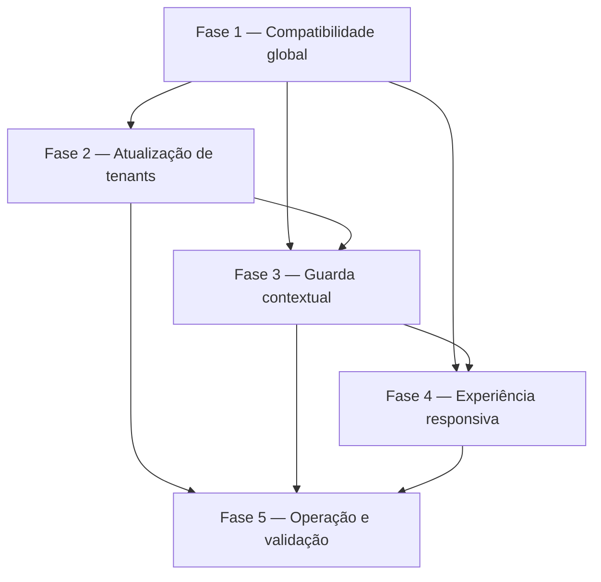

# Tarefas Rinos One - Compatibilidade de Schemas e Guarda Operacional

Escopo: impedir o atendimento contra schemas incompatíveis, atualizar organizações existentes de modo seguro e apresentar indisponibilidade global ou contextual sem expor detalhes de infraestrutura.

**Legenda de status:**

- `[ ]` Pendente
- `[~]` Em andamento
- `[x]` Concluído
- `[!]` Bloqueado

**Legenda de criticidade:**

- `[C]` Crítico - Impacto financeiro direto, regulatório, segurança, SLA ou operação bloqueante
- `[A]` Alto - Funcionalidade essencial
- `[M]` Médio - Necessário, mas sem urgência imediata

---

## FASE 1 - Fundação de compatibilidade e bloqueio global

### 1.1 Serviço de catálogo e decisão global `[C]`

Ref: [spec.md](spec.md) FR-SCG-001 a 004, 014 e 015; [research.md](research.md) Decisões 1 a 3; [checklists/security.md](checklists/security.md) CHK001 e 005.

- [x] 1.1.1 Criar o serviço que compara o catálogo global distribuído com o histórico aplicado e representa decisão compatível ou incompatível sem expor detalhes.
- [x] 1.1.2 Configurar a janela segura e configurável de revalidação, fazendo falhas de leitura ou cache resultarem em incompatibilidade.
- [x] 1.1.3 Definir exceções e códigos de domínio estáveis para incompatibilidade global e de organização.
- [x] 1.1.4 Criar testes unitários para catálogo completo, migration pendente, histórico ausente, erro de conexão e expiração da janela de verificação.

### 1.2 Guarda HTTP global e contrato seguro `[C]`

Ref: [plan.md](plan.md) §Guarda global; [contracts/schema-compatibility.md](contracts/schema-compatibility.md); [interface-spec.md](interface-spec.md) INT-WEB-SCHEMA-001.

- [x] 1.2.1 Implementar middleware global de precedência adequada para bloquear páginas e endpoints funcionais antes de controllers e regras de negócio.
- [x] 1.2.2 Entregar resposta JSON `503 PLATFORM_SCHEMA_INCOMPATIBLE` para API e resposta web segura para navegação humana, sem informação técnica.
- [x] 1.2.3 Declarar e proteger as exceções operacionais mínimas de saúde e recuperação, sem abrir funções de negócio durante bloqueio.
- [x] 1.2.4 Criar testes de feature que comprovem que a guarda ocorre antes de autenticação funcional, controllers e gravações.

---

## FASE 2 - Ciclo de atualização de organizações existentes

### 2.1 Persistência e transições do ciclo organizacional `[C]`

Ref: [data-model.md](data-model.md) §tenantSchemaUpdate; [spec.md](spec.md) FR-SCG-008 a 013; [checklists/requirements.md](checklists/requirements.md) CHK004.

- [x] 2.1.1 Criar migration core aditiva para `tenantSchemaUpdate`, com PK BIGINT, FK tenant→core, índices de consulta, unicidade operacional e estados previstos.
- [x] 2.1.2 Criar enum, model e serviço de ciclo com reivindicação transacional, tentativas, sucesso, falha transitória e falha terminal.
- [x] 2.1.3 Reutilizar a política configurável de limite e atrasos de tentativas, distinguindo falhas transitórias das terminais.
- [x] 2.1.4 Criar testes de migration, transições, unicidade de ciclo ativo e retenção de evidência sem mensagem técnica.

### 2.2 Descoberta e execução serializada de atualizações `[C]`

Ref: [plan.md](plan.md) §Atualização de organizações existentes; [spec.md](spec.md) FR-SCG-009 a 012 e FR-SCG-INFRA-LOCK/SCHED; [checklists/security.md](checklists/security.md) CHK003 e 007.

- [x] 2.2.1 Implementar descoberta idempotente de organizações com catálogo de tenant incompleto e criação/reuso do ciclo alvo.
- [x] 2.2.2 Implementar job de atualização que reivindica somente um ciclo válido, usa a conexão exclusiva de provisionamento e valida o catálogo ao final.
- [x] 2.2.3 Integrar o processo supervisionado de descoberta, retomada e nova tentativa sem executá-lo no boot da web ou por ação de usuário.
- [x] 2.2.4 Criar testes de integração com schemas descartáveis para sucesso, tentativa repetida, concorrência, falha transitória e falha terminal.

### 2.3 Convergência do provisionamento inicial `[A]`

Ref: [spec.md](spec.md) História 4 e FR-SCG-012; [plan.md](plan.md) §Atualização de organizações existentes.

- [ ] 2.3.1 Extrair a validação final de catálogo para um componente reutilizável pelo provisionamento inicial e atualização posterior.
- [ ] 2.3.2 Ajustar o provisionamento inicial para ativar a organização somente após a mesma validação integral de compatibilidade.
- [ ] 2.3.3 Preservar os estados e a política de falhas existentes de criação, sem confundi-los com atualização de organização ativa.
- [ ] 2.3.4 Criar testes de regressão para criação de tenant, migration pendente e falha de validação final.

---

## FASE 3 - Guarda contextual e integrações de runtime

### 3.1 Disponibilidade organizacional na porta de contexto `[C]`

Ref: [spec.md](spec.md) FR-SCG-005 a 011; [plan.md](plan.md) §Guarda por organização; [checklists/security.md](checklists/security.md) CHK002, 004 e 008.

- [ ] 3.1.1 Criar decisão central de disponibilidade da organização a partir de estado administrativo, ciclo de atualização e catálogo de tenant.
- [ ] 3.1.2 Aplicar a decisão à resolução de contexto e à aquisição de conexão de runtime, sem bloquear a conexão exclusiva de provisionamento.
- [ ] 3.1.3 Converter a indisponibilidade contextual em `503 TENANT_SCHEMA_UNAVAILABLE` com mensagem segura e estável.
- [ ] 3.1.4 Criar testes de feature para duas organizações, recursos pessoais, contexto previamente selecionado e ausência de acesso a dados atrasados.

### 3.2 Adoção transversal pelos módulos organizacionais `[A]`

Ref: [plan.md](plan.md) §Estrutura do projeto; [interface-spec.md](interface-spec.md) INT-WEB-PEOPLE-001 e INT-WEB-DRIVE-001.

- [ ] 3.2.1 Inventariar todas as portas atuais de dados de tenant e substituir acessos diretos por resolução que exija compatibilidade.
- [ ] 3.2.2 Integrar Pessoas, Drive Work e demais rotas contextuais à resposta comum, preservando contratos de validação, autorização e conflito não relacionados.
- [ ] 3.2.3 Garantir que processos de retenção e manutenção usem a conexão apropriada e não sejam bloqueados indevidamente pela guarda de runtime.
- [ ] 3.2.4 Criar testes de regressão por módulo para confirmar que um tenant incompatível não é acessado e outro tenant compatível continua funcional.

---

## FASE 4 - Experiência responsiva e localização

### 4.1 Implementar INT-WEB-SCHEMA-001 — Indisponibilidade global `[A]`

Ref: [interface-spec.md](interface-spec.md) INT-WEB-SCHEMA-001; [wireframes/int-web-schema-001.md](wireframes/int-web-schema-001.md); [contracts/schema-compatibility.md](contracts/schema-compatibility.md).

- [ ] 4.1.1 Criar a página segura de indisponibilidade global, reutilizando marca, tokens e tema sem montar a casca funcional.
- [ ] 4.1.2 Implementar a nova tentativa da página e a transição para a página solicitada somente depois da compatibilidade ser restaurada.
- [ ] 4.1.3 Adicionar mensagens localizadas nos quatro idiomas, landmarks, foco inicial, contraste e comportamento de movimento reduzido.
- [ ] 4.1.4 Criar testes de componente e E2E para desktop, tablet e telefone, incluindo resposta global real e ausência de conteúdo funcional.

### 4.2 Implementar INT-WEB-SCHEMA-002 — Organização temporariamente indisponível `[A]`

Ref: [interface-spec.md](interface-spec.md) INT-WEB-SCHEMA-002; [wireframes/int-web-schema-002.md](wireframes/int-web-schema-002.md); [contracts/schema-compatibility.md](contracts/schema-compatibility.md).

- [ ] 4.2.1 Ajustar cliente, store de tenant e shell para reconhecer `TENANT_SCHEMA_UNAVAILABLE`, limpar contexto e manter recursos pessoais.
- [ ] 4.2.2 Apresentar estado textual no seletor e aviso contextual sem oferecer operação de recuperação ou detalhe técnico.
- [ ] 4.2.3 Adaptar popover desktop e folha móvel, incluindo teclado, foco, toque, área segura e confirmação de trabalho local não salvo.
- [ ] 4.2.4 Criar testes unitários e E2E para seleção bloqueada, contexto já ativo, troca para organização compatível e localização.

### 4.3 Integração de Pessoas e Drive Work com o aviso comum `[A]`

Ref: [interface-spec.md](interface-spec.md) INT-WEB-PEOPLE-001 e INT-WEB-DRIVE-001; [checklists/interface.md](checklists/interface.md) CHK005 e 010.

- [ ] 4.3.1 Fazer Pessoas interromper ação contextual e delegar limpeza ao fluxo comum ao receber o código de indisponibilidade.
- [ ] 4.3.2 Fazer Drive Work interromper ação contextual e preservar Drive pessoal ao receber o mesmo código.
- [ ] 4.3.3 Garantir telemetria agregada sem dados de Pessoa, arquivo, caminho, schema ou migration.
- [ ] 4.3.4 Criar testes de componente e E2E para estados partial-stale, foco seguro e preservação das superfícies pessoais.

---

## FASE 5 - Operação, documentação e validação final

### 5.1 Procedimento operacional e configuração de ambiente `[C]`

Ref: [plan.md](plan.md) §Operação e deploy; [research.md](research.md) Decisões 1 e 4; [spec.md](spec.md) FR-SCG-013 e 014.

- [ ] 5.1.1 Documentar o procedimento de deploy: migration global antes da liberação, confirmação da guarda, atualização de tenants e reinício supervisionado de workers.
- [ ] 5.1.2 Documentar variáveis de ambiente seguras para revalidação, tentativas, atrasos e retenção, sem registrar valores secretos.
- [ ] 5.1.3 Documentar recuperação de incompatibilidade global, ciclo organizacional falho e limites explícitos de acesso operacional.
- [ ] 5.1.4 Revisar README e documentação de provisionamento para remover afirmações incompatíveis e incluir a nova guarda.

### 5.2 Validação integrada e evidências `[C]`

Ref: [quickstart.md](quickstart.md); [checklists/requirements.md](checklists/requirements.md); [checklists/security.md](checklists/security.md); [checklists/interface.md](checklists/interface.md).

- [ ] 5.2.1 Executar e registrar testes unitários, feature e integração para todas as histórias P1 e P2, incluindo falha fechada e concorrência.
- [ ] 5.2.2 Executar type-check, testes JavaScript, build e cenários E2E responsivos com respostas reais de incompatibilidade.
- [ ] 5.2.3 Executar inspeção visual humana dos wireframes e estados em desktop, tablet e telefone, registrando aceite ou divergências.
- [ ] 5.2.4 Revisar referências residuais e confirmar que nenhum endpoint ou porta de tenant contorna a guarda comum.

---

## Matriz de Dependências

## Cobertura de Interfaces

| Surface ID | Cobertura | Interaction IDs | Tarefas |
| --- | --- | --- | --- |
| SURF-WEB-ACCESS | FULL | INT-WEB-SCHEMA-001, INT-WEB-SCHEMA-002 | 1.2, 3.1, 4.1, 4.2, 5.2 |
| SURF-WEB-PEOPLE | PARTIAL | INT-WEB-PEOPLE-001 | 3.2, 4.3, 5.2 |
| SURF-WEB-DRIVE | PARTIAL | INT-WEB-DRIVE-001 | 3.2, 4.3, 5.2 |
| SURF-FUTURE-CONSUMERS | DEFERRED | N/A — contrato HTTP compartilhado | 1.2, 3.1, 5.2 |

## Resumo Quantitativo

| Fase | Tarefas | Subtarefas | Criticidade |
| --- | --- | --- | --- |
| 1 - Fundação de compatibilidade e bloqueio global | 2 | 8 | C |
| 2 - Ciclo de atualização de organizações existentes | 3 | 12 | C, A |
| 3 - Guarda contextual e integrações de runtime | 2 | 8 | C, A |
| 4 - Experiência responsiva e localização | 3 | 12 | A |
| 5 - Operação, documentação e validação final | 2 | 8 | C |
| **Total** | **12** | **48** | — |

## Escopo Coberto

| Item | Descrição | Fase |
| --- | --- | --- |
| GLOBAL-GUARD | Falha fechada da interface e API quando o catálogo global estiver incompatível | 1 |
| TENANT-UPGRADE | Descoberta, fila, lock, tentativa e validação de organizações existentes | 2 |
| CONTEXT-GUARD | Bloqueio central antes de contexto, conexão e operação contextual | 3 |
| RESPONSIVE-UX | Página global, seletor e integração de Pessoas/Drive em todos os form factors | 4 |
| OPERATIONS | Configuração, deploy, recuperação, testes e evidências | 5 |

## Escopo Excluído

| Item | Descrição | Motivo |
| --- | --- | --- |
| AUTO-GLOBAL-DDL | Executar migrations globais automaticamente durante o boot da web | Contraria a separação de privilégios e a decisão aprovada de deploy explícito. |
| MANUAL-MIGRATION-UI | Tela para aplicar migrations, exibir SQL ou corrigir histórico | A recuperação é responsabilidade operacional e não de usuários finais. |
| DATA-REPAIR | Correção automática de dados de negócio durante atualização | Exige SDD própria; esta feature trata somente compatibilidade estrutural. |
| NATIVE-CLIENTS | Aplicações nativas ou clientes de integração dedicados | Não há superfície aprovada; recebem apenas o contrato HTTP estável. |
