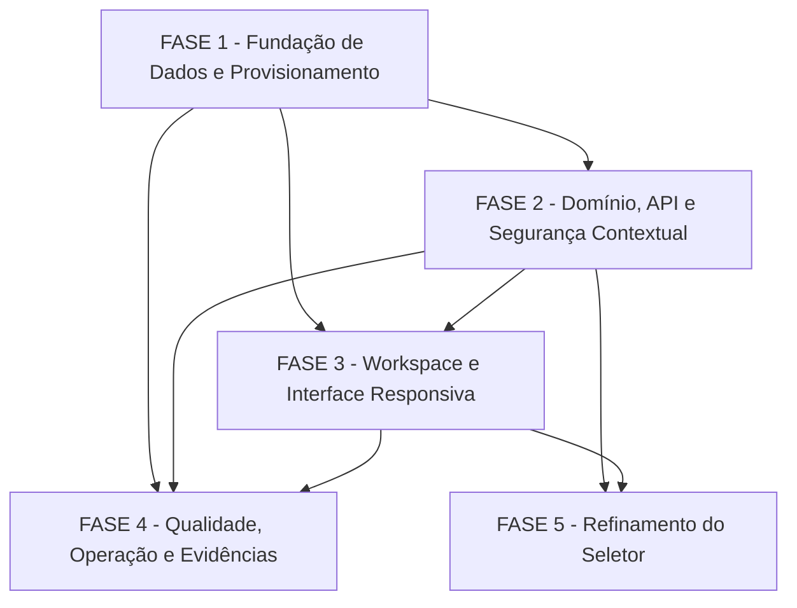

# Tarefas Rinos One — Fundação de Tenants

Escopo: criar a base global e física de tenants, disponibilizar sua API e contexto isolado por aba, e integrá-los ao workspace responsivo sem introduzir módulos de negócio, membros ou limites comerciais.

**Legenda de status:**

- `[ ]` Pendente
- `[~]` Em andamento
- `[x]` Concluído
- `[!]` Bloqueado

**Legenda de criticidade:**

- `[C]` Crítico — isolamento, autorização, schema ou operação bloqueante.
- `[A]` Alto — funcionalidade essencial da fundação.
- `[M]` Médio — refinamento necessário, sem bloquear a base segura.

---

## FASE 1 - Fundação de Dados e Provisionamento

### 1.1 Catálogos de migrations e dados globais `[C]`

Ref: [plan.md](plan.md#Migrations-e-conexões), [data-model.md](data-model.md), [database-topology.md](../../architecture/database-topology.md)

- [x] 1.1.1 Criar o catálogo `database/migrations/core/` sem mover ou alterar migrations globais já aplicadas.
- [x] 1.1.2 Criar migrations globais para `tenant`, `tenantMembership` e `tenantProvisioning`, com ULIDs, constraints, índices e transições compatíveis com o modelo aprovado.
- [x] 1.1.3 Criar o catálogo `database/migrations/tenant/` e sua baseline mínima, sem adicionar tabelas de módulos de negócio.
- [x] 1.1.4 Implementar comando de migration global que execute o catálogo legado e o catálogo core de forma determinística.
- [x] 1.1.5 Criar testes de schema para constraints de associação, unicidade da intenção e separação dos catálogos.

### 1.2 Conexões, configuração e privilégios `[C]`

Ref: [plan.md](plan.md#Migrations-e-conexões), [research.md](research.md#decision-3-preparação-assíncrona-idempotente-e-com-privilégios-separados), Constituição IV

- [x] 1.2.1 Adicionar ao modelo de ambiente as configurações não sensíveis de conexão de provisionamento e da política de retentativas.
- [x] 1.2.2 Configurar conexão global, conexão dinâmica de tenant e conexão de provisionamento sem expor credenciais no repositório.
- [x] 1.2.3 Implementar derivação e validação estrita do schema `rinosone_{tenantId}` a partir de ULID, sem aceitar nome fornecido pela interface.
- [x] 1.2.4 Documentar privilégios mínimos separados para runtime e provisionamento, incluindo preparação de schema e migrations.
- [x] 1.2.5 Criar testes unitários para derivação de nome físico e rejeição de identificadores inválidos.

### 1.3 Worker e ciclo de provisionamento `[C]`

Ref: [plan.md](plan.md#Fluxo-de-criação-e-provisionamento), [data-model.md](data-model.md#entidade-tenantprovisioning), [quickstart.md](quickstart.md#cenário-1-criação-e-ativação-bem-sucedidas)

- [x] 1.3.1 Implementar job persistido que cria o schema, executa somente migrations de tenant e confirma a versão esperada.
- [x] 1.3.2 Implementar máquina de estados de provisionamento e transições atômicas entre `QUEUED`, `RUNNING`, `SUCCEEDED` e `FAILED`.
- [x] 1.3.3 Aplicar a política configurável de até três tentativas com intervalos padrão de 1, 5 e 15 minutos somente a falhas transitórias.
- [x] 1.3.4 Classificar falhas terminais sem registrar SQL, host, schema, segredo ou detalhes de infraestrutura.
- [x] 1.3.5 Criar testes de job para sucesso, retomada idempotente, falha transitória, falha terminal e promoção exclusiva para `ACTIVE`.

---

## FASE 2 - Domínio, API e Segurança Contextual

### 2.1 Domínio de tenant e associação inicial `[A]`

Ref: [spec.md](spec.md#requisitos), [data-model.md](data-model.md), [research.md](research.md#decision-5-associação-mínima-sem-antecipar-gestão-de-acesso)

- [x] 2.1.1 Criar modelos e tipos de domínio para tenant, associação, papel `OWNER`, disponibilidade e provisionamento.
- [x] 2.1.2 Criar serviço transacional que reserva uma criação idempotente, insere tenant, associação OWNER e preparação em uma única confirmação global.
- [x] 2.1.3 Garantir que reenvio com a mesma chave e mesmo criador recupere a mesma intenção, tenant e operação.
- [x] 2.1.4 Impedir criação, associação ou disponibilidade de módulos, membros e papéis não autorizados por esta feature.
- [x] 2.1.5 Criar testes unitários e de feature para estados, idempotência, criador OWNER e transações revertidas.

### 2.2 API versionada de tenants `[A]`

Ref: [tenant-context.md](contracts/tenant-context.md), [plan.md](plan.md#Convenções-de-Borda), [checklists/api.md](checklists/api.md)

- [x] 2.2.1 Implementar listagem dos tenants associados ao usuário autenticado com estado, papel e seleção permitida.
- [x] 2.2.2 Implementar criação autenticada por `POST /api/v1/tenants`, incluindo validação de nome e `Idempotency-Key`.
- [x] 2.2.3 Implementar validação/início e encerramento explícitos de contexto sem gravar tenant na sessão server-side.
- [x] 2.2.4 Implementar alteração de disponibilidade restrita ao `OWNER`, com confirmação de transição de estado.
- [x] 2.2.5 Padronizar todas as falhas previstas no envelope seguro `error.code`, `error.message` e `fields` quando aplicável.
- [x] 2.2.6 Criar testes de contrato para todos os endpoints, payloads camelCase, códigos HTTP e não enumeração de tenant.

### 2.3 Resolução e auditoria de contexto `[C]`

Ref: [spec.md](spec.md#requisitos), [research.md](research.md#decision-2-contexto-em-memória-por-aba-e-tenant-explícito-na-fronteira), [checklists/security.md](checklists/security.md)

- [x] 2.3.1 Implementar resolvedor contextual que recebe somente `tenantId` validado e revalida usuário, associação e estado antes de acesso ao schema.
- [x] 2.3.2 Garantir negação segura para tenant ausente, inválido, inativo, não associado ou indisponível, sem fallback de escopo.
- [x] 2.3.3 Impedir que sessão, cookie, principal autenticado ou cache compartilhem tenant ativo entre abas.
- [x] 2.3.4 Registrar eventos minimizados de criação, disponibilidade, seleção, troca, encerramento e negação no canal de segurança existente.
- [x] 2.3.5 Criar testes de feature para revalidação, revogação, isolamento de contexto e exclusão de dados sensíveis nos logs.

---

## FASE 3 - Workspace e Interface Responsiva

### 3.1 Cliente de contexto por aba `[A]`

Ref: [interface-spec.md](interface-spec.md#int-web-001--identidade-contextual-na-barra), [plan.md](plan.md#Resolução-de-contexto), [tenant-context.md](contracts/tenant-context.md)

- [x] 3.1.1 Criar tipos, parser de respostas e cliente HTTP de tenants com verificação de shape antes de alterar estado da interface.
- [x] 3.1.2 Implementar store de contexto exclusivamente em memória, sem persistência em sessão, cookie, local storage ou principal.
- [x] 3.1.3 Implementar seleção, troca, encerramento e limpeza de dados contextuais pendentes apenas na aba atual.
- [x] 3.1.4 Criar testes unitários para store, falhas remotas, perda de contexto e não restauração após atualização da página.

### 3.2 INT-WEB-001 e INT-WEB-002 — Barra e seletor `[A]`

Ref: [interface-spec.md](interface-spec.md#int-web-001--identidade-contextual-na-barra), [interface-spec.md](interface-spec.md#int-web-002--seletor-de-tenant), [wireframe](wireframes/tenant-workspace.md)

- [x] 3.2.1 Evoluir a barra autenticada para mostrar avatar de tenant reutilizável imediatamente à esquerda do avatar pessoal.
- [x] 3.2.2 Implementar fallback de tenant neutro e de iniciais, rótulos acessíveis, anúncio de mudança e preservação do menu pessoal existente.
- [x] 3.2.3 Implementar `TenantSelector` reutilizável com estado atual, lista operacional, retorno ao espaço pessoal e entrada para criação/gestão.
- [x] 3.2.4 Adaptar seletor para popover ancorado no desktop e folha modal acessível no telefone, preservando foco e área segura.
- [x] 3.2.5 Integrar seletor aos dados reais, aos estados loading/empty/offline/denied e à validação contextual da API.
- [x] 3.2.6 Criar testes de componente, responsividade, teclado, leitor de tela e inspeção visual contra o wireframe de INT-WEB-001/002.

### 3.3 INT-WEB-003 — Criação e gestão básica `[A]`

Ref: [interface-spec.md](interface-spec.md#int-web-003--criação-e-gestão-básica-de-tenants), [tenant-context.md](contracts/tenant-context.md), [wireframe](wireframes/tenant-workspace.md)

- [x] 3.3.1 Implementar diálogo reutilizável de organizações com formulário de nome, validação local e feedback seguro de criação.
- [x] 3.3.2 Gerar e reutilizar chave de intenção somente para repetição da mesma criação em andamento.
- [x] 3.3.3 Exibir estados de preparação, ativo, inativo e falha sem disponibilizar tenants não operacionais no seletor.
- [x] 3.3.4 Implementar ativação/desabilitação exclusiva de OWNER com confirmação acessível e preservação de dados.
- [x] 3.3.5 Adicionar textos e rótulos acessíveis nos quatro idiomas, respeitando tokens, densidades, temas e telas estreitas.
- [x] 3.3.6 Criar testes de componente para todos os estados, erro, offline, foco, confirmação e atualização de lista.

---

## FASE 4 - Qualidade, Operação e Evidências

### 4.1 Validação backend e contratos `[A]`

Ref: [quickstart.md](quickstart.md), [spec.md](spec.md#critérios-de-sucesso), [tenant-context.md](contracts/tenant-context.md)

- [x] 4.1.1 Executar e ampliar testes unitários para estado, identidade física e classificação de falhas.
- [x] 4.1.2 Executar e ampliar testes de feature para criação, idempotência, OWNER, disponibilidade e contexto negado.
- [x] 4.1.3 Validar o roundtrip real de cada endpoint contra o contrato e parser consumido pela interface.
- [x] 4.1.4 Verificar que toda operação contextual revalida o tenant e que uma resposta antiga não reaplica contexto inválido.
- [x] 4.1.5 Executar as suítes de backend, formatação e análise estática configuradas e registrar resultados.

### 4.2 Integração MySQL e provisionamento real `[C]`

Ref: [quickstart.md](quickstart.md#cenário-1-criação-e-ativação-bem-sucedidas), [plan.md](plan.md#Migrations-e-conexões), [checklists/security.md](checklists/security.md)

- [x] 4.2.1 Preparar ambiente MySQL descartável com credenciais distintas de runtime e provisionamento.
- [x] 4.2.2 Validar criação de schema, charset/collation, baseline de tenant e histórico de migrations independente.
- [x] 4.2.3 Validar que falha transitória respeita 1, 5 e 15 minutos e que falha terminal não cria contexto ativo.
- [x] 4.2.4 Validar que migrations globais não executam em schemas de tenant e vice-versa.
- [x] 4.2.5 Registrar evidências sanitizadas sem credenciais, nomes de schema de produção, SQL ou dados de usuários.

### 4.3 Validação web, E2E e acessibilidade `[A]`

Ref: [quickstart.md](quickstart.md#cenário-7-interação-humana-crítica), [interface-spec.md](interface-spec.md), [checklists/interface.md](checklists/interface.md)

- [x] 4.3.1 Executar testes da interface para INT-WEB-001, INT-WEB-002 e INT-WEB-003 nos quatro idiomas.
- [x] 4.3.2 Criar E2E com duas abas e tenants diferentes, comprovando que troca e encerramento em uma não mudam a outra.
- [x] 4.3.3 Criar E2E para autenticação preservada e contexto limpo após atualização ou restauração de página.
- [x] 4.3.4 Verificar teclado, foco, leitura de estados, toque, tema, densidades e responsividade em desktop e telefone.
- [x] 4.3.5 Executar verificação de tipos, testes web, build de produção e inspeção visual dos wireframes aprovados.

### 4.4 Operação e documentação de implantação `[A]`

Ref: [plan.md](plan.md#Migrations-e-conexões), [database-topology.md](../../architecture/database-topology.md), Constituição V

- [x] 4.4.1 Atualizar o modelo `.env.example` e a documentação operacional com conexões, worker, migrations e retentativas de tenant.
- [x] 4.4.2 Documentar sequência segura de deploy, provisionamento, retry e recuperação de tenant com falha.
- [x] 4.4.3 Atualizar a topologia de dados e o catálogo de superfícies para refletir a implementação concluída.
- [x] 4.4.4 Revisar documentação, links, escopo excluído e evidências de qualidade antes de marcar a feature como implementada.

---

## FASE 5 - Refinamento do Seletor de Organizações

### 5.1 Recência, apresentação e busca `[A]`

Ref: [spec.md](spec.md#requisitos), [interface-spec.md](interface-spec.md#int-web-002--seletor-de-tenant), [tenant-context.md](contracts/tenant-context.md)

- [x] 5.1.1 Persistir a última seleção contextual válida por vínculo e ordenar a listagem pessoal sem restaurar contexto entre abas.
- [x] 5.1.2 Remodelar o popover com título, até cinco organizações, organização ativa destacada, estado vazio e separador de gestão futura.
- [x] 5.1.3 Criar diálogo reutilizável de mais organizações com filtro, cartões de estado e suporte a setas, Enter e Escape.
- [x] 5.1.4 Atualizar traduções, testes de API e componentes para a nova interação, preservando os quatro idiomas.

---

## Matriz de Dependências

## Cobertura de Interfaces

| Surface ID | Cobertura | Interaction IDs | Task IDs |
| --- | --- | --- | --- |
| SURF-WEB-ACCESS | FULL | INT-WEB-001, INT-WEB-002, INT-WEB-003 | 3.1, 3.2, 3.3, 4.3 |
| SURF-FUTURE-CONSUMERS | DEFERRED | N/A | N/A — não há entrega nesta feature |

## Resumo Quantitativo

| Fase | Tarefas | Subtarefas | Criticidade |
| --- | --- | --- | --- |
| 1 - Fundação de Dados e Provisionamento | 3 | 15 | C |
| 2 - Domínio, API e Segurança Contextual | 3 | 16 | C, A |
| 3 - Workspace e Interface Responsiva | 3 | 16 | A |
| 4 - Qualidade, Operação e Evidências | 4 | 19 | C, A |
| 5 - Refinamento do Seletor de Organizações | 1 | 4 | A |
| **Total** | **14** | **70** | — |

## Escopo Coberto

| Item | Descrição | Fase |
| --- | --- | --- |
| TEN-FOUND-01 | Schemas, migrations, conexões e provisionamento seguro por tenant. | 1 |
| TEN-FOUND-02 | Entidades, associação OWNER, estados, API e contexto explícito. | 2 |
| TEN-FOUND-03 | Avatar, seletor, criação, gestão e troca responsiva por aba. | 3 |
| TEN-FOUND-04 | Evidências de qualidade, integração MySQL e operação. | 4 |
| TEN-FOUND-05 | Recência persistida e seletor limitado com busca acessível. | 5 |

## Escopo Excluído

| Item | Descrição | Motivo |
| --- | --- | --- |
| TEN-OUT-01 | Convites, membros, grupos, RBAC e permissões detalhadas. | Requer feature própria de acesso a tenants. |
| TEN-OUT-02 | Módulos de negócio, catálogo de produtos e dados funcionais no schema tenant. | Nenhum produto foi aprovado nesta fase. |
| TEN-OUT-03 | Imagem, edição de perfil e identidade visual própria da organização. | Gestão completa do tenant fica para etapa futura. |
| TEN-OUT-04 | Exclusão definitiva, retenção comercial e recuperação de tenant. | Ciclo de vida destrutivo não foi aprovado. |
| TEN-OUT-05 | Limites, quotas ou contratação de tenants. | Decisão explicitamente adiada para a feature de limites e contratação. |
