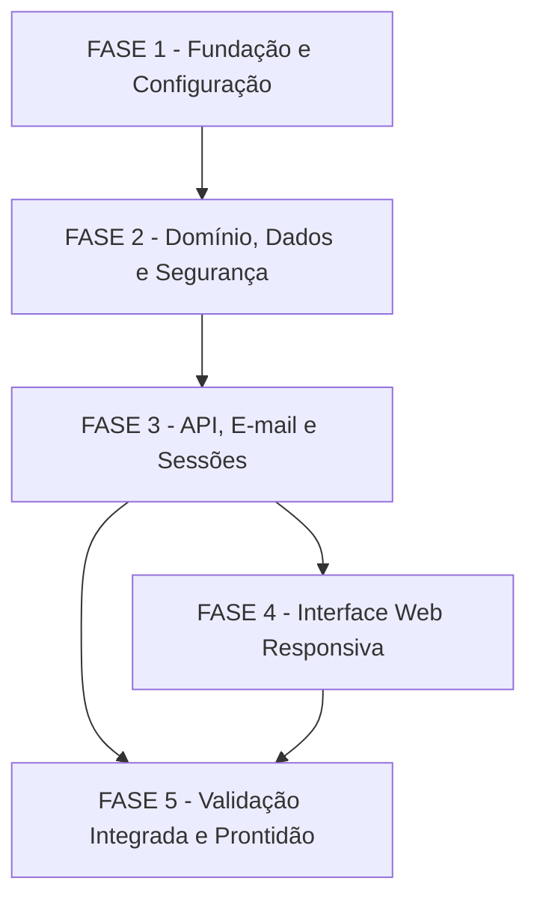

# Tarefas Rinos One - Acesso de Usuário

Escopo: implementar exclusivamente cadastro, validação por e-mail, login por senha ou sem senha, autenticação persistente opcional e controle de sessões da primeira fase.

**Legenda de status:**

- `[ ]` Pendente
- `[~]` Em andamento
- `[x]` Concluído
- `[!]` Bloqueado

**Legenda de criticidade:**

- `[C]` Crítico - Impacto financeiro direto, regulatório, segurança, SLA ou operação bloqueante
- `[A]` Alto - Funcionalidade essencial
- `[M]` Médio - Necessário, mas sem urgência imediata

---

## FASE 1 - Fundação e Configuração

### 1.1 Bootstrap da aplicação modular `[A]`

Ref: [plan.md](plan.md) §Estrutura do Projeto; [constitution.md](../../constitution.md) §I–II

- [x] 1.1.1 Criar o bootstrap Laravel, a SPA Vue e a estrutura de diretórios aprovada para domínio, API, interface, migrations e testes.
- [x] 1.1.2 Configurar MySQL, sessão server-side, cache e fila persistidos no banco para desenvolvimento e testes.
- [x] 1.1.3 Configurar rotas públicas e protegidas sob a API JSON versionada, com proteção CSRF e cabeçalhos de segurança.
- [x] 1.1.4 Criar a base de testes de unidade, feature, componente e navegador sem inserir módulos de produto.
- [x] 1.1.5 Validar build local, migrations base e execução das suítes base.

### 1.2 Configuração segura e automação de qualidade `[C]`

Ref: [research.md](research.md) §Decision 4–6; [security.md](checklists/security.md) CHK005, CHK009

- [x] 1.2.1 Criar `.env.example` comentado com conexão de banco, e-mail, limites de autenticação, persistência de login e retenção de logs, sem valores reais.
- [x] 1.2.2 Ignorar configurações reais e validar que nenhum segredo ou destinatário de e-mail é versionado.
- [x] 1.2.3 Configurar o envio assíncrono de e-mails em fila, o scheduler de descarte de emissões vencidas e um canal de desenvolvimento seguro para inspeção local.
- [x] 1.2.4 Configurar CI para formatação, testes backend/frontend, type-check, build, auditoria de dependências e cenários de navegador.
- [x] 1.2.5 Expor no modelo de ambiente o schema principal `rinosone` e o prefixo reservado `rinosone_`, sem criar tenants ou schemas adicionais.
- [~] 1.2.6 Automatizar a captura SMTP com Mailpit no CI e no ambiente local, validando destinatário, conteúdo, código, link, fila e consumo. — Compose, workflow e testes criados; a execução local aguarda runtime Docker e a evidência do CI aguarda a primeira execução remota.

## FASE 2 - Domínio, Dados e Segurança de Acesso

### 2.1 Persistência de identidade, emissões e sessões `[C]`

Ref: [data-model.md](data-model.md) §User–§PersistentAuthentication; [spec.md](spec.md) FR-001–006, FR-017, FR-023–029

- [x] 2.1.1 Criar migrations e constraints para usuário, emissões temporárias, sessões e autenticações persistentes com identificadores, unicidade de e-mail, escolha de persistência e relações aprovadas.
- [x] 2.1.2 Implementar normalização de e-mail e persistência de senha somente por hash forte.
- [x] 2.1.3 Implementar exclusão imediata de emissões usadas ou substituídas e de sessões invalidadas, além da limpeza periódica configurável de emissões vencidas.
- [x] 2.1.4 Implementar retenção configurável de logs de segurança, com padrão de 30 dias e exclusão de segredos.
- [x] 2.1.5 Criar testes de migration, constraints, isolamento de dados e descarte de registros temporários.

### 2.2 Regras de domínio para elegibilidade e credenciais `[C]`

Ref: [spec.md](spec.md) FR-003–006, FR-010–015, FR-020, FR-022–029; [research.md](research.md) §Decision 2–4, §Decision 7–8

- [x] 2.2.1 Implementar estados de conta pendente de validação, pendente de nome de exibição e ativa.
- [x] 2.2.2 Implementar emissão única de link e código por finalidade, com hash, expiração de 10 minutos, consumo exclusivo e substituição da emissão anterior.
- [x] 2.2.3 Implementar regra de força de senha: mínimo de 6 caracteres e 2 entre minúscula, maiúscula, número e caractere especial.
- [x] 2.2.4 Implementar limites configuráveis por usuário quando identificável, e-mail e origem para emissões, código e senha, com bloqueio temporário e resposta neutra.
- [x] 2.2.5 Criar testes unitários determinísticos para estados, expiração, consumo concorrente, reutilização, substituição, senha e limites.
- [x] 2.2.6 Enviar códigos numéricos de seis dígitos, limitar a três erros por emissão por padrão e excluir a emissão ao atingir o limite configurável.

## FASE 3 - API, E-mail e Sessões

### 3.1 Cadastro e validação de e-mail `[C]`

Ref: [auth-api.md](contracts/auth-api.md) §Iniciar cadastro–§Concluir validação por link; [spec.md](spec.md) US-001, FR-001–006, FR-014–015, FR-022–030

- [x] 3.1.1 Implementar início de cadastro com resposta neutra, emissão de link e código e enfileiramento de e-mail.
- [x] 3.1.2 Implementar confirmação por código e por link, exigindo nome de exibição, consumindo a emissão uma única vez e criando a sessão autenticada após ativação.
- [x] 3.1.3 Persistir e propagar a escolha “Manter-me conectado” da solicitação até a autenticação concluída, inclusive quando o link for aberto em outra aba.
- [x] 3.1.4 Implementar validação de requests, mapeamento de erros e logs estruturados sem dados sensíveis.
- [x] 3.1.5 Criar testes de feature para cadastro, e-mail único, validação, expiração, reenvio, limites e não enumeração de contas.

### 3.2 Login por senha e sem senha `[C]`

Ref: [auth-api.md](contracts/auth-api.md) §Entrar por senha–§Concluir acesso sem senha; [spec.md](spec.md) US-002–003, FR-007–015, FR-020, FR-022–026

- [x] 3.2.1 Implementar definição de senha apenas para conta ativa e validar a política de força aprovada.
- [x] 3.2.2 Implementar login por e-mail e senha com resposta segura para falhas e limites configuráveis.
- [x] 3.2.3 Implementar solicitação de acesso sem senha, link mágico e confirmações por código ou link compartilhando a mesma emissão.
- [x] 3.2.4 Implementar autenticação persistente opcional por credencial opaca, hash no servidor e reconstrução de sessão server-side perdida.
- [x] 3.2.5 Criar testes de feature e contrato para os dois logins, persistência opt-in, fechamento do navegador, perda de sessão e consumo duplo de emissão.

### 3.3 Encerramento e invalidação de sessões `[C]`

Ref: [auth-api.md](contracts/auth-api.md) §Encerrar sessões; [spec.md](spec.md) US-004, FR-016–017, FR-029

- [x] 3.3.1 Implementar encerramento imediato da sessão atual e exclusão do registro correspondente.
- [x] 3.3.2 Implementar invalidação das demais sessões e autenticações persistentes, preservando somente a sessão atual e sua credencial associada, quando houver.
- [x] 3.3.3 Garantir que credenciais persistentes revogadas não reconstruam novas sessões.
- [x] 3.3.4 Criar testes multi-sessão para consulta da sessão atual, encerramento atual, invalidação de outras sessões e revogação em navegadores persistentes.
- [x] 3.3.5 Implementar leitura autenticada do estado mínimo da sessão atual para a interface, sem expor identificadores de sessão ou dispositivos.

## FASE 4 - Interface Web Responsiva

### 4.1 Entrada de acesso — INT-WEB-001 `[A]`

Ref: [interface-spec.md](interface-spec.md) §INT-WEB-001; [int-web-001.md](wireframes/int-web-001.md); [auth-api.md](contracts/auth-api.md) §Iniciar cadastro, §Entrar por senha, §Solicitar acesso sem senha

- [x] 4.1.1 Implementar tela pública de entrada com modos de criar conta, entrar por senha e solicitar acesso sem senha.
- [x] 4.1.2 Implementar campos, validações, resposta neutra, caixa “Manter-me conectado” e preservação segura de dados no fluxo por e-mail.
- [x] 4.1.3 Cobrir estados ready, processing, success, validation-error, remote-error, offline e access-denied conforme o contrato de interação.
- [x] 4.1.4 Aplicar comportamento responsivo, teclado, toque, foco inicial, alertas acessíveis e textos em português do Brasil.
- [x] 4.1.5 Criar testes de componente e integração com payloads reais para os três modos de entrada.

### 4.2 Confirmação por e-mail — INT-WEB-002 `[A]`

Ref: [interface-spec.md](interface-spec.md) §INT-WEB-002; [int-web-002.md](wireframes/int-web-002.md); [auth-api.md](contracts/auth-api.md) §Concluir validação, §Concluir acesso sem senha

- [x] 4.2.1 Implementar jornada de código, contador de 10 minutos, reenvio limitado e confirmação de cadastro com nome de exibição.
- [x] 4.2.2 Implementar tratamento de link aberto em outra aba e continuidade da mesma jornada sem expor o segredo na interface ou telemetria.
- [x] 4.2.3 Exibir a escolha de persistência e refletir sua conclusão sem permitir alteração silenciosa da emissão.
- [x] 4.2.4 Cobrir estados de expiração, emissão usada ou substituída, bloqueio, falha remota, offline, teclado, toque e foco acessível.
- [x] 4.2.5 Criar testes de componente e E2E para código, link, reenvio, consumo único e ativação de conta.

### 4.3 Segurança de acesso — INT-WEB-003 `[A]`

Ref: [interface-spec.md](interface-spec.md) §INT-WEB-003; [int-web-003.md](wireframes/int-web-003.md); [auth-api.md](contracts/auth-api.md) §Definir senha, §Encerrar sessões

- [x] 4.3.1 Implementar estado autenticado com definição opcional de senha e apresentação segura da persistência de login.
- [x] 4.3.2 Implementar encerramento da sessão atual e retorno para a entrada de acesso.
- [x] 4.3.3 Implementar confirmação explícita para invalidar demais sessões e atualizar o estado após a revogação.
- [x] 4.3.4 Aplicar estados, responsividade, ação destrutiva acessível, teclado, toque e avisos dinâmicos definidos na interface.
- [x] 4.3.5 Criar testes de componente e E2E para senha, encerramento atual, invalidação de demais sessões e persistência revogada.

## FASE 5 - Validação Integrada e Prontidão

### 5.1 Contratos, segurança e regressão `[C]`

Ref: [quickstart.md](quickstart.md) §Cenário 1–7; [api.md](checklists/api.md); [security.md](checklists/security.md)

- [x] 5.1.1 Executar e manter verdes os testes de unidade, feature, componente e navegador definidos para a feature.
- [x] 5.1.2 Executar roundtrip real entre web, API, banco e canal de e-mail de desenvolvimento, comparando payloads com o contrato. — Entrega confirmada manualmente pela pessoa responsável pelo endereço de teste autorizado.
- [!] 5.1.3 Verificar manualmente desktop, tablet e telefone, incluindo teclado, toque, foco, zoom, avisos e estados de falha. — Aguarda inspeção em dispositivos físicos; a simulação automatizada está registrada em `validation.md`.
- [x] 5.1.4 Validar que logs, respostas e telemetria não expõem e-mail completo, senha, código, link, token ou identificadores de sessão.
- [x] 5.1.5 Registrar evidências das validações e corrigir qualquer divergência entre spec, contratos, interface e comportamento observável.

### 5.2 Preparação de implantação `[A]`

Ref: [research.md](research.md) §Decision 5–8; [briefing inicial](../../briefing/20260922-briefing-inicial.md) §Restrições

- [x] 5.2.1 Documentar as variáveis de ambiente e comentários de ajuda exigidos pela implantação, sem valores reais.
- [!] 5.2.2 Validar configuração de produção para cookies seguros, HTTPS, chave da aplicação, banco, fila, e-mail e retenção de logs. — Aguarda domínio, certificado e ambiente de produção.
- [!] 5.2.3 Configurar worker de fila, scheduler de limpeza de emissões vencidas e procedimento de recuperação para indisponibilidade temporária de sessão ou e-mail. — Procedimento documentado; aguarda host e supervisor da infraestrutura.
- [!] 5.2.4 Executar o checklist de prontidão e registrar qualquer pré-requisito de infraestrutura ainda externo ao repositório. — Depende das tarefas 5.1.2, 5.1.3, 5.2.2 e 5.2.3.

---

## Matriz de Dependências

## Cobertura de Interfaces

| Surface ID | Coverage | Interaction IDs | Task IDs |
| --- | --- | --- | --- |
| SURF-WEB-ACCESS | FULL | INT-WEB-001 | 4.1 |
| SURF-WEB-ACCESS | FULL | INT-WEB-002 | 4.2 |
| SURF-WEB-ACCESS | FULL | INT-WEB-003 | 4.3 |

## Resumo Quantitativo

| Fase | Tarefas | Subtarefas | Criticidade |
| --- | ---: | ---: | --- |
| 1 - Fundação e Configuração | 2 | 11 | A, C |
| 2 - Domínio, Dados e Segurança | 2 | 11 | C |
| 3 - API, E-mail e Sessões | 3 | 15 | C |
| 4 - Interface Web Responsiva | 3 | 15 | A |
| 5 - Validação Integrada e Prontidão | 2 | 9 | C, A |
| **Total** | **12** | **61** | — |

## Escopo Coberto

| Item | Descrição | Fase |
| --- | --- | --- |
| ACC-001 | Bootstrap modular, configuração por ambiente, fila e automação de qualidade | 1 |
| ACC-002 | Identidade, emissões temporárias, limites, senha, sessões e autenticação persistente | 2–3 |
| ACC-003 | Cadastro, validação, login por senha e login sem senha via API e e-mail | 3 |
| ACC-004 | Web responsiva para INT-WEB-001, INT-WEB-002 e INT-WEB-003 | 4 |
| ACC-005 | Testes, contratos, acessibilidade, segurança de dados e prontidão de implantação | 5 |

## Escopo Excluído

| Item | Descrição | Motivo |
| --- | --- | --- |
| EXC-001 | Perfil, edição de dados pessoais, recuperação ou alteração posterior de senha e segundo fator | Explicitamente fora da primeira fase. |
| EXC-002 | Produtos, módulos, papéis administrativos e integrações futuras | Não são necessários ao acesso básico aprovado. |
| EXC-003 | Entregáveis formais de privacidade, compliance e comunicação legal ao usuário | Explicitamente adiados para fase futura. |
