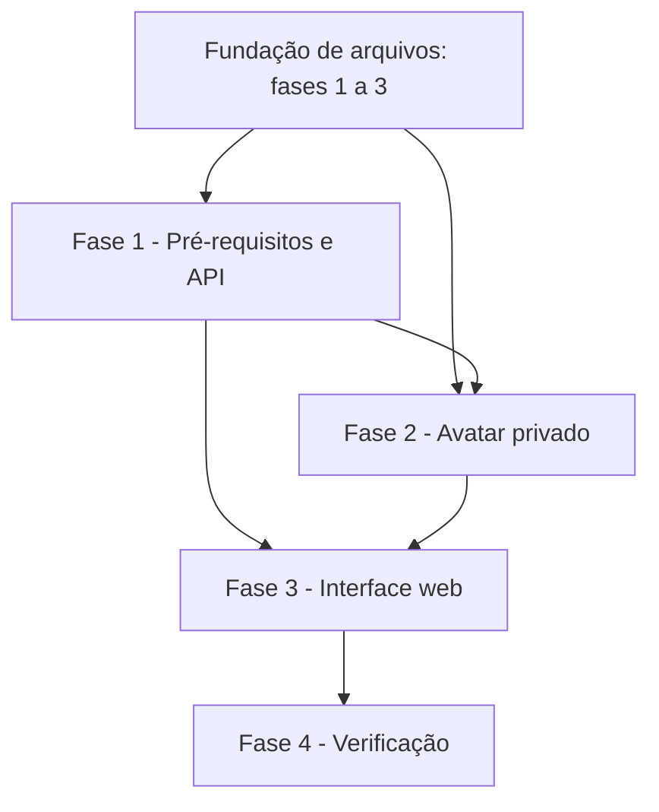

# Tarefas Rinos One — Perfil do usuário

Escopo: implementar a seção Perfil, alteração de nome e avatar privado recortado, usando exclusivamente a fundação de arquivos.

**Legenda de status:**

- `[ ]` Pendente
- `[~]` Em andamento
- `[x]` Concluído
- `[!]` Bloqueado

**Legenda de criticidade:**

- `[C]` Crítico - Impacto financeiro direto, regulatório, segurança, SLA ou operação bloqueante
- `[A]` Alto - Funcionalidade essencial
- `[M]` Médio - Necessário, mas sem urgência imediata

---

## FASE 1 - Pré-requisitos e contrato

### 1.1 Preparar processamento seguro de avatar `[A]`

Ref: [Research §GD](research.md#gd-é-dependência-obrigatória-de-processamento), Plan §Dependências e ordem

- [x] 1.1.1 Instalar e validar GD com suporte a JPEG, PNG e WebP nos ambientes necessários. <!-- GD habilitado no PHP 8.5 local; funções de leitura/escrita JPEG, PNG e WebP confirmadas em 2026-09-26 -->
- [x] 1.1.2 Criar verificação explícita de capacidade para reportar indisponibilidade de processamento sem aceitar upload incompleto. <!-- AvatarProcessingCapability e AvatarProcessingUnavailableException em 2026-09-26 -->
- [x] 1.1.3 Configurar limites de formato, tamanho e dimensões conforme o contrato e variáveis de ambiente quando aplicável. <!-- config/profile.php e variáveis PROFILE_AVATAR_* em 2026-09-26 -->
- [x] 1.1.4 Cobrir disponibilidade/indisponibilidade de codec por testes de serviço ou ambiente controlado. <!-- AvatarProcessingCapabilityTest valida runtime GD e simula ausência de codec em 2026-09-26 -->

### 1.2 Implementar API autenticada de Perfil `[A]`

Ref: [Contrato HTTP](contracts/profile-api.md), Spec FR-PROFILE-001 a FR-PROFILE-003

- [x] 1.2.1 Implementar `GET /api/v1/profile` e `PATCH /api/v1/profile` limitados ao usuário da sessão. <!-- ProfileController, UserProfileService e rotas autenticadas em 2026-09-26 -->
- [x] 1.2.2 Reutilizar as regras existentes de validade de nome e manter o valor persistido quando a alteração for recusada. <!-- DisplayNameValidationRules compartilhada entre cadastro e Perfil, com rejeição sem persistência coberta em 2026-09-26 -->
- [x] 1.2.3 Atualizar a projeção de identidade de sessão após sucesso, sem exigir autenticação novamente. <!-- A projeção usa o usuário autenticado atualizado; ProfileApiTest valida a sessão contínua em 2026-09-26 -->
- [x] 1.2.4 Cobrir autorização, validação, persistência e contrato de nome por testes de feature. <!-- ProfileApiTest cobre sessão, isolamento, validação, persistência e projeção em 2026-09-26 -->

## FASE 2 - Avatar privado e integração com arquivos

### 2.1 Implementar processamento e persistência do avatar `[C]`

Ref: Spec FR-PROFILE-004 a FR-PROFILE-010, Plan §Avatar, tasks da fundação 2.2 e 3.2

- [x] 2.1.1 Validar no servidor JPEG, PNG e WebP, 10 MB e ambas dimensões mínimas de 400 px. <!-- AvatarSourceValidator inspeciona bytes, MIME, tamanho e dimensões com cobertura unitária em 2026-09-26 -->
- [x] 2.1.2 Implementar recorte validado e saída final de exatamente 400 × 400 px, descartando a origem transitória. <!-- AvatarCropProcessor gera somente bytes finais, valida a geometria normalizada e mantém a origem fora do resultado em 2026-09-26 -->
- [x] 2.1.2.1 Expor `POST /api/v1/profile/avatar`, orquestrando validação da origem, geometria, processamento e persistência antes da interface. <!-- StoreAvatarRequest, UserProfileService e ProfileController integram validação, processamento, binding e projeção atualizada em 2026-09-26 -->
- [x] 2.1.3 Integrar `storeManagedVersion` com `USER_PROFILE_AVATAR`, garantindo substituição atômica de binding. <!-- UserProfileService prepara somente os bytes finais, usa FileStorageV1 e remove o temporário após a operação; UserProfileAvatarStorageTest valida a binding em 2026-09-26 -->
- [x] 2.1.4 Implementar leitura autenticada e remoção segura pelo contrato, sem URL pública ou caminho físico exposto. <!-- GET e DELETE /api/v1/profile/avatar usam FileStorageV1 com binding privada; releaseManagedBinding remove binding, posse e consumo no fluxo transacional em 2026-09-26 -->
- [x] 2.1.5 Cobrir formatos, limites, geometria, substituição, remoção, privacidade e fallback com testes unitários e de feature. <!-- AvatarSourceValidatorTest, AvatarCropProcessorTest, UserProfileAvatarStorageTest, ProfileAvatarPrivateApiTest e ProfileApiTest cobrem esses cenários em 2026-09-26 -->

## FASE 3 - Interface web responsiva

### 3.1 Implementar seção Perfil nas Configurações `[A]`

Ref: [Interface INT-WEB-001](interface-spec.md#int-web-001--perfil-nas-configurações-do-usuário), Spec FR-PROFILE-001 a FR-PROFILE-003 e 007 a 011

- [x] 3.1.1 Inserir Perfil como primeira seção da navegação de Configurações e implementar `ProfileSettingsPanel` reutilizável. <!-- A seção Perfil abre por padrão, o painel reutilizável preserva a estrutura de identidade e nome, e ações aguardam a integração da tarefa 3.1.2 em 2026-09-26 -->
- [x] 3.1.2 Integrar carregamento, edição de nome, remoção confirmada e atualização imediata da identidade/topbar. <!-- GET/PATCH/DELETE do perfil são integrados à seção e a projeção retornada atualiza a topbar sem nova autenticação em 2026-09-26 -->
- [x] 3.1.3 Implementar todos os estados, preservação de dados, erros, responsividade e navegação descritos em INT-WEB-001. <!-- Estados de carregamento, falha e repetição preservam a edição; descarte ao trocar seção/fechar a janela usa confirmação; navegação móvel rola horizontalmente sem expandir o canvas em 2026-09-26 -->
- [x] 3.1.4 Localizar textos em pt-BR, inglês, espanhol e francês sem perder estado ao trocar idioma. <!-- O grupo access.profile centraliza os textos e a troca de locale mantém a edição local do nome em 2026-09-26 -->
- [ ] 3.1.5 Cobrir componente, integração HTTP e inspeção visual desktop/telefone conforme wireframe.

### 3.2 Implementar editor reutilizável de avatar `[A]`

Ref: [Interface INT-WEB-002](interface-spec.md#int-web-002--editor-de-avatar), Spec FR-PROFILE-004 a FR-PROFILE-006 e 011

- [ ] 3.2.1 Criar `AvatarCropDialog` reutilizável com seleção, prévia e recorte quadrado local.
- [ ] 3.2.2 Implementar reposicionamento, zoom, centralização e alternativas equivalentes para ponteiro, toque e teclado.
- [ ] 3.2.3 Mapear erros do contrato, progresso, cancelamento, repetição segura e preservação da imagem em memória.
- [ ] 3.2.4 Aplicar foco modal no escopo da janela, nomes acessíveis, leitor de tela, contraste e movimento reduzido.
- [ ] 3.2.5 Cobrir controles, estados e fluxo real com testes de componente/integrados e inspeção visual responsiva.

## FASE 4 - Verificação integrada

### 4.1 Validar contratos e experiência completa `[A]`

Ref: [Quickstart](quickstart.md), Checklist interface CHK001 a CHK014

- [ ] 4.1.1 Executar cenários de nome, criação, substituição, rejeição e remoção de avatar contra API e storage reais de homologação.
- [ ] 4.1.2 Validar que falhas não trocam o avatar vigente nem deixam arquivo original ou binding parcial.
- [ ] 4.1.3 Validar teclado, leitor de tela, traduções e desktop/telefone conforme interface-spec.
- [ ] 4.1.4 Executar formatação, testes relevantes, análise estática e build de produção.

---

## Matriz de Dependências

## Cobertura de Interfaces

| Surface ID | Coverage | Interaction IDs | Task IDs |
| --- | --- | --- | --- |
| SURF-WEB-ACCESS | FULL | INT-WEB-001, INT-WEB-002 | 3.1, 3.2, 4.1 |

## Resumo Quantitativo

| Fase | Tarefas | Subtarefas | Criticidade |
| --- | ---: | ---: | --- |
| 1 - Pré-requisitos e contrato | 2 | 8 | A |
| 2 - Avatar privado e integração | 1 | 5 | C |
| 3 - Interface web responsiva | 2 | 10 | A |
| 4 - Verificação integrada | 1 | 4 | A |
| **Total** | **6** | **27** | - |

## Escopo Coberto

| Item | Descrição | Fase |
| --- | --- | --- |
| FR-PROFILE-001 a 003 | Seção Perfil e alteração do nome. | 1 e 3 |
| FR-PROFILE-004 a 010 | Recorte, persistência privada, substituição e remoção de avatar. | 2 e 3 |
| FR-PROFILE-011 e 012 | i18n, acessibilidade, responsividade e uso da fundação. | 2 a 4 |

## Escopo Excluído

| Item | Descrição | Motivo |
| --- | --- | --- |
| Perfil público e dados pessoais adicionais | Exposição ou novos campos de perfil. | Não aprovados nesta fase. |
| Senha e dois fatores | Segurança de conta além do avatar/nome. | Fluxos próprios já planejados. |
| Drive, álbuns e thumbnails | Gestão e visualização de arquivos do usuário. | Dependem de futura feature de workspace. |
| Compartilhamento externo | URLs públicas e permissões de arquivos. | Requer especificação separada. |
