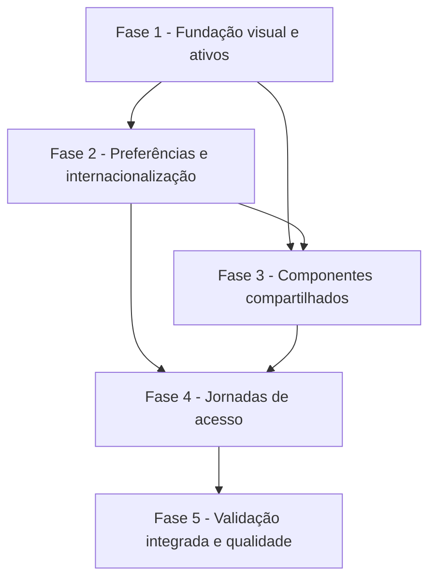

# Tarefas Rinos One — Identidade Visual e Preferências de Interface

Escopo: implementar a fundação visual com dez famílias cromáticas, Rubi Industrial como padrão, temas, preferências locais, internacionalização, componentes reutilizáveis e a reformulação das telas de acesso, sem alterar regras ou contratos de autenticação.

**Legenda de status:**

- `[ ]` Pendente
- `[~]` Em andamento
- `[x]` Concluído
- `[!]` Bloqueado

**Legenda de criticidade:**

- `[C]` Crítico - Impacto financeiro direto, regulatório, segurança, SLA ou operação bloqueante
- `[A]` Alto - Funcionalidade essencial
- `[M]` Médio - Necessário, mas sem urgência imediata

---

## FASE 1 - Fundação Visual e Ativos

### 1.1 Ativos de marca e instalação web `[A]`

Ref: spec.md FR-009, FR-010, FR-016; plan.md §Tipografia, ícones e ativos

- [x] 1.1.1 Copiar logo e ícone originais para ativos públicos derivados, preservando os arquivos em `etc/ID Visual/` sem alteração.
- [x] 1.1.2 Gerar variantes dimensionadas do ícone, favicon e manifesto de instalação web com referências aos ativos derivados.
- [x] 1.1.3 Integrar metadados de marca, favicon e manifesto no documento inicial da aplicação.
- [x] 1.1.4 Criar teste ou verificação automatizada para a existência, dimensões esperadas e referências dos ativos públicos.

### 1.2 Tokens, temas e base responsiva `[A]`

Ref: spec.md FR-001, FR-002, FR-006, FR-008, FR-015; plan.md §Tokens, §Temas e paleta, §Movimento e responsividade

- [x] 1.2.1 Criar a estrutura de estilos para tokens primitivos, semânticos, calculados e de componente, proibindo valores visuais brutos em telas.
- [x] 1.2.2 Implementar aliases Rubi Industrial para temas claro e escuro, incluindo foco, estados semânticos, contraste e elevação.
- [x] 1.2.3 Implementar multiplicadores independentes de fonte, espaçamento e tamanho de componentes, breakpoints e redução de movimento.
- [x] 1.2.4 Cobrir tokens e temas com testes ou inspeções automatizadas de contraste, preferências e ausência de regressão na folha de estilos.

> [!NOTE]
> A fundação impede valores brutos nas novas camadas do design system. A substituição dos utilitários visuais existentes nas jornadas de acesso permanece deliberadamente nas fases 3 e 4, quando os componentes compartilhados e as telas serão compostos sobre estes tokens.

---

## FASE 2 - Preferências e Internacionalização

### 2.1 Estado local e inicialização sem flash visual `[A]`

Ref: spec.md FR-002, FR-003, FR-006, FR-007; data-model.md §Preferência visual local; plan.md §Preferências e inicialização

- [x] 2.1.1 Implementar o contrato versionado de preferência local e a validação dos valores permitidos para tema, idioma e três escalas.
- [x] 2.1.2 Implementar aplicação e restauração atômica de atributos de tema, idioma e densidade antes da montagem da interface.
- [x] 2.1.3 Garantir que dados de formulário, senha, código, token, e-mail e sessão não sejam gravados pela camada de preferências.
- [x] 2.1.4 Criar testes unitários para padrão, valor inválido, persistência, restauração e exclusão de dados sensíveis.

### 2.2 Catálogos e troca global de idioma `[A]`

Ref: spec.md FR-004, FR-005, FR-007; plan.md §Internacionalização; interface-spec.md INT-WEB-VIS-005

- [x] 2.2.1 Adicionar a dependência de internacionalização e configurar o modo de composição com português do Brasil como padrão e fallback.
- [x] 2.2.2 Criar catálogos tipados e completos para português do Brasil, inglês, espanhol e francês para todas as telas de acesso.
- [x] 2.2.3 Atualizar idioma ativo, atributo `lang` e textos sem alterar rota, sessão ou dados seguros da jornada em curso.
- [x] 2.2.4 Criar testes para paridade de chaves, fallback e preservação da jornada durante troca de idioma.

---

## FASE 3 - Componentes Compartilhados

### 3.1 Biblioteca base de interface `[A]`

Ref: spec.md FR-008, FR-015; plan.md §Componentes compartilhados; interface-spec.md INT-WEB-VIS-001–004

- [x] 3.1.1 Implementar casca, marca, cartão, campo, botão, alerta, botão de ícone e diálogo como componentes reutilizáveis baseados em tokens.
- [x] 3.1.2 Implementar variantes, estados de carregamento, erro, indisponibilidade, foco e ação destrutiva sem estilos exclusivos de tela.
- [x] 3.1.3 Garantir contrato de acessibilidade dos componentes: rótulos, foco, teclado, leitor de tela, toque, zoom e redução de movimento.
- [x] 3.1.4 Criar testes de componente para variantes, estados e contrato de acessibilidade dos elementos base.

### 3.2 Controles reutilizáveis de apresentação `[A]`

Ref: spec.md FR-003, FR-005, FR-006, FR-013; interface-spec.md INT-WEB-VIS-005

- [x] 3.2.1 Implementar o popup de preferências visuais com quatro grupos de botões selecionáveis e aplicação imediata de cada valor.
- [x] 3.2.2 Implementar o seletor de idioma com bandeira, nome textual, estado selecionado, teclado e fechamento controlado.
- [x] 3.2.3 Implementar abertura, foco inicial, Escape, clique externo seguro e retorno de foco dos dois controles utilitários.
- [x] 3.2.4 Criar testes de componente para escolhas, persistência, anúncios acessíveis, navegação por teclado e não dependência de rede.

---

## FASE 4 - Composição das Jornadas de Acesso

### 4.1 Entrada e criação de conta `[A]`

Ref: interface-spec.md INT-WEB-VIS-001, INT-WEB-VIS-002; wireframes/int-web-vis-001.md; wireframes/int-web-vis-002.md

- [x] 4.1.1 Reorganizar a entrada em logo + cartão, removendo os textos e a barra de modos substituídos pela especificação.
- [x] 4.1.2 Implementar o formulário único de entrada, com botão “Entrar sem senha” quando a senha estiver vazia e “Entrar” quando preenchida.
- [x] 4.1.3 Implementar a rota/jornada própria de criação de conta com nome de exibição, e-mail, retorno à entrada e controles globais.
- [x] 4.1.4 Cobrir validação, resposta neutra, persistência de campos seguros, reflow e acessibilidade das duas jornadas com testes de componente e integração.

### 4.2 Confirmação por e-mail `[A]`

Ref: interface-spec.md INT-WEB-VIS-003; wireframes/int-web-vis-003.md; ../user-auth/contracts/auth-api.md

- [x] 4.2.1 Aplicar casca, marca, cartão, componentes base e controles globais à confirmação por código e link.
- [x] 4.2.2 Preservar os fluxos existentes de emissão, validade, tentativa, reenvio e consumo único sem alterar o contrato de autenticação.
- [x] 4.2.3 Garantir que troca de idioma ou preferências não persista código, token, link ou altere a emissão ativa.
- [x] 4.2.4 Cobrir os estados de confirmação, erro, expiração, offline, teclado numérico e acessibilidade com testes de integração e componente.

### 4.3 Área autenticada e ações de segurança `[A]`

Ref: interface-spec.md INT-WEB-VIS-004; wireframes/int-web-vis-004.md; ../user-auth/contracts/auth-api.md

- [x] 4.3.1 Aplicar a fundação visual aos grupos de senha e sessões, usando marca reduzida, cartões e ações semânticas reutilizáveis.
- [x] 4.3.2 Integrar preferências e idioma sem alterar a consulta de sessão, definição de senha, logout ou invalidação das demais sessões.
- [x] 4.3.3 Adequar diálogo de invalidação de sessões para foco preso, retorno de foco, versão responsiva e estado destrutivo compreensível.
- [x] 4.3.4 Criar testes de componente e integração para estados autenticado, erro, sessão inválida, diálogo e controles globais.

### 4.4 Catálogo de famílias cromáticas `[A]`

Ref: spec.md FR-001, FR-017, FR-018; plan.md §Temas e paleta; data-model.md §Família cromática

- [x] 4.4.1 Definir em tokens as dez famílias claras e escuras, com Rubi Industrial como resolução sem configuração.
- [x] 4.4.2 Aplicar aliases semânticos de família e a trama neutra de fibra de carbono no canvas escuro, sem seletor de paleta nesta fase.
- [x] 4.4.3 Atualizar metadados de cor de navegador, documentação de superfície e modelo de dados sem criar persistência ou API de perfil.
- [x] 4.4.4 Criar testes para catálogo, padrão Rubi Industrial, temas claro/escuro e ausência de persistência de paleta.

---

## FASE 5 - Validação Integrada e Qualidade

### 5.1 Cobertura automatizada do design system `[A]`

Ref: spec.md SC-001–SC-005; quickstart.md Scenarios 1–4; checklists/interface.md CHK001–CHK016; checklists/ux.md CHK001–CHK015

- [x] 5.1.1 Adicionar testes unitários para cálculo de tokens, preferências, catálogos e componentes compartilhados.
- [x] 5.1.2 Adicionar testes de regressão para os dois temas, três escalas independentes e quatro idiomas nas telas de acesso.
- [x] 5.1.3 Executar verificação de tipos, lint/formatação, testes de interface e build de produção, registrando evidências em `validation.md`.
- [x] 5.1.4 Revisar que não foram introduzidos textos não internacionalizados, valores visuais locais ou persistência de dados sensíveis.

### 5.2 Validação ponta a ponta e inspeção responsiva `[A]`

Ref: quickstart.md Scenario 5; interface-spec.md INT-WEB-VIS-001–005; spec.md SC-001–SC-005

- [x] 5.2.1 Ampliar cenários ponta a ponta para entrada com e sem senha, cadastro, confirmação e área autenticada usando contratos reais.
- [x] 5.2.2 Validar troca de preferências e idioma durante jornada, preservando rota, sessão e somente dados seguros.
- [x] 5.2.3 Executar inspeção visual automatizada em telefone, tablet e desktop para claro/escuro e escalas extremas, registrando evidências.
- [x] 5.2.4 Verificar navegação por teclado, foco, redução de movimento, contraste e instalação web com critérios documentados.

---

## Matriz de Dependências

## Cobertura de Interfaces

| Surface ID | Coverage | Interaction IDs | Task IDs |
| --- | --- | --- |
| SURF-WEB-ACCESS | FULL | INT-WEB-VIS-001 | 1.1, 1.2, 2.1, 2.2, 3.1, 3.2, 4.1, 5.1, 5.2 |
| SURF-WEB-ACCESS | FULL | INT-WEB-VIS-002 | 1.1, 1.2, 2.1, 2.2, 3.1, 3.2, 4.1, 5.1, 5.2 |
| SURF-WEB-ACCESS | FULL | INT-WEB-VIS-003 | 1.1, 1.2, 2.1, 2.2, 3.1, 3.2, 4.2, 5.1, 5.2 |
| SURF-WEB-ACCESS | FULL | INT-WEB-VIS-004 | 1.1, 1.2, 2.1, 2.2, 3.1, 3.2, 4.3, 5.1, 5.2 |
| SURF-WEB-ACCESS | FULL | INT-WEB-VIS-005 | 1.2, 2.1, 2.2, 3.2, 5.1, 5.2 |

## Resumo Quantitativo

| Fase | Tarefas | Subtarefas | Criticidade |
| --- | ---: | ---: | --- |
| 1 - Fundação visual e ativos | 2 | 8 | A |
| 2 - Preferências e internacionalização | 2 | 8 | A |
| 3 - Componentes compartilhados | 2 | 8 | A |
| 4 - Jornadas de acesso | 4 | 16 | A |
| 5 - Validação integrada e qualidade | 2 | 8 | A |
| **Total** | **12** | **48** | - |

## Escopo Coberto

| Item | Descrição | Fase |
| --- | --- | --- |
| VIS-001 | Ativos derivados, favicon, manifesto e identidade de marca | 1 |
| VIS-002 | Tokens, temas, responsividade, tipografia e escalas calculadas | 1 |
| VIS-003 | Preferências locais e internacionalização em quatro idiomas | 2 |
| VIS-004 | Componentes base, popup de preferências e seletor de idioma | 3 |
| VIS-005 | Entrada, criação, confirmação e área autenticada | 4 |
| VIS-006 | Testes, qualidade, inspeção visual e validação ponta a ponta | 5 |

## Escopo Excluído

| Item | Descrição | Motivo |
| --- | --- | --- |
| EXC-001 | Sincronizar preferências com o perfil ou entre dispositivos | Perfil e persistência de preferências não pertencem a esta fase. |
| EXC-002 | Novos produtos, módulos ou telas além do acesso | Não há ampliação funcional autorizada. |
| EXC-003 | Traduzir mensagens de e-mail | A localização de e-mails exige escopo próprio e não altera os fluxos atuais. |
| EXC-004 | Interfaces nativas Android, iOS ou desktop | Apenas a web responsiva tem cobertura aprovada. |
