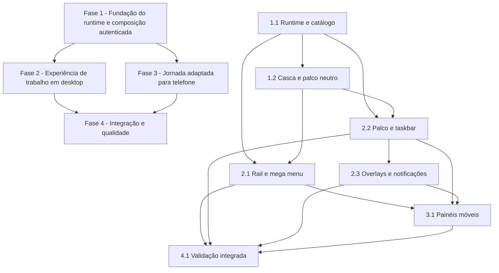

# Tarefas Área de Trabalho da Aplicação - Shell de Workspace

Escopo: implementar a Área de trabalho autenticada, com navegação por catálogo interno, superfícies efêmeras por aba, taskbar, camadas globais e adaptação móvel, sem antecipar módulos de negócio ou persistência adicional.

**Origem**: spec SDD `workspace-shell`.

**Legenda de status:**

- `[ ]` Pendente
- `[~]` Em andamento
- `[x]` Concluído
- `[!]` Bloqueado

**Legenda de criticidade:**

- `[C]` Crítico — impacto financeiro, regulatório, segurança, SLA ou operação bloqueante.
- `[A]` Alto — funcionalidade essencial.
- `[M]` Médio — necessário, mas sem urgência imediata.

---

## FASE 1 - Fundação do runtime e composição autenticada

### 1.1 Runtime efêmero e catálogo interno de destinos `[A]`

Ref: [spec.md](spec.md) FR-WS-004, FR-WS-006, FR-WS-007, FR-WS-014 e FR-WS-015; [plan.md](plan.md) §Arquitetura; [workspace-runtime.md](contracts/workspace-runtime.md).

- [x] 1.1.1 Criar os tipos TypeScript do destino, superfície, diálogo, notificação e estado do workspace, com identidades e políticas de instância explícitas.
- [x] 1.1.2 Criar o catálogo interno tipado, inicialmente sem módulos de negócio, que filtre destinos pessoais e de organização conforme o contexto ativo.
- [x] 1.1.3 Implementar a store Pinia efêmera por aba para abrir, focar, fechar e limpar superfícies contextuais sem armazenamento persistente.
- [x] 1.1.4 Implementar o contrato de alteração pendente, pilha de diálogos e fila de notificações como operações centralizadas do runtime.
- [x] 1.1.5 Conectar os sinais existentes de troca/perda de organização e encerramento de sessão à limpeza segura do runtime, preservando superfícies pessoais quando aplicável.
- [x] 1.1.6 Criar testes unitários da store e do catálogo para instância única/múltipla, foco, descarte/cancelamento, isolamento efêmero e invalidação contextual. <!-- Vitest: 15 testes relevantes aprovados. -->

### 1.2 Casca autenticada e palco inicial neutro `[A]`

Ref: [spec.md](spec.md) FR-WS-001, FR-WS-002 e FR-WS-015; [interface-spec.md](interface-spec.md) INT-WEB-WORKSPACE-001; [wireframe desktop](wireframes/workspace-desktop.md).

- [x] 1.2.1 Remover da área autenticada o conteúdo demonstrativo de segurança e quaisquer mensagens que aparentem ser um módulo real.
- [x] 1.2.2 Introduzir `WorkspaceShell` abaixo da top bar existente, preservando marca, avatar, menu pessoal e seletor de organização já entregues.
- [x] 1.2.3 Implementar o palco com estados inicial, vazio, pronto e indisponível, mantendo uma única superfície ativa visível por vez.
- [x] 1.2.4 Aplicar tokens de layout, superfície, foco, movimento, tema e densidades sem criar estilos locais não reutilizáveis.
- [x] 1.2.5 Criar testes de componente para a composição autenticada e os estados neutros, incluindo ausência de conteúdo demonstrativo. <!-- Vitest: 65 testes aprovados; type-check e build aprovados. -->

---

## FASE 2 - Experiência de trabalho em desktop

### 2.1 Rail de navegação e mega menu `[A]`

Ref: [spec.md](spec.md) FR-WS-003 a FR-WS-005; [interface-spec.md](interface-spec.md) INT-WEB-WORKSPACE-002; [wireframe desktop](wireframes/workspace-desktop.md).

- [x] 2.1.1 Implementar `WorkspaceNavigationRail` expansível e recolhível, com rótulos acessíveis quando somente ícones estiverem visíveis.
- [x] 2.1.2 Implementar `WorkspaceMegaMenu` ancorado ao palco, com categorias, grupos, colunas, estado vazio e rolagem interna.
- [x] 2.1.3 Conectar a seleção de destino ao runtime, fechando o menu somente após a intenção de abertura ser aceita.
- [x] 2.1.4 Implementar fechamento por acionador, clique externo, Escape, abertura aceita, troca/perda de organização e perda de sessão, com retorno de foco definido.
- [x] 2.1.5 Aplicar filtros de escopo ao menu e tratar mudança de elegibilidade durante a abertura sem apresentar destino contextual indevido.
- [x] 2.1.6 Criar testes de componente para navegação, recolhimento, foco, filtro de contexto, estados vazios e atalhos de fechamento. <!-- Vitest: 70 testes aprovados; type-check e build aprovados. -->

### 2.2 Palco, superfícies abertas e taskbar `[A]`

Ref: [spec.md](spec.md) FR-WS-006 a FR-WS-009; [interface-spec.md](interface-spec.md) INT-WEB-WORKSPACE-001 e INT-WEB-WORKSPACE-003; [workspace-runtime.md](contracts/workspace-runtime.md).

- [x] 2.2.1 Implementar `WorkspaceStage` que mantenha o estado visual local de superfícies inativas sem as renderizar simultaneamente no palco.
- [x] 2.2.2 Implementar `WorkspaceTaskbar` com título localizado, ícone, item ativo semanticamente identificado e controle explícito de fechamento.
- [x] 2.2.3 Recolher o rail ao abrir uma superfície e definir a escolha previsível da próxima ativa após fechamento, com retorno à descoberta após a última instância.
- [x] 2.2.4 Implementar atalhos seguros de próxima/anterior e fechamento, ignorando eventos em campos editáveis e conflitos assistivos conhecidos.
- [x] 2.2.5 Garantir que falha de ação contextual preserve item e foco, e que itens invalidados sejam removidos apenas no escopo da aba atual.
- [x] 2.2.6 Validar contraste, foco visível, semântica de item ativo, navegação por teclado e expansão localizada de títulos.
- [x] 2.2.7 Criar testes unitários e de componente para alternância, instâncias, fechamento e atalhos da taskbar. <!-- Vitest: 76 testes aprovados; type-check e build aprovados. -->

### 2.3 Diálogos, confirmação de descarte e notificações globais `[A]`

Ref: [spec.md](spec.md) FR-WS-010 a FR-WS-012; [interface-spec.md](interface-spec.md) INT-WEB-WORKSPACE-003; [wireframe taskbar e diálogo](wireframes/workspace-taskbar-dialog.md).

- [x] 2.3.1 Implementar `WorkspaceOverlayHost` sobre a casca, com pilha de diálogos e somente a camada superior interativa.
- [x] 2.3.2 Integrar a confirmação de descarte ao fechamento de superfície pendente, distinguindo cancelamento e confirmação explícita.
- [x] 2.3.3 Configurar política de Escape e clique externo conforme criticidade do diálogo, aprisionar foco quando bloqueante e devolvê-lo ao originador.
- [x] 2.3.4 Implementar `WorkspaceNotificationHost` com fila, tipo semântico, anúncio assistivo e regra de não roubar foco.
- [x] 2.3.5 Localizar títulos, ações, mensagens e pluralizações dos controles globais nos quatro idiomas suportados.
- [x] 2.3.6 Criar testes de componente para pilha, fila, foco, descarte, anúncio e preservação de estado em falhas. <!-- Vitest: 81 testes aprovados; type-check e build aprovados. -->

---

## FASE 3 - Jornada adaptada para telefone

### 3.1 Painéis móveis de navegação e superfícies `[A]`

Ref: [spec.md](spec.md) FR-WS-013 e FR-WS-014; [interface-spec.md](interface-spec.md) INT-WEB-WORKSPACE-004; [wireframe mobile](wireframes/workspace-mobile.md).

- [x] 3.1.1 Evoluir o acionador móvel da marca para abrir a navegação da Área de trabalho, sem transformar a identidade visual em botão destacado no desktop.
- [x] 3.1.2 Evoluir `MobileNavigationDrawer` ou introduzir `WorkspaceMobileNavigationPanel` para mostrar categorias e destinos filtrados no contexto atual.
- [x] 3.1.3 Implementar `WorkspaceMobileTaskPanel` para listar superfícies abertas, indicar a ativa e solicitar fechamento por item.
- [x] 3.1.4 Garantir um único palco em largura total, sem taskbar desktop ou simulação de janelas livres em telefone.
- [x] 3.1.5 Implementar exclusão mútua dos painéis, precedência de diálogo bloqueante, foco modal, safe areas, teclado virtual e rolagem interna.
- [x] 3.1.6 Aplicar alvo de toque pela escala de componentes, redução de movimento e comportamento legível em orientação paisagem e textos longos.
- [x] 3.1.7 Criar testes de componente e inspeção responsiva para os painéis, ações por teclado/toque, troca de organização e estado sem superfícies. <!-- Vitest: 84 testes; Playwright: 14 cenários em telefone, tablet e desktop; type-check e build aprovados. -->

---

## FASE 4 - Integração e qualidade de entrega

### 4.1 Validação integrada, acessibilidade e documentação `[A]`

Ref: [quickstart.md](quickstart.md); [interface-spec.md](interface-spec.md) §Traceability; [checklists/interface.md](checklists/interface.md); [checklists/ux.md](checklists/ux.md).

- [x] 4.1.1 Cobrir em testes integrados os cenários neutro, abertura, instância única/múltipla, alternância, descarte, troca de organização e isolamento por aba.
- [x] 4.1.2 Medir a troca local por taskbar e atalho em desktop, comprovando até 1 segundo em ao menos 95% das interações previstas por SC-WS-006.
- [x] 4.1.3 Verificar em navegador os layouts desktop, tablet e telefone contra os wireframes, registrando ajustes visuais necessários sem substituir a especificação textual.
- [x] 4.1.4 Executar revisão de teclado, foco, leitor de tela, contraste, zoom, densidades, tema, redução de movimento e quatro idiomas nas interações `INT-WEB-WORKSPACE-001` a `004`.
- [x] 4.1.5 Executar formatação disponível, testes backend e frontend, verificação de tipos e build de produção definidos pelo repositório, corrigindo regressões restritas a esta feature.
- [x] 4.1.6 Atualizar documentação de arquitetura e da feature caso a implementação revele uma decisão duradoura, sem documentar módulos não aprovados.
- [x] 4.1.7 Marcar no backlog as subtarefas verificadas com a evidência objetiva de testes, build e inspeção visual correspondente. <!-- Pint: aprovado; PHP: 94 aprovados, 2 integrações Mailpit ignoradas por configuração ausente; Vitest: 85 aprovados; Playwright: 14 aprovados; type-check e build aprovados. -->

---

## FASE 5 - Correções da composição do canvas `[x]`

Ref: [spec.md](spec.md) FR-WS-001, FR-WS-003, FR-WS-008 e FR-WS-011; [interface-spec.md](interface-spec.md) INT-WEB-WORKSPACE-001 a 003.

- [x] 5.1 Reestruturar o canvas autenticado para manter topbar fixa, remover a rolagem geral e limitar a rolagem ao conteúdo interno que a necessitar.
- [x] 5.2 Remover título, mensagem e moldura do estado neutro; a moldura pertence somente a uma janela aberta.
- [x] 5.3 Converter o mega menu em popover sobreposto à área de janelas, sem deslocar a taskbar ou o conteúdo dessa área.
- [x] 5.4 Remover a previsão de painéis acopláveis e formalizar os escopos de diálogo: área de trabalho bloqueante e janela local.
- [x] 5.5 Executar testes, checagem de tipos, build e validação em navegador dos limites de rolagem e sobreposição. <!-- vue-tsc: aprovado; Vitest: 86 aprovados; Vite build: aprovado; Playwright: 14 cenários aprovados, incluindo viewport e sobreposição do mega menu. -->

---

## FASE 6 - Validação visual com fixtures `[x]`

Ref: [spec.md](spec.md) FR-WS-003, FR-WS-006, FR-WS-008 e FR-WS-011; [interface-spec.md](interface-spec.md) INT-WEB-WORKSPACE-002 e 003.

- [x] 6.1 Fazer o mega menu abrir por hover, manter clique/teclado e calcular o posicionamento vertical a partir do item acionador, respeitando os limites do canvas.
- [x] 6.2 Aplicar altura intrínseca e remover a rolagem própria do mega menu.
- [x] 6.3 Criar fixtures temporárias de navegação e janelas para testar categorias, grupos, instância única/múltipla e taskbar, sem criar módulos ou dados reais.
- [x] 6.4 Criar controles de demonstração para notificação, diálogo da área de trabalho e diálogo local de janela.
- [x] 6.5 Validar hover, posicionamento, limites verticais, diálogos e taskbar em navegador e nos testes de componente. <!-- Playwright: cenário de hover, limites do canvas e dois escopos de diálogo aprovado; regressões desktop e tablet aprovadas. -->

---

## FASE 7 - Refinamento de taskbar e topbar `[x]`

Ref: [spec.md](spec.md) FR-WS-008 e FR-WS-014; [interface-spec.md](interface-spec.md) INT-WEB-WORKSPACE-003.

- [x] 7.1 Usar ícone SVG de superfície no cabeçalho da janela e na taskbar; mover fechamento para o X no cabeçalho.
- [x] 7.2 Transformar taskbar em dock centralizado de ícones, com ampliação por hover, escala do ativo e marcador pill.
- [x] 7.3 Fixar o fundo da topbar em preto e derivar seus tokens internos da variante escura do tema selecionado.
- [x] 7.4 Validar acessibilidade, fechamento, animação, contraste e responsividade em navegador. <!-- vue-tsc: aprovado; Vitest: 89 aprovados; Vite build: aprovado; Playwright: 15 cenários aprovados, incluindo taskbar, fechamento de janela e topbar preta. -->

---

## FASE 8 - Correções de escopo local e acabamento `[x]`

Ref: [spec.md](spec.md) FR-WS-008 e FR-WS-011; [interface-spec.md](interface-spec.md) INT-WEB-WORKSPACE-003.

- [x] 8.1 Aplicar separação explícita e verificável entre avatar de organização e avatar pessoal na topbar.
- [x] 8.2 Criar host de diálogos próprio da instância de janela, com pilha local, interação somente no topo, preservação durante troca de janela e descarte no fechamento da própria instância.
- [x] 8.3 Remover fundo e divisão visual da taskbar, preservando o dock centralizado de ícones sobre a área de trabalho.
- [x] 8.4 Cobrir empilhamento, descarte por troca de janela, espaçamento dos avatares e transparência da taskbar em testes de componente e navegador. <!-- Evidência: Vitest, type-check, build e Playwright executados após a correção. -->

---

## Matriz de Dependências

## Cobertura de Interfaces

| Surface ID | Cobertura | Interaction IDs | Task IDs |
| --- | --- | --- | --- |
| SURF-WEB-ACCESS | FULL | INT-WEB-WORKSPACE-001 | 1.2, 2.2, 4.1 |
| SURF-WEB-ACCESS | FULL | INT-WEB-WORKSPACE-002 | 2.1, 3.1, 4.1 |
| SURF-WEB-ACCESS | FULL | INT-WEB-WORKSPACE-003 | 2.2, 2.3, 3.1, 4.1 |
| SURF-WEB-ACCESS | FULL | INT-WEB-WORKSPACE-004 | 3.1, 4.1 |

## Resumo Quantitativo

| Fase | Tarefas | Subtarefas | Criticidade |
| --- | ---: | ---: | --- |
| 1 - Fundação do runtime e composição autenticada | 2 | 11 | A |
| 2 - Experiência de trabalho em desktop | 3 | 19 | A |
| 3 - Jornada adaptada para telefone | 1 | 7 | A |
| 4 - Integração e qualidade de entrega | 1 | 7 | A |
| **Total** | **7** | **44** | **A** |

## Escopo Coberto

| Item | Descrição | Fase |
| --- | --- | --- |
| FR-WS-001 a FR-WS-005 | Casca, palco inicial, rail e mega menu filtrado por escopo. | 1 e 2 |
| FR-WS-006 a FR-WS-009 | Runtime efêmero, superfícies, instâncias e taskbar. | 1 e 2 |
| FR-WS-010 a FR-WS-012 | Descarte seguro, diálogos e notificações globais. | 1 e 2 |
| FR-WS-013 e FR-WS-014 | Adaptação móvel e invariantes de contexto organizacional. | 3 |
| FR-WS-015 e FR-WS-016 | Ausência de restauração e limites explícitos de escopo. | 1 e 4 |
| INT-WEB-WORKSPACE-001 a INT-WEB-WORKSPACE-004 | Interações, estados, responsividade, acessibilidade e localização. | 1 a 4 |

## Escopo Excluído

| Item | Descrição | Motivo |
| --- | --- | --- |
| Módulos de negócio | Conteúdo, rotas, dados, permissões e operações de produtos futuros. | Não autorizado nesta fase; o catálogo contém somente fixtures visuais sem comportamento de produto. |
| Catálogo remoto e permissões detalhadas | Serviço, endpoint ou modelo persistido para descoberta de módulos autorizados. | Depende de especificação de produtos, papéis e acessos. |
| Restauração entre sessões | Reabrir superfícies, menus ou contexto após recarregar a aba. | Contraria a decisão de estado efêmero da fase. |
| Janelas livres | Arrastar, redimensionar, sobrepor ou replicar janelas de sistema operacional. | A experiência usa superfícies produtivas, não simulação de desktop. |
| Telefone como desktop reduzido | Taskbar horizontal e múltiplas janelas visíveis em tela estreita. | Substituído por painéis e um único palco ativo. |
